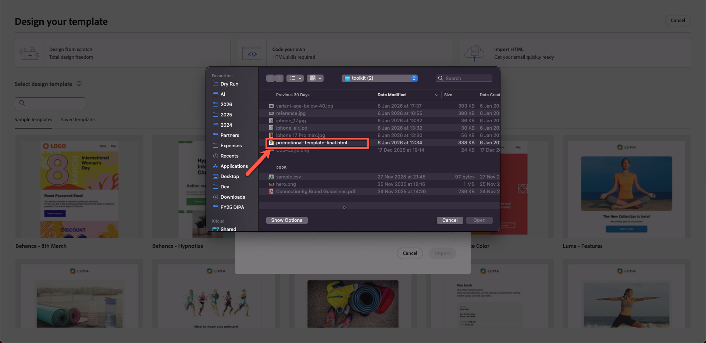
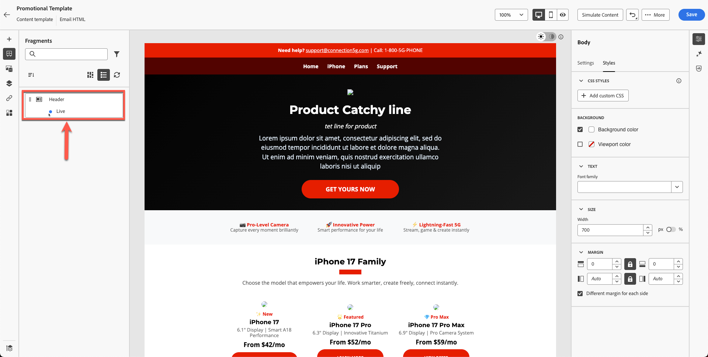

# 콘텐츠 템플릿 작성 중

## 템플릿 및 조각을 사용하여 콘텐츠 만들기

**목적:** Adobe Journey Optimizer에서 재사용 가능한 템플릿을 만드는 방법을 알아봅니다.

## 학습 목표

이 단원을 마치면 다음과 같은 작업을 수행할 수 있습니다.

1. 가져온 HTML 및 조각을 사용하여 전체 이메일 템플릿을 작성합니다.

## 템플릿이 중요한 이유

템플릿을 사용하면 이메일, 캠페인 및 여정에서 재사용할 수 있는 일관된 브랜드 맞춤식 콘텐츠를 만들 수 있습니다.

### 템플릿

해당 구조의 블루프린트:

- 헤더 배치
- 본문 컨텐츠 영역
- 바닥글 영역
- 표준 레이아웃 스타일

템플릿은 팀 간의 브랜드 일관성을 보장하며 상당한 제작 시간을 절약합니다.

## 조각을 사용하여 새 템플릿 만들기

템플릿은 사용자가 캠페인 간 전체 레이아웃을 재사용하는 데 도움이 됩니다. Adobe Journey Optimizer의 컨텐츠 템플릿은 캠페인 및 여정을 위한 재사용 가능한 컨텐츠를 만드는 방법을 단순화하고 간소화하기 위해 설계된 강력한 도구입니다. 이메일, SMS 또는 푸시 알림을 만드는 경우, 템플릿은 프로젝트 간에 손쉽게 맞춤화하고 공유할 수 있는 사전 디자인된 구조를 제공하여 시간을 절약하는 데 도움이 됩니다.

디자인 프로세스를 가속화하고 개선하기 위해 독립 실행형 템플릿을 만들어 Journey Optimizer 캠페인 및 여정 전반에서 사용자 정의 콘텐츠를 쉽게 재사용할 수 있습니다.

이 기능을 사용하면 콘텐츠 중심의 사용자가 캠페인이나 여정 외부의 템플릿에서 작업할 수 있습니다. 그런 다음 마케팅 사용자는 이러한 독립 실행형 콘텐츠 템플릿을 자체 여정 또는 캠페인 내에서 재사용하고 조정할 수 있습니다.

## 템플릿 만들기

1. **콘텐츠 관리 → 콘텐츠 템플릿**(으)로 이동합니다.

&#x200B;2. **템플릿 만들기**&#x200B;를 클릭하고 다음을 입력하십시오.
   - **이름:** `Promotional Template`
   - **설명:** `Promotional Template for phone products`
   - **채널:** `Email`

&#x200B;3. **만들기**&#x200B;를 클릭합니다.

## 제목 줄 추가 및 이메일 디자이너 열기

1. 제목란 `Promotional Template`을(를) 추가하고 이메일 본문에서 **을(를) 클릭하여**&#x200B;을(를) 열어 편집합니다.

&#x200B;2. 다음 세 가지 옵션이 표시됩니다.
   1. 처음부터 디자인
   2. 나만의 코드 작성
   3. HTML 가져오기

세 번째 옵션을 선택합니다. **HTML 가져오기** 클릭

## 제공된 HTML 템플릿 가져오기

1. 도구 키트 폴더 `promotional-template-final.html`에서 템플릿 html 파일 업로드

&#x200B;2. 가져오기 단추를 클릭하여 템플릿을 **가져오기**&#x200B;합니다.

&#x200B;3. 레이아웃이 렌더링될 때까지 기다립니다. 이미지 링크가 끊어지고 브랜딩이 누락된 것과 같은 문제가 표시됩니다. (자리 표시자 에셋이 있으므로 예상된 동작입니다.)

## 템플릿 구조 탐색

### 왼쪽 패널

Adobe Journey Optimizer(AJO)의 &quot;**구조**&quot; 및 &quot;**콘텐츠**&quot; 구성 요소는 전자 메일, 랜딩 페이지 및 콘텐츠 조각을 디자인할 때 사용되는 필수 요소입니다. 구조는 레이아웃 프레임워크를 정의하는 반면 콘텐츠는 이러한 레이아웃 내부에 배치된 실제 빌딩 블록을 제공합니다.

Adobe Journey Optimizer의 본문 섹션은 이메일 또는 페이지 콘텐츠의 기본 컨테이너입니다. 모든 구조 구성 요소(열, 레이아웃)와 콘텐츠 구성 요소(텍스트, 이미지, 단추 등)가 있는 시각적 디자인 공간의 루트 역할을 합니다 중첩 상태입니다.

### 오른쪽 패널

Adobe Journey Optimizer의 본문 섹션 아래에 있는 &quot;**설정**&quot; 및 &quot;**스타일**&quot; 옵션을 사용하면 전자 메일 또는 페이지의 기본 모양과 레이아웃을 정의할 수 있습니다. 본문이 모든 구성 요소의 상위이므로 이러한 컨트롤은 전체 디자인에 영향을 줍니다.

본문 구역의 오른쪽 패널에서 

왼쪽 레일 바에서 다음 섹션을 찾습니다.

- 조각
- 파일
- 본문 구조
- 추적된 URL

이전 연습에서 만든 헤더 조각이 아래와 같이 여기에 표시됩니다. 헤더 조각이 초안 모드가 아닌 파란색 점을 사용하여 라이브로 표시되는지 확인하십시오. 나머지 부분을 확인하면서 시간을 보내세요.

&#x200B;> [!NOTE]
>
>여기에 조각이 표시되지 않으면 제대로 저장하지 않았으므로 다시 업로드해야 합니다.

## 헤더 조각 삽입

이제 템플릿을 개선합니다. 머리글과 바닥글을 이미 만들었습니다.

1. 기존 콘텐츠 위에 **1:1 열**&#x200B;을(를) 끌어옵니다.

이런 게 보이시네요

&#x200B;2. 배경은 현재 검정색인 템플릿 배경색을 사용합니다. **배경색을 흰색으로 설정합니다. 오른쪽 레일의 스타일 탭에서**&#x200B;을(를) 클릭하고 색상 선택기에서 흰색을 사용합니다.

&#x200B;3. **조각**&#x200B;을 열고 **헤더** 조각에서 드래그합니다.

&#x200B;4. 헤더 조각은 아래와 같이 템플릿에 깔끔하게 정렬됩니다.

&#x200B;5. **저장** 단추를 클릭하여 템플릿을 저장한 다음 **뒤로**&#x200B;를 클릭합니다.

![[뒤로]를 클릭하기 전에 템플릿을 저장하는 저장 단추](assets/building-content-template-click-save-button-template.png)

>[!NOTE]
>
>일부 깨진 이미지가 표시될 수 있습니다. 나중에 수정하겠습니다.

## 요약

이 단원에서는 다음과 같은 작업을 성공적으로 수행합니다.

- 전체 프로모션 템플릿을 작성하기 위해 HTML을 가져옴

이제 다음 모듈(**전자 메일 만들기**)로 이동할 준비가 되었습니다.
