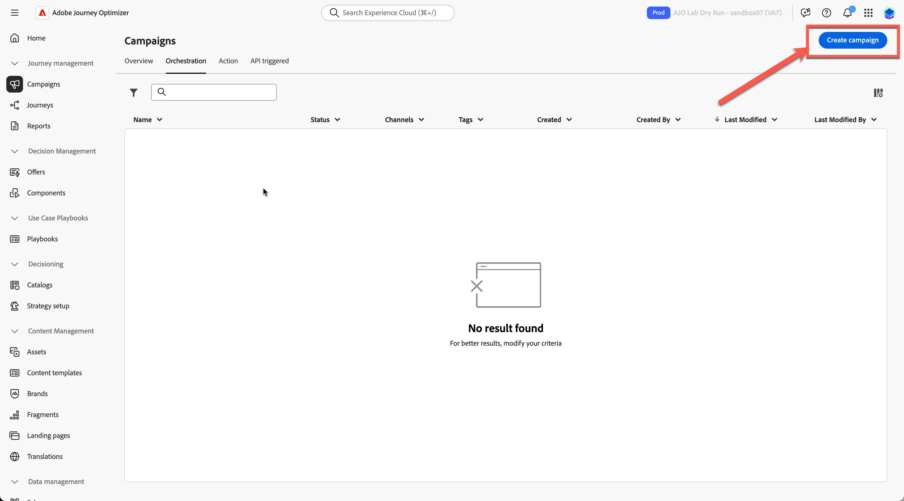
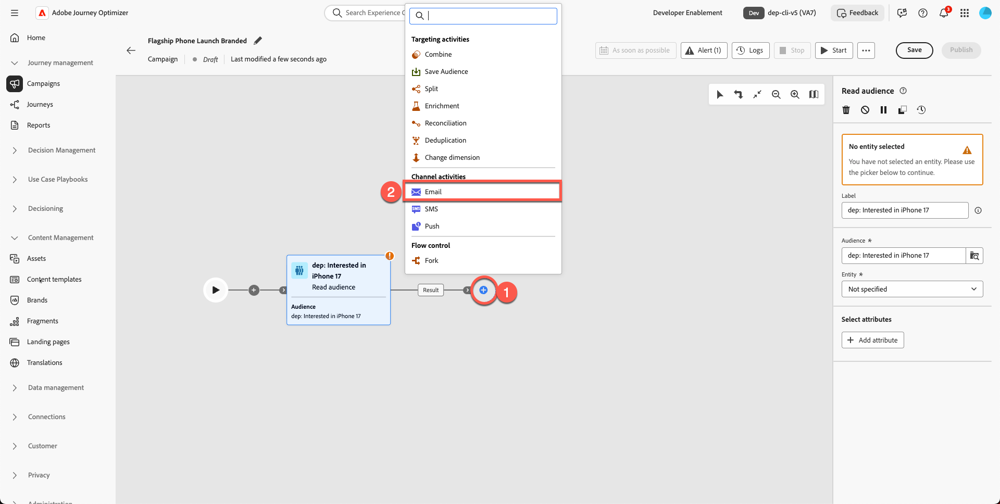
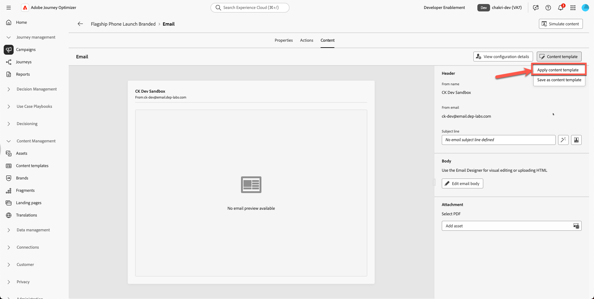
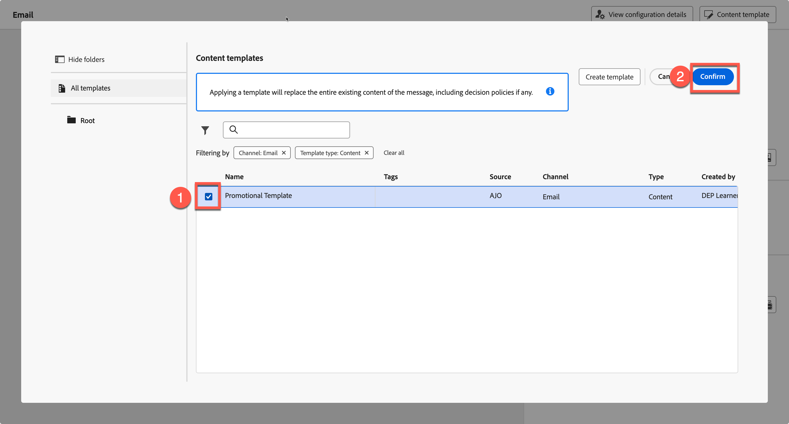

# 이메일 만들기

## 템플릿을 사용하여 콘텐츠 만들기

**목적:** Adobe Journey Optimizer에서 재사용 가능한 템플릿을 만든 다음 캠페인 내의 실제 전자 메일 내에 적용하는 방법을 알아봅니다.

## 학습 목표

이 단원을 마치면 다음과 같은 작업을 수행할 수 있습니다.

1. 새 캠페인을 만들고 새 브랜드 템플릿을 사용합니다.
1. 영웅 이미지, 제품 이미지, 단추 및 레이아웃 스타일을 업데이트합니다.

## 캠페인에서 이메일 만들기 및 업데이트

### 목표

이 연습에서는 만든 템플릿을 여정 내의 이메일에 적용하는 방법을 배웁니다. 이상적인 시나리오에서는 기존 여정 또는 캠페인을 사용하고 이메일 콘텐츠를 표준화된 템플릿으로 대체하여 브랜드 일관성을 보장하고 실행 속도를 높일 수 있습니다.

이 단계에서는 여정 간에 템플릿을 재사용하여 팀이 이메일을 처음부터 다시 작성하지 않고도 디자인을 업데이트할 수 있는 방법을 보여 줍니다.

## 새 이메일 캠페인 만들기

1. 기본 화면으로 돌아가서 **여정 관리 → 캠페인**&#x200B;을 클릭합니다.
2. **캠페인 만들기**&#x200B;를 클릭합니다.

   

3. &quot;**오케스트레이션 - 마케팅**&quot;을(를) 선택하고 **확인**&#x200B;을 클릭합니다.

   

4. 캠페인 이름을 `Flagship Phone Launch Branded`(으)로 지정합니다. **저장** 단추를 누릅니다.

   

5. **+ 기호**&#x200B;를 클릭하고 **대상자 읽기** 활동을 선택하십시오.

   

6. 다음 단계는 **&quot;대상자 읽기&quot;** 상자를 선택하고 **대상자 폴더 아이콘**&#x200B;을 클릭합니다

   

7. **dep: iPhone 17** 대상자를 선택하고 &quot;**대상자 추가**&quot; 단추를 클릭하십시오.

   

8. 엔터티 - **dep-rel: 고객 계정 - customer\_id**(또는 이 부분에서는 중요하지 않음)을 선택합니다.
9. **+ 기호**&#x200B;를 클릭하여 **전자 메일 활동**&#x200B;을 추가한 다음 채널 활동에서 **전자 메일**&#x200B;을(를) 선택하십시오.

   

10. **전자 메일 편집**&#x200B;을 클릭합니다.

&#x200B;11. **작업 탭**&#x200B;을 클릭하고 **내** 전자 메일 구성을 선택합니다. 샌드박스에서 이를 관계형 이메일로 표시할 수 있습니다. (임의 선택)

전자 메일 구성이 선택된 

&#x200B;12. **콘텐츠 탭**&#x200B;을 클릭합니다.

전자 메일 편집기의 

&#x200B;13. **콘텐츠 템플릿 적용**&#x200B;을 클릭합니다.

&#x200B;14. 만든 템플릿 **&quot;프로모션 템플릿&quot;**&#x200B;을(를) 선택하고 **확인**&#x200B;을(를) 클릭합니다

&#x200B;15. **전자 메일 본문 편집**&#x200B;을 클릭합니다.

&#x200B;16. 새 머리글, 영웅, 바닥글 및 콘텐츠 블록이 올바르게 표시되는지 확인합니다.

## 영웅 이미지 및 제품 이미지 교체

영웅 및 전화 이미지를 변경합니다. toolkit 폴더에서 에셋으로 콘텐츠를 업로드해야 합니다. 현재 제품 영웅 배너 이미지는 자리 표시자입니다.

1. 깨진 영웅 배너 이미지를 클릭합니다.

   

2. 임시 소스 URL을 제거합니다.

   

3. **미디어 가져오기**&#x200B;를 클릭합니다

   

4. 도구 키트에서 `hero.png`을(를) 업로드합니다. (파일을 드래그할 수 있습니다)

   

5. **다음,**&#x200B;**에셋에 대한 폴더 선택** 및 **가져오기** 누르기

   

6. 이메일 템플릿이 정상적으로 준비 중입니다. 다음과 같이 표시됩니다. 작업을 저장하려면 **&quot;저장&quot;**&#x200B;을 클릭합니다.

## 선택적 운동

### 제품 이미지 바꾸기

계속해서 모든 제품 이미지(toolkit 폴더에 제공된 이미지)를 업데이트하고 둥근 테두리를 원하는 대로 추가합니다. 아래와 같이 끊어진 링크가 없는 이메일이 더 좋아 보입니다. 모든 제품 카드에 대해 이 과정을 반복합니다.

## 요약

이 단원에서는 다음과 같은 작업을 성공적으로 수행합니다.

- 브랜드 템플릿을 사용하여 이메일로 새 캠페인을 만들었습니다.
- 업데이트된 영웅 및 제품 이미지
- 향상된 스타일

이제 다음 모듈(**AI 도우미 및 콘텐츠 개인화**)로 이동하여 AI를 사용하여 텍스트를 세분화하고 이미지를 자동으로 생성할 준비가 되었습니다.
