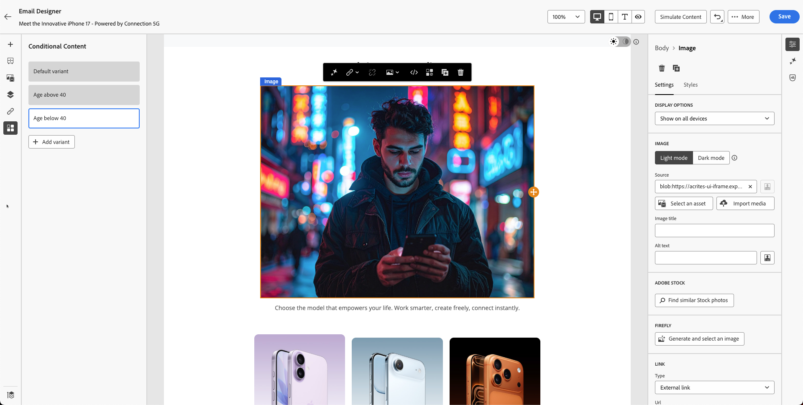

# Personalization 및 콘텐츠 실험

**목적:** 프로필 특성을 사용하여 이메일 콘텐츠를 개인화하고, 동적 콘텐츠 변형을 작성하고, Adobe Journey Optimizer에서 조건부 논리를 적용하는 방법에 대해 알아봅니다.

## 학습 목표

이 단원을 마치면 다음과 같은 작업을 수행할 수 있습니다.

1. 프로필 속성을 사용하여 개인화 필드를 추가합니다.
1. 개인화 편집기 및 Handlebars 구문을 사용합니다.
1. 프로필 논리를 기반으로 다이내믹 콘텐츠 변형을 작성합니다.
1. 개인화된 콘텐츠 블록에 대한 조건부 규칙을 만듭니다.
1. 출생 연도와 같은 속성을 기반으로 변형 전환을 테스트합니다.

## 소개

Adobe Journey Optimizer의 개인화를 통해 규모에 맞게 일대일 경험을 사용할 수 있습니다.
이 단원에서는 다음 작업을 수행합니다.

- 개인화된 텍스트(이름 및 성) 삽입
- 연령 기반 콘텐츠 변형 작성
- 프로필 속성을 사용하여 조건부 논리 적용
- 모듈 7에서 시뮬레이션을 위한 콘텐츠 준비

Adobe Journey Optimizer의 Personalization을 사용하면 개별 프로필, 동작 및 컨텍스트 기반 데이터를 기반으로 콘텐츠를 동적으로 맞춤화함으로써 개인화되고 영향력이 큰 고객 경험을 구축할 수 있습니다. 개인화된 이메일, 알림 또는 오퍼를 만드는 모든 경우, 제공된 도구 및 기술을 통해 적시에 적절한 사람에게 적절한 메시지를 쉽게 연결할 수 있습니다. Personalization 편집기, Handlebars 구문 및 Adobe Experience Platform 데이터가 함께 작동하여 아이디어를 구체화하고, 표현식 조각을 사용하여 재사용 가능한 콘텐츠 블록을 탐색하고, 고급 도우미 기능을 탐색하여 더 깊은 가능성을 여는 방법에 대해 알아봅니다. 각 주제에서는 단계별 기술을 연마하여 개인화된 여정을 자신 있게 디자인할 수 있습니다.

## 기본 개인화 추가

이 연습 부분은 개인화를 단순하게 유지합니다. 프로필을 기반으로 이메일에 이름과 성을 추가합니다. Personalization은 정의한 XDM 개인 프로필 스키마에서 관리하는 프로필 데이터를 기반으로 합니다. XDM 개인 프로필 스키마는 Journey Optimizer에서 콘텐츠를 개인화하는 데 사용할 수 있는 유일한 스키마입니다.

1. 이전 모듈에서 만든 이메일을 엽니다.
2. 다음 내용이 포함된 히어로 제목 위에 텍스트 블록을 추가합니다. **안녕하세요,**
3. **개인화** 아이콘을 클릭합니다.

4. **이름****** 검색합니다.

5. 식 영역에 추가하려면 **+**&#x200B;을(를) 클릭하십시오.
6. **이름** 필드 뒤에 **스페이스**&#x200B;을(를) 추가합니다.

7. 위의 프로세스를 반복하되 이번에는 **성**&#x200B;을(를) 검색하고 추가하십시오.

최종 구문에는 이름과 성 변수가 명확하게 구분되어 표시됩니다.

8. 조각의 유효성을 검사합니다. 콘텐츠를 조각으로 저장하는 옵션이 있습니다. 다른 이메일 콘텐츠 작성에 전체 이름을 사용하는 경우 좋은 기회입니다. 건너뛰고 다음 단계로 이동합니다.
9. **저장** 클릭

보기는 다음과 같습니다. 중괄호는 변수로 구성되며 각 개인에게 해당 이름이 포함된 이메일이 전송됩니다.

이때 개별 프로필에 대한 개인화를 추가하는 방법을 알 수 있습니다.

## 다이내믹 콘텐츠 소개

Adobe Journey Optimizer의 다이내믹 콘텐츠를 사용하면 대상에 원활하게 적응하는 개인화된 메시지를 만들 수 있습니다. 조건부 규칙을 사용하여 프로필 속성, 대상자 멤버십 또는 실시간 이벤트를 기반으로 이메일, SMS 및 푸시 알림을 사용자 지정할 수 있습니다. 특정 기준이 충족되지 않는 경우에 대한 대체 메시지를 만들거나 일관성을 위해 재사용 가능한 규칙을 저장하는 경우, 개인화 편집기 및 이메일 Designer은 아이디어를 현실화할 수 있는 직관적인 도구를 제공합니다.

이는 이메일에 일부 조건부 콘텐츠를 추가하고 사용자의 나이를 기반으로 개인화하기 위한 완벽한 사용 사례입니다.

스키마를 다시 참조하세요. 출생연도로 **&quot;person.birthYear&quot;**&#x200B;이(가) 있습니다. 이 속성은 유용하게 사용할 수 있습니다. 나이를 기준으로 캠페인을 타깃팅하고 설정합니다.

이 연습에서는 연령을 기반으로 두 개의 변형을 만듭니다. 한 변형은 40세 이상의 사용자를 대상으로 하고, 다른 변형은 40세 미만의 사용자를 대상으로 합니다(아마도 20대 중반과 30대 중반). 1986년 이전에 출생한 사람은 40세 이상으로 간주되는 반면, 1986년 이후에 출생한 사람은 40세 이하로 간주된다.

**연령 논리**

프로필 특성 `person.birthYear`을(를) 사용합니다.

| 대상 그룹 | 조건 |
| ------------ | ----------------- |
| 40세 이상 | birthYear \&lt; 1986 |
| 40 미만 | birthYear >= 1986 |

## 두 개의 이미지 변형 만들기

이전 단원에서 만든 이 블록을 기억하십니까? 당신의 이미지는 나의 것과 다릅니다.

40세 미만의 사용자를 위한 다른 이미지를 만들고(40대 중반의 Firefly 이미지를 만들었음을 기억함) 이 연습에 사용하십시오.

1. 기존 이미지 블록을 선택합니다. (이미지를 클릭) **조건부 차단**&#x200B;을(를) 클릭합니다.
2. **변형 추가**&#x200B;를 클릭합니다.

3. 첫 번째 변형의 이름을 **40세 이상**(으)로 바꾸십시오.

4. **&quot;변형 추가&quot;** 단추를 클릭하여 새 변형을 만들고 이름을 **40세 미만으로 변경합니다.**

5. &quot;20세 중반&quot;과 같은 프롬프트를 사용하여 Firefly을 사용하여 이미지를 생성할 수 있습니다. 그러나 시간을 절약하기 위해 툴킷에 &quot;**variant-age-below-40.jpg**&quot;이라는 이미지가 이미 있습니다.
6. 이미지를 클릭하고 미디어를 가져옵니다.

7. **variant-age-below-40.jpg** 이미지를 선택하십시오. **다음**&#x200B;을 클릭하여 가져온 다음 마지막으로 폴더의 **가져오기**&#x200B;를 누릅니다. 기본적으로 이미 폴더에 있어야 합니다.

8. 변형 간을 전환해 보면 다른 이미지가 적용된 것을 볼 수 있습니다.

지금까지 당신은 디자인을 구축했지만 아직 논리를 적용하지 않았습니다. 다음 단계에서는 논리를 적용합니다.

## 변형에 조건부 논리 적용

두 변형이 모두 준비되었지만 조건부 논리를 아직 적용하지 않았습니다.

## &quot;40세 이상&quot;에 대한 논리

1. **나이를 40** 변형보다 높게 선택하고 마우스를 가져갑니다.
2. **조건부 논리** 아이콘을 클릭합니다.

3. 새 조건을 만듭니다.

4. 특성 목록에서 **year**&#x200B;을(를) 검색합니다.
5. **출생연도**&#x200B;를 캔버스로 드래그합니다.
6. 조건을 다음으로 설정:
   - **birthYear \&lt; 1986**

7. 조건 이름을 **40세 이상**&#x200B;으로 지정합니다.
8. 설명 추가 - &quot;**40** 이상인 사용자에 대한 이미지 변형&quot;
9. **추가 → 선택**&#x200B;을 클릭합니다.

## &quot;40세 미만&quot;에 대한 논리

1. **나이를 선택하고 40** 섹션 아래로 가리킵니다.
2. 단계를 반복하되 논리를 다음으로 변경:
   - **birthYear >= 1986**

3. 조건의 이름을 지정합니다. **40세 미만**
4. 설명을 추가합니다. &quot;**40** 미만인 사용자에 대한 이미지 변형&quot;
5. **추가 → 선택**&#x200B;을 클릭합니다.

## 변형 전환 유효성 검사

두 변형 간을 전환하여 다음을 확인합니다.

- 올바른 이미지가 표시됨
- 논리가 올바르게 적용됨
- 변형이 &quot;적용된 조건 없음&quot;으로 표시되지 않음

변형: **40세 이상**

변형: **40세 미만**

이메일을 저장하려면 &quot;**저장**&quot; 단추를 클릭하세요.

## 요약

이 단원에서는 다음 방법을 성공적으로 배웠습니다.

- 일대일 메시지를 위한 개인화 필드 추가
- 동적 이미지 변형 작성
- 나이에 따라 조건부 규칙 적용

이제 다음 모듈(**콘텐츠 시뮬레이션**)에서 두 변형을 모두 테스트할 준비가 되었습니다.
