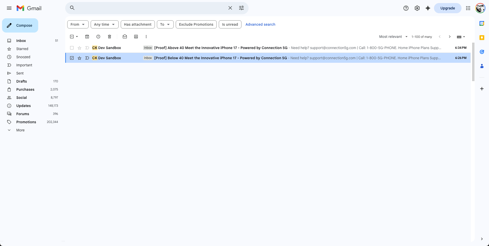

# 이메일 테스트

## 학습 목표

이 단원을 마치면 다음과 같은 작업을 수행할 수 있습니다.

- Adobe Journey Optimizer 이메일 편집기에서 증명 이메일을 전송합니다.
- 증명 이메일을 사용하여 개인화된 콘텐츠 및 조건부 변형의 유효성을 검사합니다.
- 스팸 및 잘린 메시지 처리를 포함하여 받은 편지함에서 증명 이메일 게재를 확인합니다.
- Adobe Journey Optimizer 내에서 증명 게재 로그, 타임스탬프 및 변형을 검토합니다.
- 이메일 콘텐츠가 정확하고 개인화되었으며 활성화 준비가 되었는지 확인합니다.

## 증명 이메일 보내기(선택 사항이지만 권장됨)

이 시점에서 프로필 속성을 개인화할 수 있을 뿐만 아니라 속성을 사용하여 표시할 콘텐츠를 결정하는 조건부 논리를 만들 수 있다는 것을 배웠습니다. Adobe Journey Optimizer은 매우 강력하고 마케터에게 많은 유연성을 제공합니다.

1. **콘텐츠 시뮬레이션**&#x200B;을 클릭합니다.
2. **콘텐츠 변형 시뮬레이션**&#x200B;을 선택합니다.

시뮬레이션 패널이 열립니다.

3. **증명 보내기**&#x200B;를 클릭합니다.

4. 개인 이메일 주소를 추가합니다.

>[!NOTE]
>
>회사 이메일이 샌드박스에서 이메일을 차단하는 경우가 가끔 있습니다. 개인 이메일을 사용하는 것이 좋습니다.

5. 두 변형을 모두 선택합니다.
6. 제목 줄 접두사 추가
   1. 변형 1: 40 이상
   2. 변형 2: 40 미만
7. **증명 보내기**&#x200B;를 클릭합니다. 녹색 확인 메시지 &quot;**증명을 보냈습니다**&quot;가 표시됩니다.

두 이메일이 받은 편지함에 도착했는지 확인합니다.

>[!NOTE]
>
>필터에 따라 증명 이메일이 **스팸**&#x200B;에 도착할 수 있습니다.

잘린 메시지가 표시될 수 있지만 일부 바닥글 링크가 실제가 아니므로 괜찮습니다. 링크를 클릭하면 변형이 포함된 두 이메일이 모두 전달되었음을 알 수 있습니다.

### AJO에서 증명 게재 확인

마지막으로 Adobe Journey Optimizer에서도 증명 전달을 볼 수 있습니다.

1. 이메일 편집기로 돌아갑니다.
2. 전자 메일 만들기 화면으로 돌아가서 **증명 보기**&#x200B;를 클릭합니다.
3. 게재 로그, 타임스탬프 및 전송된 변형을 검토합니다.

증명 이메일 세부 정보가 표시됩니다.

## 요약

이 단원에서는 다음과 같은 작업을 성공적으로 수행합니다.

- AJO에서 보내고 확인한 증명 이메일

이제 전체 연결 5G AJO 랩 여정을 완료했으며 이메일이 정확하고 개인화되었으며 활성화 준비가 되었음을 확인했습니다.
