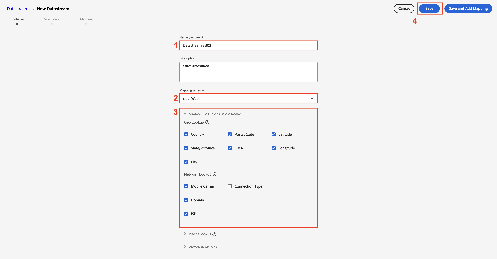

# 데이터 스트림 만들기

## 학습 목표

Edge 이벤트 처리를 활성화하는 데 필요한 서비스를 사용하여 데이터 스트림을 만들고 구성합니다.

데이터 스트림은 이를 활용할 서비스를 정의합니다.

- Edge에 데이터를 전송할 때 사용할 데이터 스트림을 지정합니다
- 그런 다음 이러한 데이터 스트림으로 전송된 데이터는 구성된 서비스에 따라 조치를 취할 수 있습니다
  - Adobe Experience Platform

## 새 데이터 스트림 만들기

1. **데이터 수집** 아래의 왼쪽 레일에서 **데이터스트림**&#x200B;을 클릭합니다.
1. 그런 다음 **새 데이터 스트림**&#x200B;을 클릭하여 데이터 스트림을 만듭니다.

새 데이터스트림 단추가 강조 표시된 

## 데이터스트림 구성

다음 정보로 데이터 스트림을 구성합니다.

1. 이름 -> **데이터스트림 SB + \&lt;샌드박스 이름>(예: 데이터스트림 SB01)**
1. 매핑 스키마 -> **dep: 웹**
1. 이 정보를 캡처하려면 **지리적 위치 및 네트워크 조회**&#x200B;에서 모든 옵션을 **켜짐**&#x200B;합니다.
1. 완료되면 **저장** 단추를 클릭하십시오.

>[!WARNING]
>
>저장 및 매핑 추가를 클릭하지 마십시오.  실수로 취소한 경우

데이터스트림을 저장하면 다음 화면이 표시됩니다.

## Adobe Experience Platform 서비스 추가

이렇게 하면 허브에 데이터를 보내고 이 데이터 스트림에서 받은 데이터에 대해 데이터 세트에 연결할 수 있습니다.

1. 화면 중간에 있는 파란색 **서비스 추가** 단추를 클릭합니다

   

2. 다음 항목을 구성합니다.
   - **서비스** -> `Adobe Experience Platform`
   - **이벤트 데이터 세트** -> `dep: Web`
   - **프로필 데이터 세트** -> `dep: Customer Account`
   - **확인란 선택** -> `Offer Decisioning`
   - **확인란 선택** -> `Adobe Journey Optimizer`
3. 완료되면 **저장** 클릭

이벤트 및 프로필 데이터 세트 필드가 있는 

이제 서비스가 데이터 스트림에 추가된 것을 볼 수 있습니다

**로컬 컴퓨터에**&#x200B;데이터 스트림 ID **를** 복사&#x200B;**저장**&#x200B;합니다(나중에 Postman에서 사용됨).

## 요약

Adobe Experience Platform 서비스가 구성된 작동하는 데이터 스트림이 있어야 합니다.
