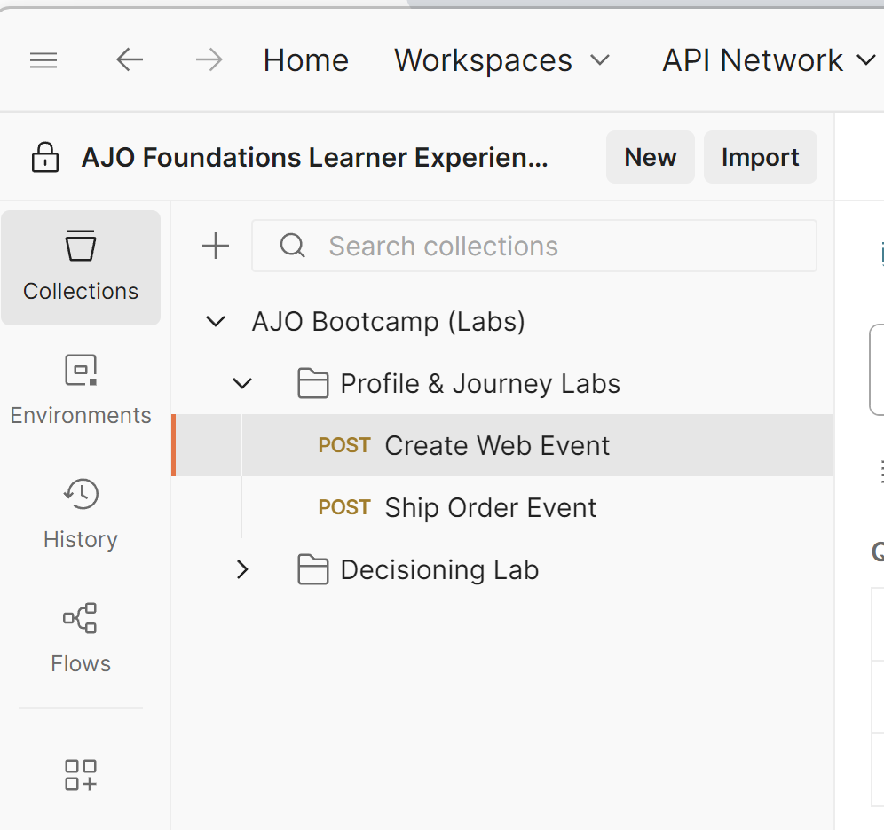

# Edge 웹 이벤트 보내기

## 학습 목표

API를 사용하여 시뮬레이션된 웹 이벤트를 Adobe Edge Network로 전송합니다.

로드되어 AEP Edge으로 전송되는 웹 페이지를 시뮬레이션하려면 만든 데이터 스트림에 Postman 호출을 전송합니다.

OAuth 토큰이 없는 이벤트에서 전송됩니다.  이 실습을 수행하려면 컴퓨터에서 Postman이 열려 있어야 합니다.

>[!NOTE]
>
>인증된 토큰을 전달하지 않으므로 속성을 다시 가져올 수 없습니다.

## 랩 기대

1. Edge을 히트할 경험 이벤트
1. 데이터 스트림 구성
1. AEP 서비스를 사용하기 위한 데이터 스트림 구성
   1. 실행할 Edge 대상
   2. 허브에 이벤트 보내기
1. Edge 대상을 포함하는 Postman 응답(하지만 속성은 없음)
1. 이벤트를 받고 이벤트 프로필 조각을 추가할 프로필 스토어
1. 관계를 추가할 ID 저장소
1. 데이터를 받고 데이터 레이크에 저장할 데이터 세트

## Postman 환경 변수 업데이트

API 요청을 실행하려면 먼저 데이터 스트림 ID를 Postman 변수 환경에 추가해야 합니다. 다음 값을 취합하여 시작합니다.

### 데이터 스트림 ID 수집

1. 이미 **데이터 스트림 ID**&#x200B;가 있어야 합니다.

>[!NOTE]
>
>**데이터 스트림 ID가 손실된 경우**
>
>1. 왼쪽 레일에서 **데이터스트림**(데이터 수집 제목 아래)을 클릭합니다.
>2. 데이터 스트림을 선택하고 **데이터 스트림 ID** 값을 복사합니다.
>
>

### 호출로 이동

1. **Postman 왼쪽 사이드바** -> `Collections`
1. **컬렉션** -> `AJO Bootcamp (Labs)`
1. **폴더** -> `Profile & Journey Labs`
1. **API 요청** -> `Create Web Event`

### DATASTREAM\_CONFIG 변수 업데이트

1. 오른쪽 상단의 **요청의 변수**&#x200B;를 클릭합니다.

   Postman 도구 모음의 

2. 페이지의 첫 번째 단계에서 **DATASTREAM_CONFIG** **Value**&#x200B;을(를) **데이터스트림 ID**(으)로 업데이트합니다.

   

3. 업데이트 **저장**(ctrl+s 또는 command+s)
4. 환경 사이드바의 오른쪽 위 모서리에 있는 &#39;**X**&#39;을 클릭하여 사이드바를 닫습니다

   

5. 이제 모든 변수가 파란색이고 환경에 값이 있으므로 **웹 이벤트 만들기** 요청을 보낼 준비가 되었습니다.

## API 실행

**보내기** 단추를 클릭하여 요청을 실행합니다.

응답은 다음과 같습니다.

응답에서 다시 돌아오는 것을 보는 것은 다음과 같은 핵심적인 것입니다.

- 200 OK 응답은 Edge Network이 데이터를 성공적으로 보내고 수락했음을 의미합니다

## 요약

이벤트가 정상적으로 Edge Network에 전송되고 수락되었습니다.
