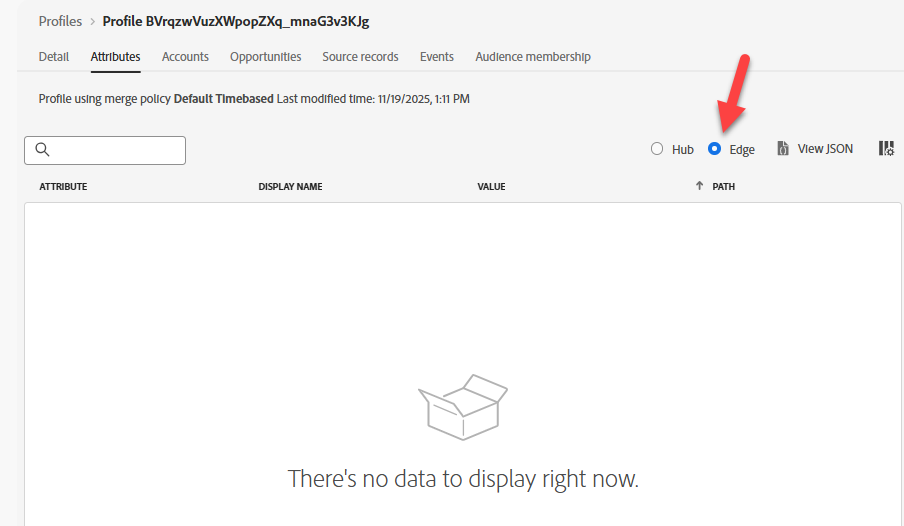
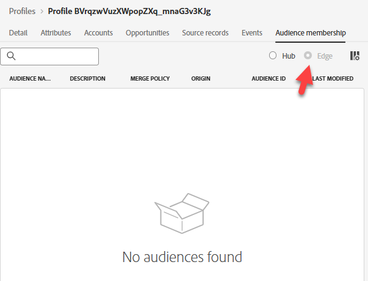

# Edge에서 프로필 유효성 검사

## 학습 목표

Edge 네트워크 프로필 저장소에 프로필이 존재하지 않는지 확인합니다.

## Edge 프로필 확인

1. **특성** 탭과 **Edge** 라디오 단추를 클릭하여 Edge 프로필을 확인합니다

>[!NOTE]
>
>경과된 시간에 따라 ID로만 구성된 프로필의 &quot;제거된&quot; 버전을 볼 수도 있습니다.

2. 대상자 멤버십 탭을 클릭합니다.  **blank**&#x200B;이(가) 됩니다.

>[!NOTE]
>
>**Edge 멤버십이 없는 이유는 무엇입니까?**
>
>**dep: 모든 이벤트 Edge(시간 내)** 자격을 보았어야 하지 않습니까?
>
>Edge 평가를 받는 대상이 있어도 아직 그럴 이유가 없으므로 Edge에 해당 대상이 존재하지 않습니다.
>
>해당 대상(예: 의사 결정 또는 대상)을 사용하려는 경우 대상 규칙이 Edge으로 푸시되고 다음에 이벤트가 Edge으로 스트리밍되면 해당 대상을 평가합니다.
>
>또한 Edge 세그멘테이션 서비스를 켜지 않았습니다.

## 요약

프로필이 Edge에 없습니다(아직).
