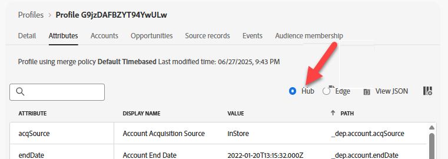

# 허브에서 프로필 유효성 검사

## 학습 목표

이벤트가 Hub의 실시간 프로필에서 프로필 업데이트 및 세그먼트 자격을 제공했는지 확인합니다.

## Hub에서 프로필 조회

Adobe Experience Platform에서 방금 Edge Network으로 보낸 이벤트에서 방금 전송한 프로필을 찾습니다.

1. 다음 정보를 사용하여 조회를 수행하려면 **고객** -> **프로필** -> **찾아보기**(으)로 이동하십시오.
   - **병합 정책** -> `Default Timebased`
   - **ID 네임스페이스** -> `Email`
   - **ID 값** -> `henry.creel@emailsim.io`
1. **보기**&#x200B;를 클릭하여 프로필 조회


## Hub 프로필 확인

1. 프로필을 열려면 **프로필 ID**&#x200B;를 클릭하십시오.
1. 먼저 **특성** 탭을 클릭하고 **허브** 라디오 단추를 클릭하여 **허브 프로필**&#x200B;을 확인하세요.




## 이벤트 유효성 검사

1. 위쪽 탐색에서 **이벤트**&#x200B;를 클릭하면 방금 보낸 이벤트를 볼 수 있습니다

프로필에 스트리밍된 이벤트를 표시하는 

## 세그먼트 유효성 검사

### JSON을 통해

1. **특성** 헤더를 클릭하고 **JSON** 보기


&#x200B;2. **segmentMembership**&#x200B;을(를) 찾습니다.  다음과 같아야 합니다(ID가 달라짐).

```json
  "segmentMembership": {
    "ups": {
      "ce0b8386-ef2a-4244-8ad0-1a72d6494181": {
        "status": "realized",
        "lastQualificationTime": "2025-12-15T23:11:49Z"
      },
      "8ce516fe-920a-4f9d-b92b-0403890a8491": {
        "status": "realized",
        "lastQualificationTime": "2025-12-12T15:01:01Z"
      }
    }
```

>[!NOTE]
>
>**segmentMembership을 읽는 방법**
>
>[https://experienceleague.adobe.com/en/docs/experience-platform/xdm/field-groups/profile/segmentation](https://experienceleague.adobe.com/en/docs/experience-platform/xdm/field-groups/profile/segmentation)
>
>**ups:** AEP에서 지원하는 다양한 종류의 대상을 위한 맵 키입니다.  ups 키에는 규칙 빌더에서 생성된 대상자가 포함되어 있습니다.  다른 대상은 다른 키(예: AAM)에 포함됩니다.
>
>**lastQualificationTime** 이 프로필이 세그먼트에 대해 마지막으로 자격이 부여된 타임스탬프입니다.
>
>**상태**
>
>*실현됨*: 프로필이 세그먼트에 적합합니다.
>*종료됨*: 프로필이 현재 요청의 일부로 세그먼트를 종료합니다.
>
>

### UI를 통해

1. **대상자 멤버십** 탭을 보면 프로필의 유효성을 보다 쉽게 확인할 수 있습니다(다음 항목 이상이 표시되어야 함).
   - dep: 모든 이벤트 스트리밍(시간 내)
   - dep: 모든 이벤트 Edge(시간 내)


>[!NOTE]
>
>**일괄 처리 대상이 없는 이유는 무엇입니까?**
>
>데이터를 스트리밍하고 일괄 평가가 하루에 한 번 수행되므로 **dep: 모든 이벤트 일괄 처리(하루 이내)**&#x200B;가 적격입니다.

## 요약

프로필이 허브에 있으며 예상 대상에 대해 자격이 있습니다.
