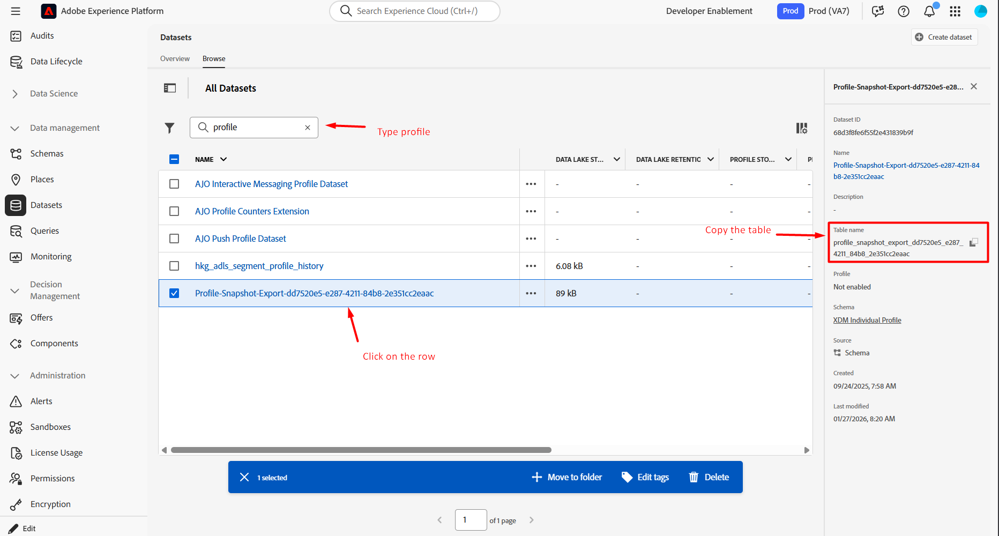

# 프로필 스냅숏 유효성 검사

## 학습 목표

프로필이 프로필 스냅샷 데이터 세트에 아직 표시되지 않는지 확인합니다.

## 프로필 스냅샷 데이터 세트 사용

1. 데이터 관리 섹션 아래의 왼쪽 탐색에서 **데이터 세트**&#x200B;를 클릭한 다음 상단 레일에 있는 **찾아보기 탭**&#x200B;을 클릭합니다

   

2. **검색 상자**&#x200B;에서 `profile`을(를) 입력한 다음 **Profile-Snapshot...&quot;이라는 제목으로 행을 클릭**&#x200B;합니다.   오른쪽 레일 **테이블 이름을 복사**&#x200B;하여 다음 단계에서 참조할 수 있는 위치에 붙여 넣습니다.

   >[!NOTE]
   >
   >&quot;프로필 스냅샷...&quot;이 표시되지 않으면 필터를 지워야 할 수도 있습니다. 데이터 세트.


   

3. 쿼리 편집기로 돌아가서 아래 SQL을 복사하여 편집기에 붙여 넣습니다.

   ```sql
   select
     identityMap,
     segmentID,
     segmentMembershipUps[segmentID] ['lastQualificationTime'],
     segmentMembershipUps[segmentID] ['status'],
     current_timestamp
   from
     (
    select
      identityMap,
      explode (map_keys (segmentMembership['ups'])) as segmentID,
      segmentMembership['ups'] as segmentMembershipUps
    from
   
    where
      map_keys (segmentMembership['ups']) is not null
    limit 100
     )
     --where identityMap['email'][0].id = 'henry.creel@emailsim.io'
     limit 50
   ```

4. 아래 요약된 대로 테이블 이름 및 이메일 주소를 업데이트합니다.
   - **14행의 테이블 이름:** `from`과(와) `where` 사이의 프로필 스냅숏 테이블에 대한 테이블 이름을 복사하여 붙여 넣으십시오
   - **전자 메일 주소:** 지금은 웹 이벤트에서 보낼 때 사용한 것과 동일한 전자 메일 주소를 19행에 입력하세요(변경하지 않은 경우 henry.creel\@emailsim.io를 사용함).
     - 현재 이 내용에 대해서는 주석을 달았습니다(그대로 두십시오). 쿼리가 실행되어 헨리를 찾으면 그를 찾을 수 없습니다.

   

5. 왼쪽 상단의 화살표를 클릭하여 쿼리를 **실행**
6. 결과는 아래와 같습니다 (그러나 헨리를 찾으면 그를 찾을 수 없습니다)


>[!NOTE]
>
>**Henry에 대한 결과가 없는 이유는 무엇입니까?**
>
>**미리 알림**: 프로필 스냅숏은 **특정 시점**&#x200B;에 프로필에 존재했던 **리플렉션** 또는 스냅숏입니다. 작업은 **매일**&#x200B;실행되며 AJO과 같은 다운스트림 용도로 사용됩니다. 이 데이터에서 스트리밍했으므로 프로필 스냅숏에는 아직 데이터가 없습니다.  내일 있을 거예요

## 요약

스냅샷 데이터 세트는 즉시 업데이트되는 것이 아니라 예약된 일괄 처리 프로세스에서 업데이트됩니다.
