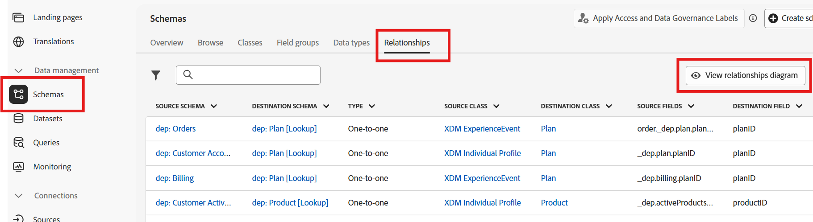

# 스키마 찾아보기

## 목표

다음 단계 집합에서 UI를 탐색하여 스키마 및 스키마 관계를 확인합니다.  캠페인을 구축할 때 사용할 수 있는 스키마 및 관계를 잘 알고 있어야 합니다.

## 스키마 보기

당신을 위해 이미 커넥션 5G 관계형 데이터 모델이 구축되었습니다. UI에서 **스키마 -> 찾아보기** 페이지로 이동하면 직접 스키마를 볼 수 있습니다.

모든 스키마를 보려면 검색 상자에 `dep-rel`을(를) 입력하십시오.

>[!NOTE]
>
>모든 스키마의 유형은 *관계형*&#x200B;입니다.

## 관계 다이어그램 보기

관계형 XDM 스키마를 사용하면 스키마를 선택하고 관계 다이어그램 보기 버튼을 클릭하여 엔티티 관계 다이어그램(ERD)을 쉽게 볼 수 있습니다.

다음을 수행합니다.

1. **관계** 탭을 클릭한 다음 **관계 다이어그램 보기** 단추를 클릭합니다

2. **스키마 선택** 클릭
3. 팝업에서 `dep-rel: Customer Account`을(를) 선택한 다음 **확인**&#x200B;을 클릭합니다

4. ERD에서 **3개 점**&#x200B;을 클릭하고 **관련 엔터티 표시**&#x200B;를 선택합니다.

5. dep-rel: 고객 계정과 직접 관련된 모든 테이블을 사용하여 ERD를 봅니다. 선택적으로 ERD를 PNG 파일로 다운로드할 수 있습니다.

>[!TIP]
>
>?!

## 요약

이제 스키마 및 관계 UI 탐색이 얼마나 쉬운지 확인했습니다.  특정 스키마를 선택하고 관계로 이동하여 Campaign 오케스트레이션에서 데이터를 이해하고 사용하는 데 도움이 될 수 있습니다.

관심 있는 경우 [여기](https://experienceleague.adobe.com/en/docs/journey-optimizer/using/data-management/get-started-schemas)에서 더 읽을 수 있습니다.
