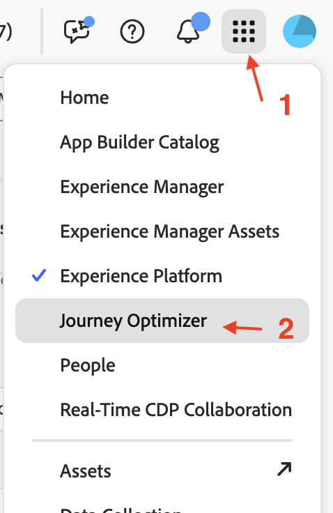
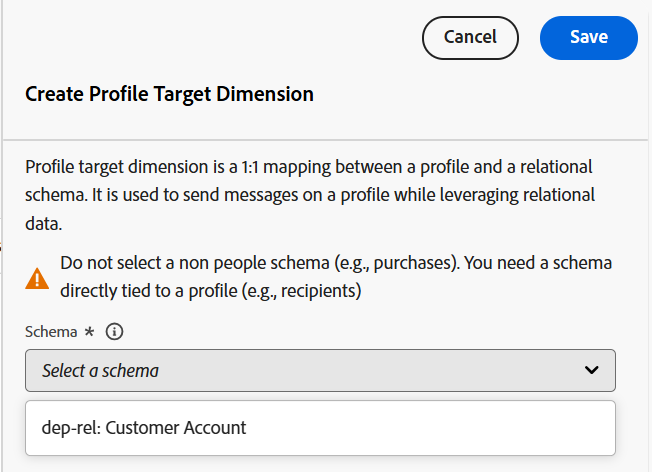
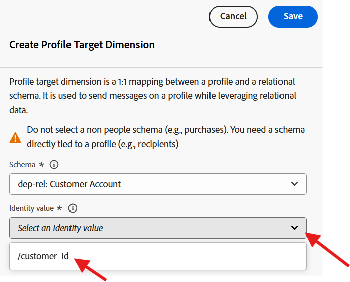

# 프로필 대상 Dimension

## 목표

다음 단계 세트에서 UI를 탐색하여 스키마를 보고 ID를 설정합니다. 그런 다음 프로필 대상 Dimension을 설정합니다. 이 유형은 캠페인이 타겟팅하고 게재할 AEP 프로필과 조정하는 엔티티 유형입니다.

## 이 구성이 중요한 이유

프로필 대상 Dimension을 사용하여 실시간 고객 프로필과 관계 스토어 간 데이터를 조인하는 방법을 Adobe Journey Optimizer에 알려 줍니다. 이 구성의 구성 요소는 다음과 같습니다.

- 관계형 스키마
- 관계형 스키마의 단일 필드
- 해당 필드에 연결된 ID 네임스페이스

>[!CAUTION]
>
>대상자를 읽거나 공유하거나 오케스트레이션된 캠페인에서 메시지를 보내려면 먼저 이 구성을 사용해야 합니다

## ID 레이블 지정

1. **앱** 아이콘을 클릭하고 **Journey Optimizer** 선택

   

2. 데이터 관리 메뉴에서 **스키마**&#x200B;를 클릭하고 **찾아보기** 탭을 선택했는지 확인하십시오.
3. 이름이 `dep-rel: Customer Account`인 스키마 검색

   

4. 이름을 클릭하여 스키마를 연 다음 **customer\_id** 필드를 클릭합니다.

   

5. 오른쪽 레일에서 **ID**, **확인란을 선택하고**&#x200B;라는 ID 네임스페이스를 선택합니다. **customerID**

   

6. 스키마를 저장하려면 **저장** 단추를 클릭하십시오. 확인 메시지가 표시됩니다
7. 스키마 UI를 종료하려면 왼쪽 레일에서 **취소** 단추 또는 **스키마**&#x200B;를 클릭하십시오.

>[!CAUTION]
>
>ID 레이블을 추가한 후 스키마를 저장하지 않으면 다음 구성 단계 세트가 작동하지 않습니다

>[!NOTE]
>
>저장 후 몇 분(5분 미만) 정도 걸린 후 다음 단계에서 프로필 대상 Dimension 드롭다운에 표시됩니다.

## 프로필 대상 Dimension 만들기

1. **관리**&#x200B;에서 **구성**&#x200B;을 클릭합니다.

   

2. **프로필 대상 Dimension**&#x200B;을(를) 선택하고 **관리**&#x200B;를 클릭합니다.

   

3. 프로필 대상 Dimension 창이 열리고 **만들기**&#x200B;를 클릭합니다.

   

4. 드롭다운에서 스키마 `dep-rel: Customer Account`을(를) 선택합니다.

   >[!NOTE]
   >
   >ID를 표시한 후 스키마가 이 화면에 표시되는 데 몇 분 정도 걸릴 수 있습니다. 페이지를 새로 고치고 스키마가 나타날 때까지 앞의 두 단계를 반복합니다.

   

5. **ID 값**&#x200B;에 대해 `/customer_id`을(를) 선택합니다.

   /customer_id가 선택된 

   >[!NOTE]
   >
   >관계형 스키마에는 ID로 레이블이 지정된 필드가 많을 수 있으므로 목록 상자입니다.

6. 프로필 대상 Dimension을 만들려면 **저장** 단추를 클릭하십시오. 그런 다음 레코드가 나타납니다.

>[!NOTE]
>
>생성된 레코드의 이름은 스키마 이름 *(dep-rel: Customer Account)*&#x200B;과(와) ID *(customer\_id)*(으)로 레이블이 지정된 필드의 연결입니다.

>[!SUCCESS]
>
>축하합니다! 랩에서 프로필 대상 Dimension 만들기 단계를 완료합니다.

## 요약

이제 스키마를 탐색하고, 속성을 ID로 표시하고, 프로필 대상 Dimension을 만드는 것이 얼마나 쉬운지 확인했습니다.

관심 있는 경우 [여기](https://experienceleague.adobe.com/en/docs/journey-optimizer/using/campaigns/orchestrated-campaigns/data-configuration/target-dimension)에서 더 읽을 수 있습니다.
