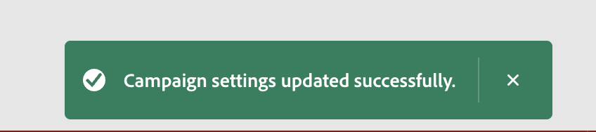
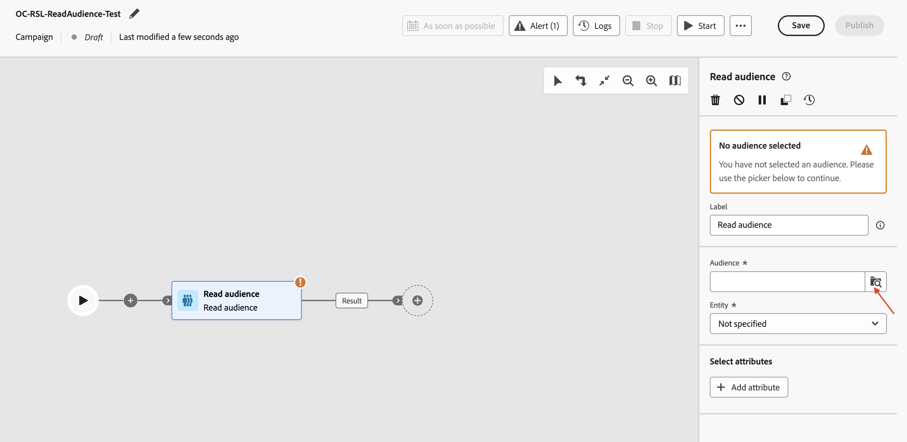
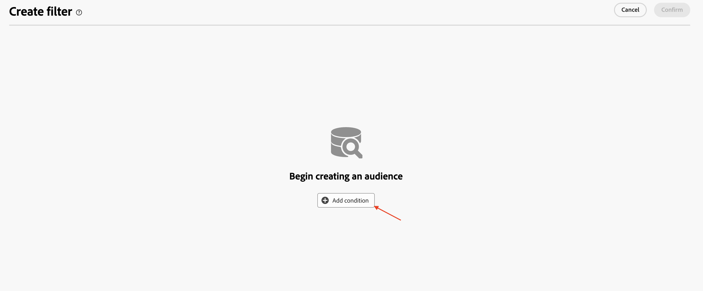
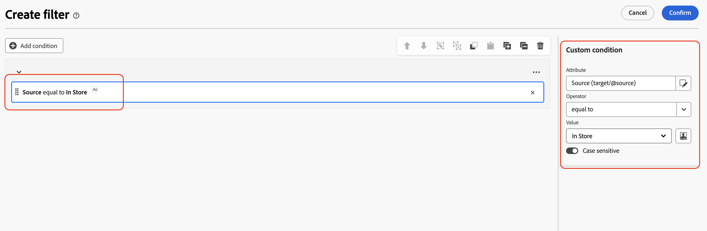
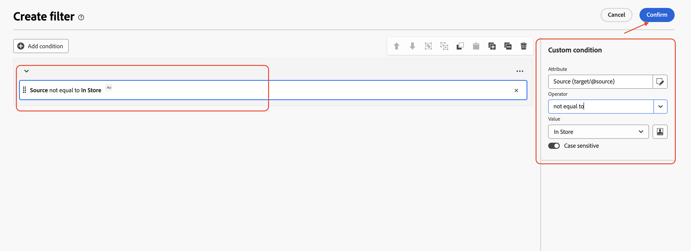

# 대상자 읽기

## 목표

다음 단계 세트에서는 AEP에서 대상을 읽고 이전에 만든 프로필 대상 Dimension과 함께 사용하기 위한 캠페인을 만듭니다. 분할 활동을 사용하여 조건에 따라 데이터를 분할합니다. 마지막으로 캠페인을 테스트하여 관계형 스키마와 함께 사용할 때 이러한 대상자가 작동하는 방식을 이해합니다.

## 대상자 읽기

이 실습에서는 데이터 강화를 위한 관계형 스키마와 함께 대상자 읽기 활동을 사용하는 방법에 대해 설명합니다.

오케스트레이션된 Campaign은 모든 활동에 관계형 스키마를 사용합니다. AEP에서 대상을 읽는 대상 읽기 활동을 사용할 때 해당 엔티티(Target Dimension)는 대상을 Campaign Target Dimension과 조정하도록 구성해야 합니다.

## 캠페인 만들기

1. 왼쪽 레일에서 **캠페인**&#x200B;을 클릭합니다.

   

2. **캠페인 만들기**&#x200B;를 클릭합니다.

   

3. **오케스트레이션 - 마케팅**&#x200B;을 선택하고 **확인**&#x200B;을 클릭합니다.

   

4. 다음과 같이 캠페인 세부 정보를 입력한 다음 **저장 단추**&#x200B;를 클릭하십시오.
   - 이름: **OC-RSL-ReadAudience-Test**
   - 설명: **RSL-Read 대상 테스트**

   

5. 확인 메시지 대기

## 대상자 읽기 활동 추가

1. 캔버스 안의 **+**&#x200B;을(를) 클릭하여 옵션 메뉴를 연 다음 **타깃팅 활동**&#x200B;에서 **대상 읽기**&#x200B;를 선택합니다.

   

2. **대상자 읽기** 세부 정보 창에서 **대상자**&#x200B;에 대한 검색 아이콘을 클릭합니다

   

3. 프로필 수가 **9**&#x200B;인 **dep: 기본 계획 구성원** 대상을 선택하고 **대상 추가**&#x200B;를 클릭합니다.

   인 기본 계획 구성원 대상자가 선택됨

4. 그런 다음 **엔티티**&#x200B;에 대한 드롭다운을 클릭하고 `dep-rel: Customer Account - customer_id` 캠페인 대상 Dimension을 선택합니다.

고객 계정 대상 Dimension이 선택된 

>[!NOTE]
>
>**특성 추가** 단추를 사용하여 캔버스에서 사용할 AEP 프로필에서 다른 특성을 추출할 수도 있습니다. 그러나 이 실습의 경우 추가 속성이 필요하지 않으므로 단계를 건너뜁니다.

## 캠페인 테스트

1. **대상자 읽기** 활동에 대한 설정이 입력되었습니다. **테스트 모드**&#x200B;에서 캠페인을 실행하려면 **시작**&#x200B;을 클릭하세요.

   

   >[!NOTE]
   >
   >실행하는 데 몇 분 정도 소요됩니다.
   >
   >테스트 모드를 사용하면 캠페인 실행에서 각 활동의 결과와 함께 해당 동작을 확인하고 모니터링할 수 있습니다. 활동은 캔버스의 끝까지 순차적으로 실행됩니다.

2. 테스트 실행이 시작되고 완료되면 결과가 표시됩니다. 실행 결과를 보려면 **결과** 노드를 클릭한 다음 결과를 미리 봅니다

   

3. **대상자 읽기**&#x200B;의 **2**(9개 중)개 프로필에 관계형 스키마의 일치하는 **대상 차원**&#x200B;이(가) 없습니다(즉, 프로필 저장소에는 있지만 관계형 저장소에는 없음). 그리고 오케스트레이션된 Campaign은 관계형 스키마에서 작동하므로 **대상자 읽기**&#x200B;에서 일치하지 않는 `customer_id`(**2**)이 삭제되고 이 경우 *일치하는* **7**&#x200B;만 캠페인의 **관계형 데이터**&#x200B;를 활용하는 후속 활동에서 사용할 수 있습니다

   

   >[!NOTE]
   >
   >다음 단계에서는 관계형 데이터를 사용하여 일치하지 않는 `customer_id` 삭제에 대한 위의 설명을 확인합니다.

4. 캠페인의 **테스트 모드**&#x200B;를 중지하려면 **중지**&#x200B;를 클릭하십시오.

   

5. 흐름 끝에서 **+**&#x200B;을(를) 클릭하고 **타깃팅 활동**&#x200B;에서 **분할**&#x200B;을(를) 추가합니다.

   

6. **분할** 활동의 세부 정보 창에서 **하위 집합**&#x200B;이라는 첫 번째 분할을 확장합니다.

   

7. 이름을 &quot;**스토어에서**&quot;(으)로 변경하고 **필터 만들기**&#x200B;를 클릭하여 필터 조건을 설정합니다.

   

8. **필터 만들기** 창에서 **조건 추가**&#x200B;를 클릭합니다.

   

9. AEP 프로필에서 다른 특성을 추출하지 않았기 때문에 여기에서 사용할 수 있는 유일한 AEP 프로필 특성은 `Customer ID`입니다. 그러나 일치하는 대상 차원에 해당하는 관계형 저장소의 열은 필터 조건을 설정하는 데 사용할 수 있습니다. **>**&#x200B;을(를) 클릭하여 **타깃팅 차원**&#x200B;을(를) 확장합니다.

   

10. 목록에서 `Source`을(를) 선택하고 **확인**&#x200B;을 클릭합니다.

&#x200B;11. Source 열에 대한 개별 값은 드롭다운에서 사용할 수 있습니다. **사용자 지정 조건**&#x200B;에 대해 드롭다운에서 &quot;**&quot; 저장소의**&quot;을(를) 선택하고 **확인**&#x200B;을(를) 클릭하여 종료합니다.

(으)로 설정됨

&#x200B;12. **분할** 활동의 세부 정보 창으로 돌아가면 첫 번째 분할에 대한 설정이 완료됩니다. 두 번째 분할에 **세그먼트 추가**&#x200B;를 클릭합니다.

이름이 **Result**&#x200B;인 새 세그먼트가 만들어집니다

&#x200B;13. 필터 조건을 설정하려면 &quot;**결과**&quot;의 이름을 &quot;**저장소에 없음**&quot;(으)로 변경하고 **필터 만들기**&#x200B;를 클릭하십시오.

![필터 옵션을 사용하여 [저장소에 없음]으로 이름이 변경된 세그먼트](assets/read-an-audience-rename-not-in-store-segment.png)

&#x200B;14. **필터 만들기** 창에서 **조건 추가**&#x200B;를 클릭합니다. 위와 동일한 방법을 따르고 **>**&#x200B;을(를) 클릭하여 **타깃팅 차원**&#x200B;을(를) 확장한 다음 목록에서 `Source`을(를) 선택하고 **확인**&#x200B;을(를) 클릭합니다

&#x200B;15. **사용자 지정 조건**&#x200B;의 경우 드롭다운에서 &quot;**&quot; 저장소의**&quot;를 선택하고 연산자의 경우 &quot;**같지 않음**&quot;을 선택합니다. 종료하려면 **확인**&#x200B;을 클릭하세요.

&#x200B;16. **분할** 활동의 세부 정보 창으로 돌아가면 두 분할에 대한 설정이 완료됩니다. **테스트 모드**&#x200B;에서 캠페인을 실행하려면 **시작**&#x200B;을 클릭하세요.

&#x200B;17. 테스트 실행이 시작되고 완료 시 결과가 표시됩니다. 관계형 스키마에서 일치하는 대상 차원이 **7**&#x200B;뿐이므로 분할 작업(**7** 및 **0**) 후에도 동일한 카운트가 관찰됩니다

의 개수를 표시하는 분할 활동 결과

&#x200B;18. 각 결과 상자를 클릭하고 결과를 보려면 **결과 미리 보기**&#x200B;를 클릭하십시오.

&#x200B;19. 캠페인의 **테스트 모드**&#x200B;를 중지하려면 **중지**&#x200B;를 클릭하십시오.

>[!NOTE]
>
>대상자 읽기에 **9**&#x200B;개의 프로필이 표시되었습니다. Source에서 필터를 빌드했으며 Source 필드가 관계형 저장소에 있으므로 이를 확인하려면 관계형 저장소에 프로필 저장소를 참여해야 합니다. Campaign Target Dimension을 통해 관계형 스키마에 가입하면 총 **7**&#x200B;개의 프로필만 일치합니다. 일치하는 이 **7** 고객 ID는 관계형 데이터를 사용하려는 다음 활동에서 사용할 수 있습니다. 모든 **7** 고객 ID의 `Source`이(가) **&quot;In Store&quot;**(으)로 설정되어 있습니다. 이는 분할 흐름을 통해 명백합니다.
>
>따라서 데이터 강화를 위해 AEP 프로필과 관련 프로필을 함께 사용할 때는 데이터 일관성을 유지하는 것이 중요합니다.

>[!SUCCESS]
>
>축하합니다. 이로써 관계형 스키마와 함께 대상 읽기 활동 사용에 대한 실습이 완료됩니다.

## 요약

이제 Campaign을 만들고, 대상 읽기 활동을 프로필 대상 Dimension과 함께 수행하여 관계형 스키마를 사용하는 것을 보았습니다. 분할 활동을 사용하여 조건에 따라 대상자를 분할했습니다. 마지막으로 테스트 모드는 프로필과 관계형 스키마 간의 데이터 일관성이 중요하다는 것을 이해하는 데 도움이 되었습니다.

관심 있는 경우 [여기](https://experienceleague.adobe.com/ko/docs/journey-optimizer/using/campaigns/orchestrated-campaigns/design-campaigns/read-audience)에서 더 읽을 수 있습니다.
