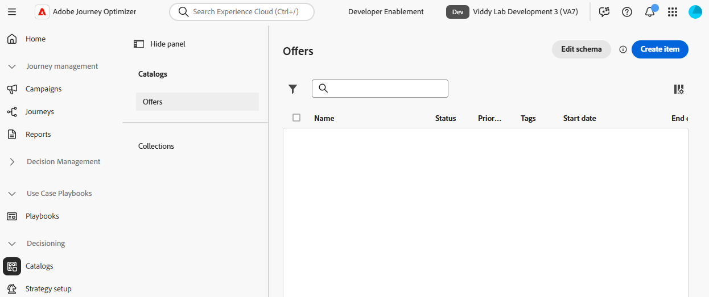
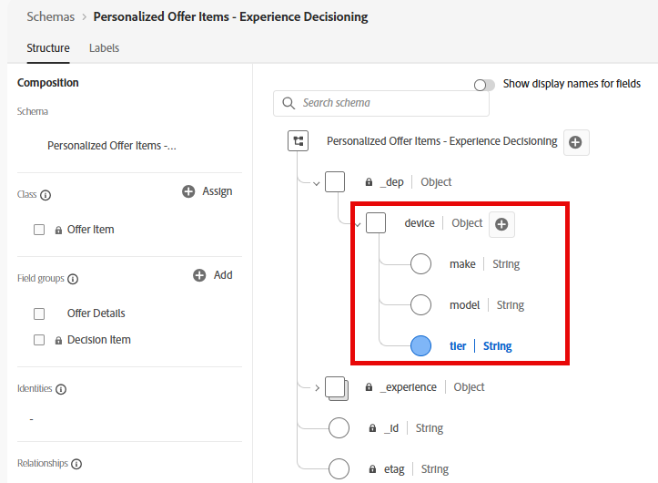
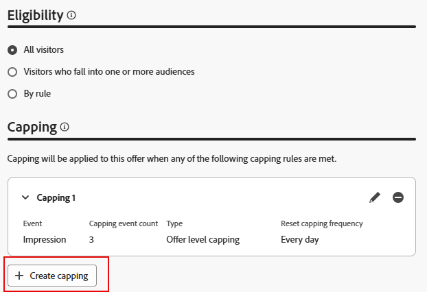

# 오퍼 항목 만들기

## 목표

이 섹션에서는 CBE(코드 기반 경험)가 요청 클라이언트에게 반환할 실제 오퍼 항목을 만듭니다. 오퍼 항목 중 일부는 자격 요건 및 빈도 제한이 있지만, 다른 항목은 그렇지 않습니다.

## 시나리오 개요

그러나 오퍼 항목을 만들기 전에 시나리오에 대한 몇 가지 빠른 미리 알림이 있습니다. 먼저, 시나리오에는 Ultra, Pro 및 Base의 3가지 iPhone 17 계층이 있습니다. 각 계층에 대해 1개씩 총 4개의 오퍼와 수신 시스템에서 모든 계층에 걸쳐 iPhone 17에 대한 일반 정보를 표시하는 데 사용할 수 있는 일반 대체 오퍼를 만듭니다.

둘째, 플랜 ID가 2 또는 3인 고객만 Ultra 및 Pro 계층 휴대폰을 사용할 수 있습니다.

다음으로, 그 회사는 다음 하위 계층 전화기가 제시되기 전에 하루에 세 번만 각각의 오퍼를 보여줄 것을 요청했습니다.

마지막으로, Connection 5G는 Ultra Tier를 판매하고 Pro를 판매한 다음 기본 모델을 판매하는 것을 선호합니다. 따라서 각 오퍼 항목에 우선 순위 점수를 부여하면 이러한 우선 순위가 표시됩니다.

## 기본/대체 오퍼 항목 만들기

처음 만드는 가장 쉬운 오퍼 항목은 대체 오퍼이며, 누구나 무제한 기간 동안 볼 수 있습니다.

1. 필요한 경우 왼쪽 레일에서 **의사 결정**&#x200B;을 확장하고 **카탈로그**&#x200B;를 클릭합니다
2. 빈 오퍼 페이지가 표시됩니다.

   

3. 파란색 **항목 만들기** 단추를 클릭합니다. &#39;오퍼 항목 만들기&#39; 페이지가 열립니다.
4. &#39;오퍼 이름&#39; 필드에 **iphone:17\:generic** 텍스트를 입력합니다. 원할 경우 설명을 입력합니다.

   >[!NOTE]
   >
   >소문자로, 콜론으로 구분된 명명 규칙은 실제 고객에게 따를 수 있는 디자인 중 하나에 불과합니다. 실제로 오퍼 항목에 대해 다른 이름 지정 전략을 개발할 수 있습니다. 오퍼 항목을 만들기 전에 문서화되고 일관되는지 확인하십시오. 이렇게 하면 컬렉션에서 오퍼 항목을 쉽게 찾고 함께 그룹화할 수 있습니다. 자세한 내용은 뒤에서 참조하십시오.

5. 가장 낮은 우선 순위/기본 오퍼 항목이므로 기본 우선 순위는 1로 둡니다.

   >[!NOTE]
   >
   >Decisioning에서 숫자가 낮을수록 우선순위가 낮습니다. 예를 들어 우선 순위가 100인 오퍼 항목이 우선 순위가 1인 오퍼 항목 앞에 표시됩니다

6. &#39;사용자 지정 특성&#39; 영역에서 **Device** 항목을 확장한 다음 텍스트 상자에 다음 정보를 입력합니다.
   - 계층: **일반**
   - 모델: **17**
   - 제조사: **iPhone**

   오퍼와 정렬, 등급 지정 및 자격 조건 기준에 사용할 수 있는 항목을 모두 설명하는 실제 텍스트 값입니다. 요청 장치로 반환할 수 있는 텍스트 값이기도 합니다.

   

   >[!NOTE]
   >
   >확장한 장치 영역은 &#39;개인화된 오퍼 항목 - Experience Decisioning&#39; 스키마가 이전 섹션에서 사용자 지정 속성으로 업데이트되었을 때 만들어진 것과 동일한 &quot;장치&quot; 상위 개체입니다. 계층, 모델 및 만들기 필드는 추가된 개별 속성입니다.
   >
   >

   >[!WARNING]
   >
   >이전 섹션에서는 시스템에서 생성한 &#39;개인화된 오퍼 항목 - Experience Decisioning&#39; 스키마에 사용자 지정 특성을 추가할 때 주의해야 할 필요가 있다고 언급했습니다. 추가적인 각 사용자 지정 노드는 앞으로 진행될 모든 오퍼 항목에 대해 가능한 필드로 표시됩니다. 불필요한 또는 캠페인별 속성을 만들면 오퍼 항목 만들기 UI가 복잡해지고 혼동을 일으킬 수 있습니다.

7. 다음 단계로 이동하려면 오른쪽 상단에 있는 파란색 **다음** 단추를 클릭하십시오.
8. 이 오퍼는 모든 사용자/모든 방문자가 사용할 수 있어야 하며 빈도 제한은 없어야 하므로 &#39;자격&#39; 또는 &#39;제한&#39; 섹션을 변경할 필요가 없습니다. 마지막 단계로 진행하려면 파란색 **다음** 단추를 다시 클릭하십시오.
9. &#39;검토&#39; 단계에서 모든 데이터가 올바른지 확인합니다.

   

10. 필요한 사항을 변경합니다. 준비가 되면 파란색 **저장** 단추를 클릭합니다.
11. 저장하면 이전 &#39;저장&#39; 버튼 위치에 흰색 &#39;승인&#39; 버튼이 표시됩니다. 이 오퍼 항목을 승인하려면 흰색 **승인** 단추를 클릭하십시오. 오퍼 항목 제목 아래에 녹색 &#39;승인됨&#39; 표시기가 표시됩니다.

일반 오퍼 항목의 

>[!NOTE]
>
>실제로 그리고 더 복잡한 오퍼의 경우, 오퍼 항목이 올바르게 생성되었는지 확인할 수 있는 적절한 승인 프로세스가 있어야 합니다. 이 실습에서 시간을 절약하기 위해 생성하는 모든 오퍼 항목을 승인하면 됩니다.

1. 오퍼 항목 제목 옆에 있는 **왼쪽 화살표**&#x200B;를 클릭하여 &#39;오퍼&#39; 페이지로 돌아오면 iphone:17\:generic 오퍼가 표시됩니다.

## 기본 모델 오퍼 항목 만들기

일반 오퍼 항목이 생성되었으므로 이제 iPhone 17의 기본 모델에 대해 다음 우선 순위 오퍼 항목을 만들 수 있습니다.

1. 파란색 **항목 만들기** 단추를 다시 클릭하고 오퍼 이름을 **iphone:17\:base**&#x200B;로 지정합니다.
2. 다음으로 우선 순위가 낮은 오퍼 항목이므로 **우선 순위** 필드를 **2**(으)로 늘립니다.
3. **장치** 영역을 확장하고 필드에 다음 값을 제공합니다.
   - 계층: **기본**
   - 모델: **17**
   - 제조사: **iPhone**

   완료되면 오퍼 항목이 다음과 같이 표시됩니다(우선 순위가 정확한지 확인하기 위해 빨간색 상자가 추가됨).

   (으)로 설정된 기본 모델 오퍼 항목

   모든 내용이 올바르면 파란색 **다음** 단추를 클릭하여 다음 단계로 진행하십시오.

4. 이 오퍼 항목은 모든 사용자가 사용할 수 있어야 하므로, 자격 요구 사항은 없습니다. 단, 하루에 3회 노출 횟수로 제한해야 합니다. &#39;**+ 최대 가용량 만들기&#39;** 단추를 클릭합니다.
5. 새 최대 가용량 규칙에서 **최대 가용량 이벤트 선택**&#x200B;을(를) **노출로 변경하십시오.**
6. **최대 이벤트 수**&#x200B;를 **3**(으)로 변경합니다. 완료되면 최대 가용량 규칙은 다음과 같습니다.

   

   수정했으면 파란색 **만들기** 단추를 클릭하여 최대 가용량 규칙을 저장합니다.

   >[!NOTE]
   >
   >추가 최대 가용량 규칙을 만드는 방법을 확인하십시오. 실제로 두 개 이상의 규칙을 추가할 수 있습니다. 이 경우 구매 이벤트와 같은 특정 이벤트가 표시되면 이를 제한하는 규칙을 추가할 수 있었습니다. 이 연구소는 하나의 캡핑 규칙으로 단순성을 유지합니다.
   >
   >

   >[!NOTE]
   >
   >빈도 제한 규칙에 언급된 &#39;일&#39;은 GMT 시간대의 일을 나타냅니다.  논리의 일수가 포함된 빈도 제한은 자정(GMT)에 재설정됩니다.

7. 검토 단계로 진행하려면 **다음**&#x200B;을(를) 클릭하십시오.
8. 모든 항목이 예상대로 표시되는지 확인하고 **저장** 단추를 클릭합니다. 저장했으면 **승인**&#x200B;을 클릭합니다.
9. 승인되면 제목 옆에 있는 왼쪽 화살표를 클릭하고 오퍼 페이지로 돌아갑니다. 이제 각각 적절한 우선 순위를 가진 두 개의 오퍼가 표시됩니다.

## 상위 계층 모델 오퍼 항목 만들기

일반 및 기본 모델 오퍼가 생성되었으므로 pro 및 ultra 모델에 대한 오퍼 항목으로 이동할 수 있습니다. 특정 플랜 수준이 있는 구성원만 이러한 오퍼를 볼 수 있으므로 이러한 오퍼 항목에는 자격 요소가 포함되어야 합니다.

1. 위의 섹션에 설명된 것과 동일한 단계 및 이름 지정 패턴에 따라 **iphone:17\:pro**&#x200B;이라는 새 오퍼를 만들고 우선 순위를 **3.**(으)로 설정합니다.
2. 다른 오퍼에서와 마찬가지로 **계층** 특성을 **Pro** 및 다른 사용자 지정 특성으로 설정하십시오.
3. &#39;자격&#39; 단계에서 **규칙별** 라디오 단추를 선택합니다.
4. 왼쪽 레일에는 이전에 &#39;상위 계층 플랜&#39;이라고 했던 결정 규칙 하나만 표시됩니다. 해당 규칙 옆의 **+** 아이콘을 클릭하여 캔버스에 추가합니다.
5. 앞서 언급했듯이, 비대체 오퍼는 하루에 3개의 디스플레이(또는 노출 수)로 빈도 상한을 지정해야 한다고 비즈니스 측은 명시했습니다. 이전 섹션의 단계에 따라 하루에 3회 노출에 대한 최대 가용량 규칙을 만듭니다. 완료되면 페이지는 다음과 같이 표시됩니다.

   

6. 모든 내용이 올바른지 확인한 후 **다음**&#x200B;을 클릭하세요. 최종 오퍼 항목 구성은 다음과 같습니다.

   

7. 모든 항목이 올바르게 표시되면 **저장**&#x200B;하고 오퍼 항목을 **승인**&#x200B;하세요.
8. 오퍼 페이지로 돌아가서, 3개의 오퍼가 있고 각 오퍼에 적절한 우선 순위가 있는지 확인하십시오.
9. 최종 오퍼 항목을 만들고 이름을 **iphone:17\:ultra,**&#x200B;로 지정합니다. 우선 순위는 **4,**&#x200B;이고 다른 오퍼와 동일한 값으로 다른 사용자 지정 특성을 설정합니다.
10. 마지막 오퍼 항목과 마찬가지로 자격 조건을 &#39;상위 계층 플랜&#39; 결정 규칙으로 설정하고 빈도 제한(일 기준)을 3회 설정합니다. 완료되면 오퍼 항목은 다음과 같이 표시됩니다.

1. 모든 설정이 올바른지 확인한 후 이 오퍼 항목을 저장하고 승인합니다. 이제 각각 고유한 우선 순위를 가진 네 개의 오퍼 항목을 모두 볼 수 있습니다.

>[!NOTE]
>
>이 실습의 지침은 각 오퍼 항목마다 우선 순위가 다르도록 하는 데 중점을 둡니다. 이 간단한 사용 사례에서는 중요하지만 UI에는 각 오퍼 항목에 고유한 우선 순위를 지정해야 하는 것이 없습니다. 시간이 지남에 따라 동일한 우선 순위를 가진 오퍼 항목이 여러 개 있을 수 있습니다. 이 내용이 이후의 섹션에서 이해하는 데 중요한 이유를 알 수 있습니다.

## 요약

일반적인 대체 오퍼와 계층별 오퍼(기본, pro 및 ultra)를 포함하여 다양한 iPhone 17 계층에 대해 여러 오퍼를 정의했습니다. 또한 올바른 우선 순위, 자격 조건 및 노출 한도 설정이 있는 4개의 오퍼 항목을 모두 승인했으므로 Decisioning 패키지에서 사용할 준비가 되었습니다.
