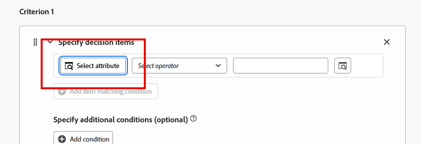
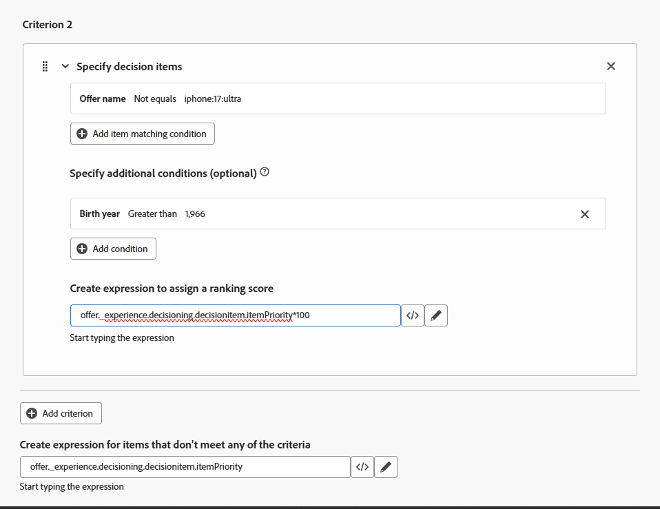

# 순위 공식 만들기

## 목표

이제 모든 오퍼 항목이 생성되고, 우선 순위가 지정되었으며, 자격 조건이 적용되고, 컬렉션으로 정리되었으므로 주어진 프로필에 대해 순위가 매겨지는 방법을 결정하는 데 주의를 기울일 수 있습니다. 이 작업은 순위 공식을 생성함으로써 수행됩니다.

순위 공식은 웹/모바일 속성 또는 경험 이벤트 자체와 상호 작용하는 프로필의 기준을 기반으로 특정 오퍼 우선 순위를 동적으로 &quot;맨 위로 상승&quot;하도록 높입니다.

이 랩 시나리오에서는 연결 5G의 연구 마케팅 팀이 39세 미만은 Ultra 또는 Pro 계층으로, 40~59세는 Base 및 Pro 계층으로 이동하는 것으로 나타났다고 가정할 것입니다. 그리고 Connection 5G는 더 높은 계층의 전화기를 판매하고 싶기 때문에 모든 것이 동등하기 때문에, 울트라 모델은 39세 이하의 사람들에게 먼저 제시되고 프로 모델은 40-59세에게 먼저 제시될 것이다. 이 섹션에서는 이러한 비즈니스 요구 사항을 충족하기 위해 등급 공식을 만드는 방법을 보여줍니다.

## 등급 수식 및 기본 표현식 만들기

1. 필요한 경우 왼쪽 레일에서 **Decisioning**&#x200B;을 확장하고 **전략 설정**&#x200B;을 클릭합니다. &#39;의사 결정 규칙&#39; 페이지에 도달하면 이전에 만들어 상위 계층 휴대폰 오퍼 항목에 대한 자격 요구 사항으로 사용한 &#39;상위 계층 플랜&#39; 의사 결정 규칙을 확인합니다.
2. &#39;순위 방법&#39; 메뉴에서 **순위 수식**&#x200B;을 클릭합니다. 아직 순위 공식이 없으므로 빈 페이지가 열립니다.

   

3. 파란색 **수식 만들기** 단추를 클릭하여 새 순위 공식을 만듭니다
4. 순위 수식의 이름을 **iPhone 17 순위 수식**&#x200B;로 지정합니다.

   >[!NOTE]
   >
   >Active Decisioning 패키지에서 오퍼를 요청하는 데 필요한 매개 변수와 함께 경험 이벤트가 Edge 데이터 수집으로 전송되면 해당 패키지의 모든 오퍼가 등급 공식을 사용하여 평가됩니다. 각 오퍼는 원래 우선 순위를 유지하거나 경험 이벤트를 트리거한 프로필에 따라 우선 순위를 동적으로 조정합니다.

5. &#39;기준&#39; 섹션의 맨 아래로 스크롤하여 맨 아래 텍스트 상자의 **\&lt;/>** 아이콘을 클릭하고 **오퍼 우선 순위 점수** 변수를 선택합니다.

이제 기본 표현식이 다음과 같이 설정됩니다.

>[!NOTE]
>
>이 맨 아래 텍스트 상자는 우선 순위 조정 기준을 충족하지 않는 모든 오퍼 항목에 적용되는 기본 표현식입니다. 이 경우 오퍼가 생성될 때 오퍼에 할당된 우선 순위일 뿐입니다. 이 순위 공식이 실행될 컬렉션에 기본 우선 순위 점수가 제공되지 않으면 기본 점수를 할당할 수 있습니다

## 우선 순위 조정 규칙 만들기

이제 기본 표현식이 있으므로 사용자의 연령에 따라 우선순위를 동적으로 조정하는 규칙을 추가할 수 있습니다.

우선 순위 조정 규칙을 고려하는 한 가지 방법은 특정 오퍼에만 적용되는 if/then 문으로 우선 순위 조정 규칙을 처리하는 것입니다. 테스트가 true로 확인되면 주어진 기준을 충족하는 오퍼의 우선 순위를 조정합니다. UI는 이 스크린샷에서 호출한 대로 이러한 필드를 약간 다른 순서로 정렬합니다.

>[!NOTE]
>
>조건문 없이 오퍼가 특정 기준을 충족하는 우선 순위 조정 규칙을 먼저 적용할 수 있으므로 &quot;if&quot;는 선택 사항입니다. 이 안내서의 예를 확장하면 휴대폰 OS 속성이 있는 몇 가지 오퍼가 있다고 가정해 보겠습니다(Android vs. iOS). 프로필의 기본 OS가 iOS인 모든 iPhone 오퍼의 우선 순위를 높일 수 있습니다. &quot;if&quot;는 없습니다. &quot;오퍼 속성 = 프로필 속성인 경우 점수를 조정하십시오.&quot;만 표시됩니다. 다음은 조건문 없이 이 아이디어를 대략적으로 설명하는 위의 이미지와 유사한 이미지입니다.
>
>

## 기준 만들기 1: 39세 미만에 대한 조정 규칙

1. 먼저 Ultra 계층 오퍼 항목에 대한 등급 규칙을 만듭니다. **기준 1** 섹션에서 첫 번째 텍스트 상자를 클릭한 다음 **특성 선택** 단추가 나타나면 클릭합니다.

   

2. &#39;특성 선택&#39; 대화 상자가 열리면 **오퍼 이름**&#x200B;을 클릭합니다. 선택한 후에는 **저장**&#x200B;을 클릭하세요.

   >[!NOTE]
   >
   >의사 결정 속성 은 오퍼 항목의 요소를 참조합니다. 기준이 적용될 오퍼 항목의 개요를 설명하는 위치이므로 사용할 수 있는 옵션은 오퍼 항목의 속성뿐입니다.
   >

3. 연산자를 &#39;같음&#39;으로 설정하고 나머지 텍스트 상자에 Ultra 계층 오퍼 항목의 이름(**iphone:17\:ultra**)을 입력하십시오. 텍스트를 입력하면 UI가 업데이트되고 일치하는 조건이 수락되었음을 반영합니다.
4. **+조건 추가**&#x200B;를 클릭한 다음 **표시되는 새 텍스트 상자**&#x200B;를 클릭합니다(텍스트 &#39;*의사 결정 항목을 만들려면 클릭하세요...*&#39; 포함).
5. 지금 사용할 수 있는 **특성 선택** 옵션을 클릭합니다&#x200B;**.**
6. &#39;특성 선택&#39; 대화 상자가 열리면 **프로필 특성 > 사용자**(아래로 스크롤해야 함)를 클릭합니다. **> 출생연도**. 선택한 후에는 **저장**&#x200B;을 클릭하세요.

   >[!NOTE]
   >
   > &#39;프로필 속성&#39;은 경험 이벤트를 보낸 사용자 또는 프로필을 참조하고, &#39;컨텍스트 데이터&#39;는 경험 이벤트 자체의 요소(예: URL, 페이지 이름 또는 경험 이벤트 페이로드의 기타 속성)를 참조합니다.

7. 연산자를 **보다 큼**(으)로 변경하고 출생연도 **1986**&#x200B;을(를) 입력합니다(UI에서 예상대로 연도에 쉼표를 넣음). 을 입력하면 조건이 수락되었음을 반영하도록 UI가 업데이트됩니다. 사업사용 사례는 40세 미만이면 누구나 울트라티어를 제공하는 것이므로 1986년 이후 출생자는 우선 순위가 조정된다.

   >[!NOTE]
   >
   >앞에서 언급했듯이 UI는 이러한 추가 조건이 &#39;선택 사항&#39;임을 나타냅니다. 이는 추가적인 기준 없이 오퍼 항목 세트의 우선 순위를 동적으로 조정하려는 경우가 있기 때문에 true입니다. 동일한 오퍼 항목을 다른 컬렉션에서 사용하고 다른 세트의 등급 규칙으로 순위를 지정할 수 있습니다. 이 실습에서는 단일 오퍼 항목 세트만 사용하므로 우선 순위를 조정하기 위해 추가 조건을 사용합니다.

8. Ultra 계층 오퍼 항목의 원래 우선 순위는 4입니다. 우선 순위를 높이려면 여기에 100을 곱하십시오. 이렇게 하려면 마지막 텍스트 상자 옆에 있는 **\&lt;/>** 아이콘을 클릭하고 **오퍼 우선 순위 점수** 변수를 선택합니다. 자동으로 입력한 텍스트 뒤에 **\*100**&#x200B;을(를) 추가합니다. 이 표현식은 원래 우선 순위(4)에 100을 곱하고 새 우선 순위 400을 제공합니다.

   이제 규칙은 다음과 같아야 합니다.

>[!NOTE]
>
>왜 100을 곱하나요? 그 아이디어는 만약 당신이 당신의 우선 순위가 다른 우선 순위보다 잘 조정되도록 하고 싶다면, 그리고 100은 그것을 이루기 위해 간단한 수학을 하는 한 방법일 뿐이라는 것이다. 다음 절에서 보듯이 공식의 순위는 복잡할 수 있으므로 수학을 단순하게 유지하는 것이 도움이 된다.
>
>또한, 우선 순위 점수를 높이기 위해 곱셈을 사용했지만, 우선 순위 점수를 낮추기 위해 다른 수학 표현식을 사용할 수 있습니다. 그러나 일반적으로 말하면 원하는 오퍼를 &#39;위로 이동&#39;하는 것이 &#39;아래로 가라앉음&#39;을 원하지 않는 오퍼를 만드는 것보다 더 쉽습니다.

## 기준 만들기 2: 40-59에 대한 조정 규칙

1. 방금 만든 조정 규칙 바로 아래에서 **+ 기준 추가** 단추를 클릭합니다.
2. **오퍼 이름**&#x200B;이(가) **iphone:17\:ultra**&#x200B;과(와) 같지 않은 경우 일치하는 조건을 만듭니다.

   >[!WARNING]
   >
   >이 규칙은 다른 모든 오퍼 항목에 적용됩니다. 자세한 내용은 이 페이지에서 살펴볼 수 있지만, 이 값이 없는 컬렉션의 모든 오퍼에 적용되므로 실제로 이러한 종류의 논리를 사용하는 것은 매우 신중해야 합니다. 이 경우에는 괜찮지만, 다른 사용 사례에서는 그렇지 않을 수 있습니다.

3. 출생연도가 **1966**&#x200B;보다 큰 사람(60세 미만인 사람)에게는 이 규칙이 적용되어야 한다는 조건을 추가하십시오.
4. 이전 규칙과 마찬가지로 오퍼 항목의 기본 우선 순위 점수에 100을 곱합니다. 완료되면 &#39;기준 2&#39; 규칙은 다음과 같습니다.

>[!NOTE]
>
>등급 수식과 자격 규칙을 함께 사용하는 것은 복잡하게 느껴질 수 있지만, 핵심 아이디어는 다음과 같습니다.
>
>- **등급 수식**&#x200B;은 우선 순위 점수를 동적으로 조정하므로 오퍼의 순서를 조정합니다.
>- **자격 규칙**(예: 의사 결정 규칙 및 빈도 제한)은 사용자가 오퍼를 볼 수 없는 경우 정렬된 목록에서 오퍼를 제거합니다.
>
>이러한 예제와 방금 만든 순위 공식을 고려할 때 오퍼를 정렬하는 방법은 다음과 같습니다.
>
>**출생연도 = 1990**
>
>- 우선 순위가 **400**&#x200B;이(가) 됨
>- Pro = **3**, 기본 = **2**, 일반 = **1**
>  결과: Ultra가 처음(최대 3회) 표시된 다음 Pro, Base 및 Generic을 차례로 표시합니다.
>
>**출생연도 = 1970**
>
>- 최대 우선 순위는 **4**&#x200B;에 유지됩니다.
>- Pro는 **300**, Base = **200**, Generic = **100이 됩니다.**
>  결과: Pro가 처음(3회), Base, Generic 순으로 표시됩니다. Ultra는 우선 순위(4)가 일반(100)보다 낮기 때문에 마지막 순서가 지정됩니다.
>
>의사 결정 규칙 및 빈도 설정을 통해 적격성이 적용되는 경우
>
>- **플랜 ID = 1**&#x200B;인 1990년생 사용자는 가장 높은 순위를 기록했더라도 Ultra 및 Pro 오퍼가 제거됩니다. Ultra 및 Pro 계층에는 추가 조건이 있으므로 기본 및 일반 오퍼만 표시됩니다. **계획 ID 2 또는 3**&#x200B;을(를) 가진 사용자만 볼 수 있습니다.
>- 제네릭 오퍼에 빈도 제한 규칙이 없으므로 **1970** 출생 연도 사용자는 Ultra 오퍼를 볼 수 없습니다. 해당 우선 순위 점수가 제네릭의 상향 점수보다 낮기 때문입니다.

1. 모든 규칙과 기본 우선 순위 점수가 있는 상태에서 맨 위로 스크롤한 후 오른쪽 위의 파란색 **만들기** 단추를 클릭합니다.

>[!TIP]
>
>이제 &#39;전략 설정&#39; 페이지로 돌아가서 방금 만든 단일 등급 공식이 표시됩니다.

>[!NOTE]
>
>두 오퍼가 동일한 우선 순위로 귀결되는 경우 어떻게 됩니까? 우선 순위 점수가 동일한 오퍼는 요청 시스템으로 반환하기 위해 임의로 선택됩니다.

## 요약

이 페이지에서는 각 프로필에 대해 오퍼 항목의 순서를 동적으로 결정하는 등급 공식을 만들었습니다. 또한 기본 표현식(원래 우선 순위 점수)을 정의한 다음 프로필 기준(예: 연령)에 따라 오퍼 우선 순위를 높이는 우선 순위 조정 규칙을 추가했습니다. 이 순위 논리는 관련 오퍼(특정 연령 범위의 Ultra 또는 Pro 계층 등)가 평가될 때 맨 위로 상승하도록 합니다.
