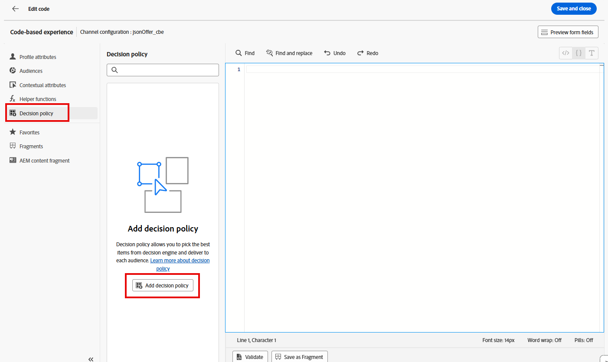

# 여정 만들기

## 입장 기준 이름 지정 및 정의

1. 필요한 경우 왼쪽 레일에서 **여정 관리** 메뉴 항목을 확장하고 **여정**&#x200B;을 클릭합니다. 여정 페이지에 도달합니다.
2. 파란색 **여정 만들기** 단추를 클릭합니다.
3. &#39;여정 만들기&#39; 오버레이가 나타나면 **처음부터 만들기**&#x200B;를 선택하고 **확인**&#x200B;을 클릭합니다
4. 오른쪽 레일에서 여정 이름을 **iPhone 17 찾아보기 중단**(으)로 지정하고 파란색 **저장** 단추를 클릭하여 여정 캔버스에 작업을 추가할 수 있습니다.
5. **대상 자격** 이벤트를 캔버스로 드래그합니다.
6. 오른쪽 레일에서 **연필** 아이콘을 클릭하여 이 이벤트의 대상을 선택합니다.
7. **dep: iPhone 17**&#x200B;에 관심 있음 대상을 선택합니다.
8. **네임스페이스** 드롭다운이 **customerID.**(으)로 설정되어 있는지 확인하십시오. 이 시점에서 여정은 다음과 같습니다.

   대상 자격 이벤트가 추가되고 네임스페이스가 customerID로 설정된 

9. 모든 사용자가 올바르게 표시되면 파란색 **저장** 단추를 클릭하여 진행 상황을 저장합니다.

>[!NOTE]
>
>&#39;dep: iPhone 17에 관심 있음&#39; 대상은 입장 기준이 같은 날 3회 가상의 연결 5G iPhone 17 개요 페이지를 보는 스트리밍 대상입니다. 많은 제품 개요 페이지와 마찬가지로 연결 5G의 iPhone 17 개요 페이지는 페이지를 다시 로드할 필요 없이 여러 요소가 업데이트되는 동적 페이지입니다. 이 단일 페이지에서 iPhone 17의 다양한 계층과 기능을 비교할 수 있습니다. 따라서 다른 사람이 같은 날 이 페이지를 3번 보면 iPhone 17에 관심을 가질 수 있습니다. 그러나 페이지의 모든 요소에 태그가 지정되고 측정되는 것은 아니므로 Connection 5G는 인증된 사용자의 연령을 사용하여 사용자가 Connection 5G 브랜드의 다른 접점과 상호 작용할 때 표시할 전화 계층을 결정합니다.


## CBE 및 의사 결정 정책 구성

1. 캔버스의 바로 왼쪽에 있는 **Actions** 아코디언을 확장하고 **Action** 요소를 캔버스로 드래그한 다음 첫 번째 노드에 연결합니다.
2. &#39;작업 유형 선택&#39; 오버레이가 나타나면 **코드 기반 경험** 작업을 선택하고 파란색 **추가** 단추를 클릭합니다.
3. 이제 표시되는 &#39;Action\:Code 기반 경험&#39; 속성에서 **작업 구성** 단추를 클릭합니다.

   

4. **코드 기반 구성** 드롭다운을 마지막 섹션에서 만든 **jsonOffer\_cbe** cbe로 변경합니다.

   

5. &#39;코드 기반 구성&#39; 드롭다운 바로 위에 있는 **콘텐츠 편집** 단추를 클릭합니다.
6. 결과 코드 기반 경험 편집기 화면에서 **코드 편집** 단추를 클릭합니다. 결과 화면에서는 경험 이벤트 요청에 반환되는 JSON을 추가합니다

   

7. 코드 편집기의 맨 왼쪽에서 **의사 결정 정책** 메뉴 항목을 클릭한 다음 새 메뉴에서 **의사 결정 정책 추가** 단추를 클릭합니다.

   

   >[!NOTE]
   >
   >선택 전략이 오퍼 컬렉션을 순위 방법에 연결하고 전략 수준 적격성을 적용하는 것인 경우, 의사 결정 정책은 선택 전략을 채널의 특정 게재에 연결하는 것입니다.

8. 이 결정 정책의 이름을 **iPhone 17 DP**(으)로 지정하고 항목 수를 1로 설정합니다.

   >[!NOTE]
   >
   >지금까지 오퍼와 오더 방법을 구성했지만 반환할 오퍼의 수를 구성하지 않았습니다. 여기서 반환할 오퍼 수를 구성합니다.

9. 파란색 **다음** 단추를 클릭합니다. 여기에서 선택 전략을 추가할 수 있습니다. **+추가** 단추를 클릭하고 **선택 전략**&#x200B;을 선택하세요.
10. 사용해야 하는 유일한 선택 전략(**iPhone 17 선택 전략**) 옆의 확인란을 선택하고 **저장**&#x200B;을 클릭합니다. 완료되면 다음과 같은 결과가 표시됩니다.


>[!NOTE]
>
>여러 선택 전략을 추가하거나 결정 항목 자체를 추가하는 방법에 주목합니다. 언제 다중 선택 전략을 사용하시겠습니까? 디지털 속성 중 하나에 4 X 4 권장 사항 그리드가 있다고 가정해 보십시오. 모두 16개의 오퍼로 채우려고 합니다. 이러한 오퍼가 몇 개의 컬렉션에 분산되어 있을 수 있습니다. 또는 처음 두 행에는 하나의 선택 전략이 필요하고 아래 두 행에는 다른 전략이 필요할 수 있습니다. 이전 화면에서는 16을 선택한 다음 이 화면을 사용하여 16에 도달하기 위해 필요한 만큼 많은 선택 전략 또는 오퍼를 추가했을 것입니다.
>
>대체 오퍼는 최종 사용자가 오퍼에 부적격한 경우(또는 부적격한 경우)에만 적용되므로 선택 사항입니다. 이 경우 선택 전략은 모든 방문자를 위한 것이었고 CBE 노드에 도달할 사람은 여정에 들어온 사람뿐입니다. 인증은 여정 진입을 위한 요구 사항입니다(여정에 설정된 네임스페이스는 인증된 경우에만 보유함). 또한 등급 공식에 대체 오퍼를 구축했으므로 이 대체 오퍼를 설정할 필요가 없습니다.

11. 결정 정책을 검토하려면 파란색 **다음** 단추를 클릭하십시오.


12. 모든 항목이 올바르게 표시되면 파란색 **만들기** 단추를 클릭하십시오. 작성된 후에는 표현식 편집기 페이지로 돌아갑니다.
13. 아래 화면과 유사한 화면이 표시됩니다. 그렇지 않은 경우 **결정 정책**&#x200B;을 다시 클릭하면 결정 정책이 나타납니다.


14. **+ 정책 삽입** 단추를 클릭하면 ForEach 루프가 코드 편집기에 나타납니다.


>[!NOTE]
>
>각 루프에 대해 가 필요한 이유 우리의 경우에는, 우리는 단지 하나의 제안을 반환합니다. 그러나 여러 오퍼를 반환할 수 있는 이전 단계를 고려하십시오. 기능을 고려할 때, 여기서 루프 메커니즘은 의미가 있습니다.

15. 루프 범위 내에 유효한 JSON을 추가하여 최종 사용자에게 제공해야 하는 휴대폰의 제조사, 모델 및 계층을 반환합니다. 빈도 제한 또한 적용되므로 trackingToken을 응답에 추가해야 합니다. 자세한 내용은 뒷부분의 지침을 참조하십시오. 시간을 절약하려면 다음 코드 행을 복사하여 For Each 루프 내의 코드 편집기에 붙여넣으면 됩니다.

```javascript
{
     "make":"",
     "model":"",
     "tier":"",
     "trackingToken":""
 },
```


>[!NOTE]
>
>표준 오퍼 XDM 스키마, 특히 제조업체, 모델 및 계층에 속성을 추가했음을 상기하십시오. 그런 다음 오퍼가 생성될 때 이러한 속성을 입력했습니다. 이제 이러한 속성을 선택한 오퍼의 값으로 채워지는 변수로 추가합니다. trackingToken 필드는 클릭 및 노출을 추적하는 데 사용되는 시스템 생성 값입니다.

16. &#39;make&#39; 노드의 **&quot;&quot;** 사이에 커서를 놓습니다. 결정 정책 메뉴에서 **\_dep > 장치 > 만들기** 노드로 이동하여 오퍼를 삽입합니다.  **만들기** 요소의 **+** 아이콘을 클릭하면 편집기가 채워집니다.


17. 유사한 방식으로 **model** 및 **tier** 특성을 추가하십시오.
18. 루트 수준으로 돌아가려면 특성 탐색에서 **결정 정책**&#x200B;을 클릭하십시오.
19. **\_experience > decisioning > decisioning 항목 > 추적 토큰** 경로를 통해 추적 토큰 값으로 이동하여 trackingToken 특성을 채웁니다.
20. 마지막으로 전체 코드를 대괄호(**\[]**) 집합에 포함시킵니다. 최종 JSON 코드는 다음과 같아야 합니다.


>[!WARNING]
>
>전체 결정 항목 주위에 대괄호 &quot;\[ ]&quot;를 포함해야 합니다. 혼란스러우신가요? #20단계를 다시 참조하십시오.


21. 모든 항목이 위의 스크린샷으로 표시되면 오른쪽 상단의 **저장 및 닫기**&#x200B;를 클릭하여 코드를 저장합니다. 그러면 코드 기반 경험 페이지로 돌아갑니다.
22. 여정 이름 옆에 있는 뒤로 화살표 **\&lt;** 아이콘을 클릭하면 캔버스로 돌아갑니다.


23. 파란색 **저장** 단추를 클릭하여 CBE 작업 노드를 저장합니다. 이제 여정은 다음과 같습니다.


24. 여정이 완료되면 오른쪽 상단의 파란색 **게시** 단추를 클릭하고 확인 상자가 나타나면 다시 **게시**&#x200B;합니다. 잠시 후 여정이 라이브됩니다!


>[!TIP]
>
>이제 여정이 이 Decisioning 패키지에 대한 JSON 오퍼를 제공할 준비가 되었습니다!

>[!NOTE]
>
>CBE를 캔버스에 배치한 후 대기 노드가 자동으로 생성된 이유는 무엇입니까? CBE는 인바운드 채널이라는 점을 기억하십시오. 최종 사용자에게 미리 전송되는 이메일 또는 푸시 알림과 달리 CBE는 Edge에 푸시되고 최종 사용자가 디지털 속성으로 와서 오퍼를 요청할 때까지 기다립니다. 대기 시간은 해당 대기 노드에 의해 정의됩니다. 기본적으로 3일 동안 설정되지만 구성할 수 있습니다. 이 실습에서는 3일로 두지만 실제 시나리오에서는 대기 시간이 경과하면 해당 사용자의 여정이 종료 노드로 진행되고 해당 사용자에 대한 Edge 프로필 스토어에서 CBE가 제거되므로 이 시간을 더 길게 연장할 수 있습니다.
>
>이는 중요한 아키텍처 및 시간 고려 사항도 강조합니다. 해당 사용자의 CBE는 언제 Edge 프로필 스토어로 푸시됩니까? 사용자가 해당 노드로 진행하면 이는 해당 사용자가 세그먼트에 대한 자격이 있는 후를 의미합니다. 즉, 사용자가 스트리밍 세분화가 실행되기 전에 세 번째 페이지를 보고, 사용자가 해당 세그먼트에 배치되고, 여정과 CBE 노드로의 진행률을 입력한 다음 해당 사용자에 대한 Edge에 CBE가 투영되면 몇 초에서 몇 분 정도 걸립니다.  데이터 및 처리 수요가 거의 없는 테스트 조직에서는 이러한 전체 프로세스가 몇 초 또는 몇 분 정도에 불과합니다. 처리량이 훨씬 많은 대규모 조직의 경우 최소 15분 동안 최대 2시간 동안 계획을 세우십시오.


## 요약

이 페이지에서는 API 스타일 인바운드 채널을 통해 외부 시스템이 오퍼 결정을 요청할 수 있도록 하는 코드 기반 경험(CBE) 채널을 구성했습니다. 이 설정에는 클라이언트 시스템에서 전송할 표면/위치 매개 변수를 지정하고 JSON 출력 형식을 선택하는 작업이 포함되었습니다.
