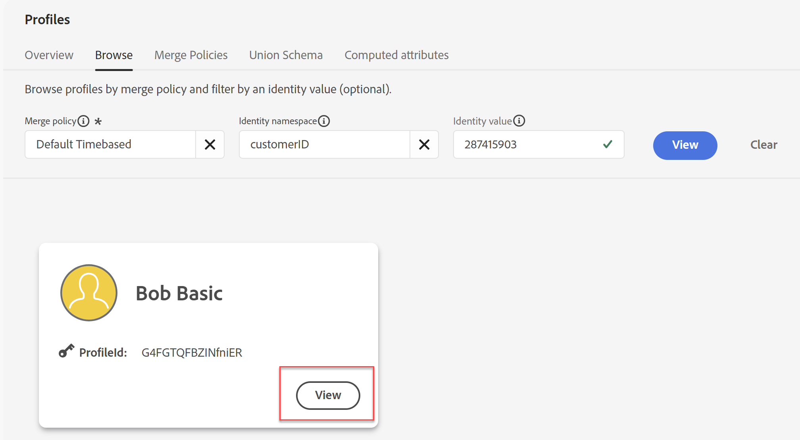
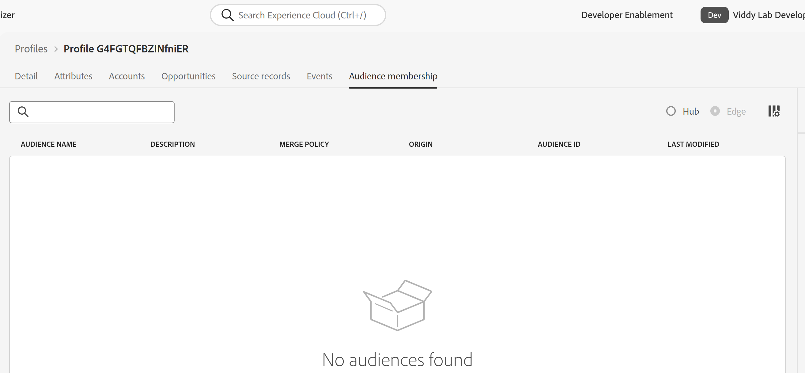
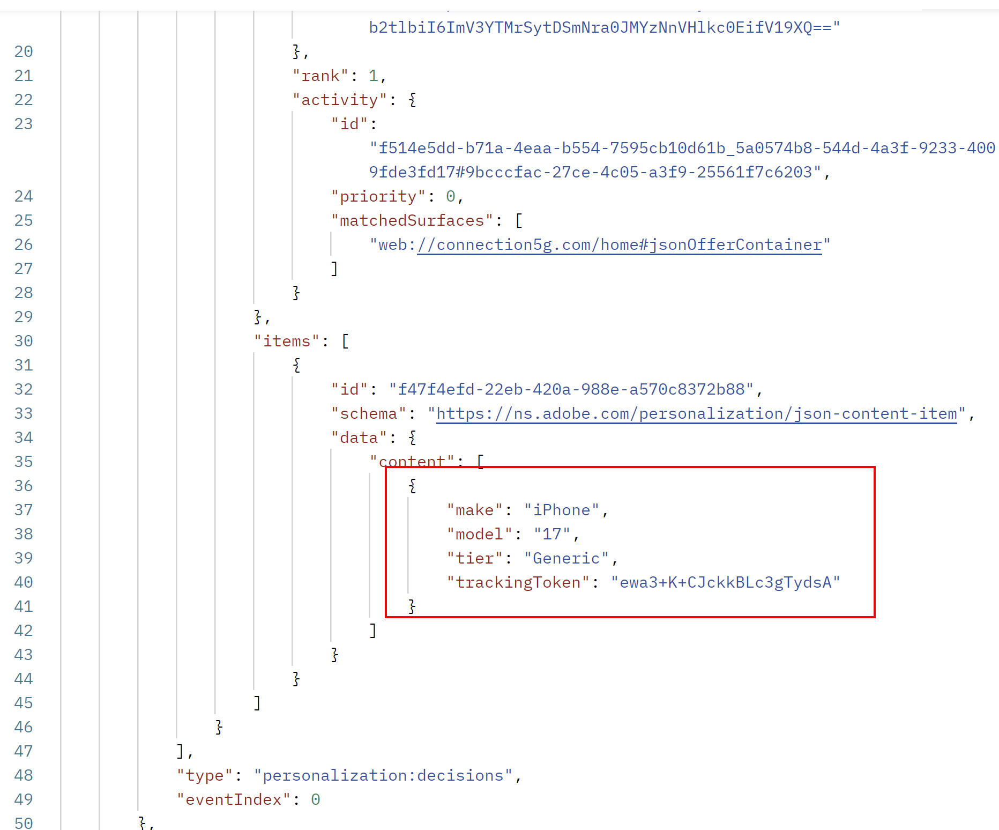

# 의사 결정 및 CBE 활용

## 목표

이제 여정이 라이브이므로 경험 이벤트에서 전송을 시작하고 오퍼가 반환되는 것을 볼 수 있습니다. 개별 프로필의 출생 연도 및 전화 플랜 ID는 반환되는 오퍼에 영향을 주므로, 특정 출생 연도 및 플랜 ID가 있는 사전 구성된 프로필에 대해 경험 이벤트를 보내야 합니다.

## 프로필 및 Postman 설정

사용할 세 가지 프로필은 이미 샌드박스에 있으며 이 표에 요약되어 있습니다.

| 이름 | 성 | 출생연도 | 플랜 ID | customerID | ECID | 이메일 |
| ---------- | ------------ | ---------- | ------- | ---------- | -------------------------------------- | --------------- |
| Bob | 기본 | 1974 | 1 | 287415903 | 34566216966446312560595171785271630085 | bob\@dep.com |
| 피터 | 전문가 | 1981 | 2 | 105946728 | 22344522145769262754334953788432801285 | peter\@dep.com |
| 우르술라 | Ultimate | 2002 | 3 | 730682145 | 35615467908312308343036144243711275069 | ursula\@dep.com |

AEP에서 이러한 프로필 찾기

1. 필요한 경우 왼쪽 레일에서 **고객** 항목을 확장하고 **프로필**&#x200B;을 클릭합니다
1. **찾아보기** 탭을 클릭하면 이미 만들었거나 이전 Labs의 일부로 만든 모든 프로필 중에서 이 세 개의 프로필이 표시됩니다.

Postman 컬렉션에서 각 프로필에 대한 해당 경험 이벤트 찾기

1. 필요한 경우 Postman을 엽니다.
1. **EDGE\_REGION** 및 **DATASTREAM\_CONFIG** 환경 변수가 계속 설정되어 있는지 확인하십시오. 다시 설정해야 하는 경우 &#39;가져오기 환경 및 컬렉션&#39; 랩의 단계를 검토하십시오.
1. **Decisioning Lab** 폴더를 확장합니다. 각 프로필에 대해 2개의 경험 이벤트가 표시됩니다.

## 경험 이벤트에서 보내기

> [!IMPORTANT]
>
>이 섹션의 시작 텍스트 설명을 건너뛰지 마십시오!

시간 및 리소스에 제한이 없는 경우 실제 웹 사이트에서 AEP 웹 SDK을 사용하여 태그 라이브러리를 빌드하고 배포하도록 하겠습니다. 오퍼를 검색하고 보고하는 방법을 보여 줍니다. 그러나 이러한 Labs에서 다루는 컨텐츠의 전체 폭과 깊이를 고려할 때 웹 사이트에 태그를 지정할 필요 없이 Postman 컬렉션에서 여정을 입력하고, 오퍼를 검색하고, 오퍼에 대해 보고하는 데 필요한 경험 이벤트를 미리 구축하도록 선택했습니다. 이 컬렉션을 올바르게 사용하면 제대로 태그가 지정된 사이트(또는 디지털 채널)가 여정에서 CBE 게재 채널을 사용하는 방식을 모방합니다.

AEP Web SDK 배포에 권장되는 접근 방식은 페이지당 두 번의 호출 접근 방식을 사용하는 것입니다. 이 패턴에서 웹 SDK은 사용자에게 필요한 개인화를 요청하는 &#39;가져오기&#39; 호출을 페이지 맨 위에서 Edge으로 보냅니다. 이러한 개인화는 Edge에서 반환된 다음 웹 SDK에서 렌더링됩니다. 그런 다음 일반적으로 데이터 수집 호출이라고도 하는 페이지 하단의 두 번째 호출이 Edge으로 전송되고, Analytics, CJA 및 기타 솔루션에 대한 다른 데이터와 함께 최종 사용자에게 표시된 내용에 대해 보고합니다. Edge에서 제안을 검색할 때 간단한 니모닉인 FAR를 기억하십시오. FAR는 Fetch, Apply 및 Report를 나타냅니다. 모든 제안을 가져와서 적용하거나 렌더링한 후(최종 사용자에게 표시됨) 보고해야 합니다. 빈도 제한 규칙이 작동하도록 이러한 오퍼가 표시되는 것으로 보고되는 것이 중요합니다.

Adobe Target 활동 및 AJO 웹 채널은 AEP 웹 SDK에서 자동으로 응답을 가져오고 적용할 수 있습니다. 페이지 하단에 있는 데이터 수집 호출과 함께 보고를 보낼 수도 있습니다. 그러나 CBE는 다릅니다. AEP Web SDK은 제안을 가져올 수 있지만 반환되는 것은 모두 적용(렌더링)한 다음 AEP Web SDK을 사용하여 표시된 것을 보고하는 것이 고객의 책임입니다. CBE는 일반적으로 표시된 내용에 대해 보고하는 데 데이터 수집 호출을 사용하지 않으므로 수동으로 전달해야 합니다.

Postman 컬렉션에서는 각 프로필에 두 개의 경험 이벤트 호출이 있음을 볼 수 있습니다

페이지 상단 가져오기 경험 이벤트

페이지 하단 데이터 수집 경험 이벤트

페이지 상단 경험 이벤트는 CBE에 대해 구성한 &#39;페이지 상의 위치&#39;인 요청에 &#39;jsonOfferContainer&#39; 매개 변수를 포함합니다. 또한 이 호출은 Postman의 스크립팅 기능을 사용하여 Edge에서 응답을 받은 다음 오퍼가 최종 사용자에게 표시되었다는 두 번째 호출을 Edge에 즉시 보냅니다. 이 실습에 대한 웹 사이트가 없으므로 오퍼에 대한 실제 적용 또는 렌더링이 없습니다. 그러나 AJO의 입장에서는 오퍼가 반환된 후 본 대로 보고되었습니다.

page bottom 데이터 수집 호출은 순전히 iPhone 17 개요 페이지에 대한 페이지 보기 생성을 위한 것입니다. 여정 자체를 시작하려면 이 페이지의 3개 보기가 필요하다는 점을 기억하십시오. 경험 이벤트가 3회 전송되면 해당 사용자는 여정을 입력한 다음 페이지 상위 가져오기 경험 이벤트만 있으면 오퍼를 가져오고 해당 이벤트가 표시되었음을 보고할 수 있습니다.

Bob의 프로필로 시작합니다.

1. **Bob - Page Bottom 데이터 수집** 요청을 클릭합니다.
2. **Body** 탭을 클릭하고 IdentityMap의 customerID 네임스페이스와 같이 인증되었음을 나타내는 매개 변수와 &#39;phones\:apple\:iphone 17\:overview&#39;의 pagename에 전달되는 &#39;web.webPageDetails.name&#39; 매개 변수가 전달되는 것을 확인합니다.

3. 페이지 보기를 보내려면 오른쪽 상단의 **보내기**&#x200B;를 클릭하세요. 다음과 유사한 응답이 반환됩니다

4. 적절한 응답을 받으면 **보내기**&#x200B;를 다시 클릭하여 동일한 페이지 하단 이벤트를 두 번째로 다시 보냅니다. 잠시 기다린 다음 Bob 프로필에 대한 세 번째 데이터 수집 호출을 보냅니다. 총 3개의 페이지 하단 호출을 전송했습니다.

이 시점에서 시스템은 이러한 히트를 처리하고 Bob을 &quot;dep: iPhone 17에 관심이 있음&quot; 스트리밍 세그먼트에 추가합니다. 작업이 완료되면 Bob이 여정에 포함됩니다. 여정에 들어오면 Bob이 여정 및 세그먼트로 들어가는 것이 Bob의 Edge Profile Store에 투영되는 데 몇 분이 소요됩니다.

5. AJO UI로 돌아가서 왼쪽 레일에서 **프로필**&#x200B;을 클릭한 다음 **찾아보기** 탭을 클릭합니다.
6. 값이 **287415903**&#x200B;인 **customerID** 네임스페이스를 사용하여 Bob의 프로필을 검색합니다.

7. **보기**&#x200B;를 클릭하여 Bob의 프로필을 엽니다(Bob의 프로필 색상은 스크린샷에 표시된 것과 다를 수 있음).

8. Bob의 프로필이 열리면 **대상 멤버십** 탭을 클릭하면 Bob이 이제 AEP Hub의 관점에서 &#39;dep: iPhone 17에 관심이 있음&#39; 세그먼트의 멤버임을 알 수 있습니다.
9. **특성,**&#x200B;을 클릭한 다음 **Edge** 라디오 단추를 선택하여 Edge 보기로 전환합니다.

>[!WARNING]
>
>라디오 단추를 Edge으로 전환하려면 속성 탭을 클릭해야 하는 UI 버그가 있습니다.

10. **대상 멤버십,**&#x200B;을 다시 클릭하면 해당 단계를 빠르게 수행한 경우, Edge이 선택되었고 Bob이 대상 멤버십이 없음을 표시합니다

11. 새 여정 탭에서 만든 브라우저로 이동한 다음 클릭합니다. 한 프로필이 여정에 들어갔고 이제 CBE 노드에 있음을 알 수 있습니다.

이 시점에서 Bob이 여정에 들어갔고 Edge 프로젝션은 현재 Edge에서 Bob의 프로필을 업데이트하는 프로젝션을 어셈블하고 있습니다.

12. Postman으로 다시 전환하고 Bob의 경험 이벤트 호출 중 두 번째 호출인 **Bob - 페이지 상단 가져오기**&#x200B;를 클릭합니다.
13. **보내기**&#x200B;를 클릭합니다. 어떻게 해야 합니까?
    - Bob의 Edge 프로필이 아직 업데이트되지 않은 경우 데이터 수집 호출에서 받은 것과 매우 유사한 응답을 받게 됩니다. 이 경우 1~2분 정도 기다린 후 Bob의 Page Top Fetch 호출을 다시 전송해 보십시오.
    - Bob의 Edge 프로필이 업데이트된 경우 보고에 사용되는 추가 정보와 함께 이전에 구성된 JSON이 포함된 응답을 받게 됩니다. 그러나 계속하기 전에, Bob이 제시해야 하는 iPhone 17의 제안은 무엇입니까?

      Bob은 1974년에 태어났으며, 이는 1966년보다 크므로 2순위 공식 기준에 적합하고 Generic, Base 및 Pro 오퍼 우선 순위 점수에 100을 곱한 후 각각 100, 200 및 300의 오퍼를 제공했습니다. 그러나 Bob Basic은 플랜 ID 1이 있으므로 결정 규칙 덕분에 Ultra 또는 Pro 계층 오퍼에 적합하지 않습니다. 따라서 점수가 200인 기본 계층 오퍼가 표시됩니다. 응답에서 (아래로 스크롤해야 할 수 있음) 확인할 수 있습니다.

14. 이 Postman 요청은 이 오퍼에 대한 디스플레이 알림을 자동으로 전송하므로 AJO은 이미 이 오퍼에 대해 하나 이상의 노출을 기록했습니다. 두 번째 노출을 보내려면 **보내기**&#x200B;를 다시 클릭하세요. 기본 오퍼가 다시 반환되었는지 확인합니다.
15. 기본, Pro 및 Ultra 계층 모델에는 세 가지 노출 횟수의 주파수 캡이 적용된다는 점을 상기하십시오. 기본 계층에서 세 번째 응답을 받고 다른 노출을 기록하려면 **보내기**&#x200B;를 세 번째로 클릭합니다.
16. **보내기**&#x200B;를 네 번째로 클릭합니다. 어떻게 해야 합니까? 기본 계층 오퍼의 빈도 상한에 도달하고 응답에서 일반 오퍼를 받게 됩니다.

17. **보내기**&#x200B;를 다시 클릭하면 일반 계층 오퍼가 표시됩니다. 100번 더 보내기 를 클릭할 수 있으며, 빈도 캡핑이 재설정될 다음 날까지 동일한 오퍼를 다시 받을 수 있습니다.

>[!WARNING]
>
>AJO에서는 그 날이 자정 GMT에 재설정된다는 것을 기억하십시오. 자정 GMT 이후에 다른 Fetch 호출을 전송하려면 대신 기본 계층 오퍼 반환이 표시됩니다.

18. Journey Orchestration UI로 돌아가서 만든 **iPhone 17 찾아보기 중단** 여정을 클릭합니다. 여정이 라이브이고 게시되었으므로 통계가 표시됩니다. 1개의 프로필이 여정에 들어갔고 현재 CBE 노드에 있음을 알 수 있습니다.

>[!NOTE]
>
>이 시점에서 프로필이 대기 노드에 없는 이유를 궁금해할 수 있습니다. CBE 노드에 도달하고 Bob의 Edge 프로필에 대한 업데이트를 예상하면 대기 노드에 있어야 합니까? 짧은 대답은 그럴 수 있지만... 또한 CBE가 활발하게 반환되고 있기 때문에, 그렇다면 Bob이 이 여정에서 있는 곳이라는 주장을 할 수 있습니다. 그러나 3일 후 여정은 프로필이 대기 노드에 실제로 있지 않고 여정을 완료했음을 보여 줍니다.

## 다른 프로필에 대한 경험 이벤트에서 보내기

이제 Bob의 프로필에서 작동하는 여정을 보았으므로 테스트할 두 개의 다른 프로필이 있습니다.

1. Postman 로 돌아가서 Peter 및 Ursula에 대한 경험 이벤트를 찾습니다.
2. 각 프로필에 대해 &quot;Page Bottom Data Collection&quot; 이벤트를 3번 실행하고, 각 전송/데이터 수집 요청 사이에 1~3초를 제공하도록 기억합니다.
3. 세 프로필이 스트리밍 세그먼트에 대한 자격이 될 때까지 몇 분 정도 기다린 후 여정을 입력한 다음 CBE를 Edge 프로필에 투영하도록 합니다.
4. Page Top Fetch 호출에서 필요한 만큼 여러 번 전송하여 Decisioning 규칙 및 등급 공식이 예상대로 작동하는지 확인합니다.

**의사 결정 프로필: 필요한 동작**

| 이름 | 성 | 첫 번째 오퍼 | 두 번째 오퍼 | 세 번째 오퍼 | 네 번째 오퍼 |
| ---------- | ------------ | --------- | --------- | --------- | --------- |
| Bob | 기본 | 기본 | 일반 | 일반 | 일반 |
| 피터 | 전문가 | Pro | 기본 | 일반 | 일반 |
| 우르술라 | Ultimate | Ultra | Pro | 기본 | 일반 |

5. 완료되면 여정으로 돌아갑니다. 3개의 프로필이 모두 여정에 들어갔고 CBE 노드에 있음을 알 수 있습니다.

>[!NOTE]
>
>3일 동안 기다렸다가 페이지 상단 가져오기를 다시 전송하면 오퍼가 반환되지 않고 세 프로필 모두 여정을 완료했음을 알 수 있습니다

## 요약

랩의 이 마지막 페이지에서 실행 단계로 이동하여 경험 이벤트 및 CBE(코드 기반 경험) 채널을 사용하여 의사 결정 설정을 테스트했습니다. Postman을 사용하여 시뮬레이션된 경험 이벤트를 Adobe Journey Optimizer으로 전송하여 다음을 수행할 수 있습니다.

- 프로필이 스트리밍 여정 기준을 충족하여 생성한 세그먼트에 들어갔습니다.
- 프로필 데이터(출생연도, 전화 번호 계획 등)를 기반으로 오퍼 결정을 가져오기 위해 가져오기 이벤트와 함께 CBE 채널이 호출되었습니다.
- 오퍼가 반환되고 구성된 빈도 상한에 대해 계산되어, 다른 규칙과 등급 논리가 어떤 오퍼에 전달되었는지 보여 줍니다.
- 오퍼 가져오기 호출을 반복적으로 전송하여 빈도 제한 및 자격 조건이 예상대로 작동하는지 확인했습니다.

Real Decisioning 호출을 실행하고 프로필이 Decisioning 엔진과 상호 작용할 때 자격 규칙, 등급 수식 및 오퍼 설정이 올바르게 작동하는지 확인했습니다.
