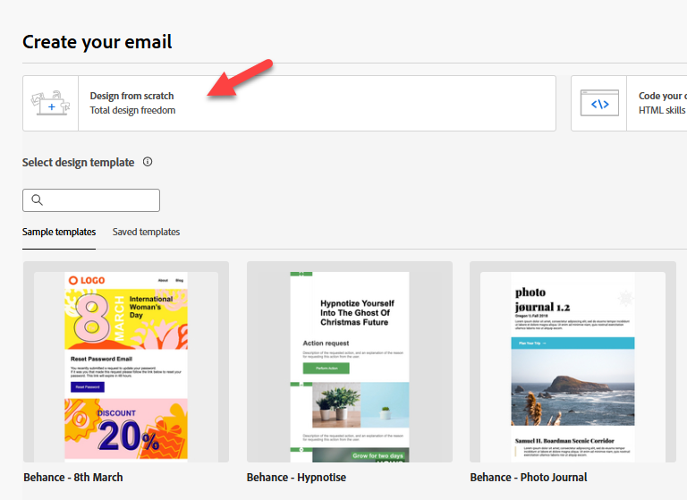
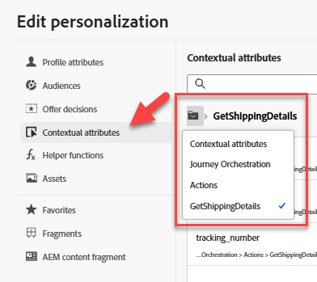
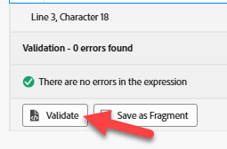
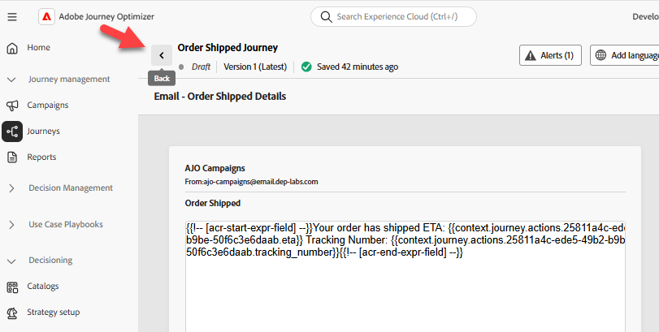

# 여정 작성

## 학습 목표

구성된 Order Shipped 이벤트로 시작하여 외부 서비스에서 ETA를 가져오고 이메일을 보내는 단일 여정을 만듭니다.

## 여정 만들기

**여정**(으)로 이동하여 **여정 만들기 - 처음부터 만들기**&#x200B;를 클릭합니다.


## 여정 속성

1. 다음과 같이 오른쪽 레일의 여정 속성 을 업데이트합니다.
   - **이름**: `Order Shipped Journey`
   - **설명**: `Notify customer that order has shipped. Include shipping details.`
   - **태그**: `Default`
   - **여정 지표**: *비워 둠*

     >[!NOTE]
     >
     >**드롭다운을 비우시겠습니까?**
     >
     >걱정하지 말고 계속 진행하세요. 샌드박스에서 만든 첫 번째 여정은 &quot;펌프 전원을 켜야&quot; 합니다.  여정을 게시하면 이 드롭다운에 선택할 수 있는 옵션이 있습니다.

   - **재입력 허용**: `checked`

   - **재입력 대기 기간:** `5 minutes`

   - **액세스 레이블**: *비워 둠*

   - **표준 시간대**: `Your Local timezone`

   - **대기 및 조건에 프로필 시간대 사용**: `NOT checked`

   - **시작/종료 날짜**: *비워 둠*

   - **시간 초과 또는 오류**: `30`

   - **최대 가용량 규칙:** *비워 둠*

   - **우선 순위**: `0`


2. 모든 항목이 정상인 경우 **저장** 단추를 클릭하십시오.


## 여정 캔버스

### 단일 이벤트 추가

**이벤트 메뉴** 아래의 왼쪽 창에서 아래와 같이 **orderShipped** 이벤트를 캔버스로 드래그하여 놓습니다


### 사용자 지정 작업 추가

1. 왼쪽 창에서 **작업 메뉴**&#x200B;를 확장한 다음 캔버스로 드래그하여 orderShipped 이벤트 다음에 만든 **GetShippingDetails** 작업을 취소하면 됩니다.

   

2. 오른쪽 레일의 액세스 및 개인정보 보호 구성 —> 마케팅 작업 드롭다운에서 값이 **없음**&#x200B;으로 설정되어 있는지 확인합니다.

   

3. 끝점 구성 —> 쿼리 매개 변수 메뉴에서 orderid 옆에 있는 **연필 아이콘**&#x200B;을 클릭합니다

   

4. 표시되는 모달에서 **컨텍스트** -> **주문됨** -> **주문**&#x200B;을 확장한 다음 **주문 ID(orderID)**&#x200B;를 선택하고 **확인**&#x200B;을 클릭합니다

   

5. 오른쪽 레일로 돌아가서 시간 초과 또는 오류 옵션이 **선택 취소됨**&#x200B;인지 확인한 다음 **저장 단추**&#x200B;를 클릭하십시오.

![시간 초과 또는 오류 옵션이 선택 취소되고 [저장] 단추가 강조 표시됨](assets/build-journey-uncheck-timeout-or-error.png)


### 이메일 작업 추가

1. 작업 메뉴에서 GetShippingDetails 작업 다음에 **Action** 작업을 캔버스로 끌어 놓습니다

   

2. 마케팅 액션에 대해 **전자 메일**&#x200B;을 선택한 다음 **추가**&#x200B;을 선택합니다.

   

3. 오른쪽 레일에서 **작업 구성**&#x200B;을 클릭합니다.

   

4. **전자 메일 채널 구성**&#x200B;을(를) `Profile-Email`(으)로 설정한 다음 **콘텐츠 편집**&#x200B;을 클릭합니다.


### 이메일 본문 콘텐츠 추가

콘텐츠의 경우, 작업을 간단하게 유지할 수 있습니다. 멍청한 단순함 같은 거요

1. 제목 줄을 `Order Shipped`(으)로 업데이트한 다음 **전자 메일 본문 편집 단추**&#x200B;를 클릭합니다.

   

2. 상단 표시줄에서 **처음부터 디자인** 콘텐츠 블록을 클릭합니다.

   

3. 구조 컨테이너 아래의 왼쪽 막대에서 **1:1 열**&#x200B;을(를) 캔버스로 끌어서 놓습니다.

   

4. 그런 다음 콘텐츠 컨테이너에서 **Text** 구성 요소를 **1:1 열**(으)로 드래그합니다

   

5. 텍스트 구성 요소를 클릭하고 **현재 텍스트를 삭제**&#x200B;한 다음 **Personalization 추가** 아이콘을 클릭합니다.

   

6. 왼쪽 레일에서 **컨텍스트 특성** 폴더를 클릭한 다음 **Journey Orchestration** -> **작업**&#x200B;을 통해 이동하고 **GetShippingDetails**&#x200B;을(를) 선택합니다.

   

7. 이제 메일의 본문에서 **아래 JSON을 Personalization**&#x200B;편집기&#x200B;**에 복사하여 붙여넣기**&#x200B;합니다.

   ```json
   {{profile.person.name.firstName}}, your order has shipped
   ETA: 
   Tracking Number: 
   ```

8. 다음과 같이 개인화 필드를 추가합니다(**왼쪽 레일의 필드 옆에 있는 더하기 &#39;+&#39; 기호를 클릭합니다**).
   - **ETA:** `eta`
   - **추적 번호:** `tracking_number`

   

   >[!NOTE]
   >
   >**+ 기호**&#x200B;을(를) 클릭하여 레일에서 캔버스로 개인화 특성을 추가합니다.  커서 위치에 배치되므로 &quot;줄 바꿈&quot;을 적절히 하십시오

   >[!NOTE]
   >
   >이메일은 컨텍스트 속성(ETA 및 추적 번호)과 프로필 속성(이름)의 조합을 사용합니다. 다른 프로필 속성을 추가하려면 프로필 속성 탭을 클릭하고 표시되는 모든 항목을 선택할 수 있습니다.
   >
   >

9. 화면 맨 아래에서 **유효성 검사** 단추를 클릭하고 오류가 없는지 확인합니다

   

10. 모든 항목이 정상인 경우 오른쪽 상단의 **저장 단추**&#x200B;를 클릭하십시오.
11. 그런 다음 오른쪽 상단의 **저장** 단추를 다시 클릭하고 왼쪽 상단의 **\&lt;- 왼쪽 화살표**&#x200B;를 클릭합니다


12. 마지막으로 왼쪽 상단의 **\&lt; 뒤로 아이콘**&#x200B;을 클릭하여 여정 캔버스로 돌아갑니다



>[!TIP]
>
>**뒤로** 단추를 다시 클릭합니다. 농담이지! 이 😜 섹션의 마지막 뒤로 단추입니다.


### 이메일 매개 변수 재정의

기본 여정 캔버스, 전자 메일 노드로 돌아가서 읽기 전용 필드가 표시되는지 확인합니다(**읽기 전용 필드 표시** 아이콘을 클릭해야 할 수 있음).


1. **전자 메일 매개 변수**(으)로 스크롤한 다음 **매개 변수 재정의 사용** 아이콘을 클릭합니다.

   

2. 빈 텍스트 상자를 클릭한 다음 왼쪽 레일에서 **Context** -> **orderShipped** -> **\_dep**(으)로 드릴다운하고 **personalEmail** 필드를 클릭합니다.  그런 다음 **확인 단추**&#x200B;를 클릭합니다

   

   >[!WARNING]
   >
   >이는 위험한 작업이므로 프로덕션 환경에서 사용할 필요가 없는 경우 사용하지 마십시오.  이렇게 하면 여정이 메시지를 실행하기 위해 프로필에서 찾는 기본 위치가 재정의됩니다.


3. 오른쪽 상단의 **저장 단추**&#x200B;를 클릭한 다음 왼쪽 상단의 **뒤로 화살표** \&lt;-를 클릭하여 여정 **닫기**&#x200B;합니다


## 요약

배송된 주문 이벤트 트리거에 응답할 수 있는 게시된 여정으로, 외부 서비스에서 ETA를 가져오고 이메일을 보냅니다.
