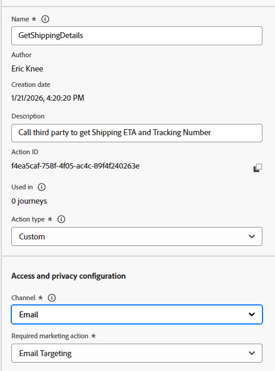

# 사용자 지정 작업 구성

## 학습 목표

패키지가 도착할 때 여정이 외부 엔드포인트 또는 서비스와 통신하여 ETA를 얻는 방법을 정의하는 사용자 지정 작업을 만듭니다.

## 작업으로 이동

관리 메뉴 아래의 왼쪽 레일에서 **구성**&#x200B;을 클릭한 다음 작업 타일에서 **관리** 단추를 클릭합니다


## 작업 구성

### 작업 이름 및 세부 정보

1. 오른쪽 상단에서 **작업 만들기** 단추를 클릭합니다.

   

2. 표시되는 구성 패널에서 다음과 같이 다음 기본 값을 업데이트합니다.
   - **이름**: `GetShippingDetails`
   - **설명**: `Call third party to get Shipping ETA and Tracking Number`
   - **작업 유형**: `Custom`
   - **채널**: `Email`
   - **필요한 마케팅 작업**: `Email Targeting`




### 엔드포인트 세부 정보

끝점 구성 영역에서 다음 세부 정보를 제공합니다.

- **끝점 URL**: `https://api.mockaroo.com/api/67077bb0?count=1&key=a0dbce20`
- **메서드**: `GET`
- **머리글:** *있는 그대로 남기기*
- **쿼리 매개 변수:**
  - **이름**: `orderid`
  - **유형**: `variable`

>[!NOTE]
>
>변수를 사용하면 모든 여정에 정적 값을 사용하는 대신 여정 중에 값을 전달할 수 있습니다

- **인증 유형**: `No Authentication`


### 응답 페이로드 세부 정보

이제 작업에서 응답 페이로드의 모양을 알 수 있도록 샘플 페이로드를 제공해야 합니다.

1. 페이로드 영역에서 **연필 아이콘**&#x200B;을 클릭하여 필드 구성 화면을 엽니다.

   

   응답 페이로드의 


2. **아래 페이로드를 [페이로드] 상자에 복사하여 붙여 넣기**

   ```json
   {
    "eta": "11/19/2025",
    "tracking_number": "072000326"
   }
   ```

   >[!NOTE]
   >
   >이는 위의 Mockaroo 종단점이 반환해야 하는 것과 동일한 JSON 구조입니다.


3. 응답 페이로드가 표시됩니다. **저장** 단추를 클릭합니다.


>[!NOTE]
>
>모든 항목을 문자열로 남길 수 있지만, 실제로는 데이터 유형과 일치하도록 업데이트해야 할 수도 있습니다


### 작업 테스트

1. 오른쪽 아래 레일의 **테스트 요청 보내기** 단추를 클릭하여 구성이 올바르게 작동하는지 확인합니다

   


2. **쿼리 매개 변수** 탭을 클릭하고 `orderId`의 값을 **123**(으)로 업데이트하십시오.

   orderId 값이 123으로 설정된 


3. **보내기 단추**&#x200B;를 클릭하면 모두 잘 작동하면 아래와 같이 응답 코드 200과 페이로드 미리 보기가 표시됩니다.

   

   미리보기

   ```json
   {
     "eta": "12/26/2025",
     "tracking_number": "063112249"
   }
   ```

   >[!WARNING]
   >
   >200 응답이나 미리보기가 표시되지 않으면 계속하지 마십시오. 진행자에게 도움을 요청하세요.


4. **취소** 단추를 클릭하여 작업 화면으로 돌아간 다음 오른쪽 상단 레일에서 위로 스크롤하여 **저장** 단추를 클릭합니다

>[!SUCCESS]
>
>축하합니다! 전문가 수준의 Ctrl+C, Ctrl+V 스킬 덕분에 사용자 지정 작업이 실시간으로 제공됩니다.

## 요약

주문 ID를 취하고 ETA 및 추적 번호를 반환하는 Adobe Journey Optimizer에서 구성된 재사용 가능한 사용자 지정 작업입니다.
