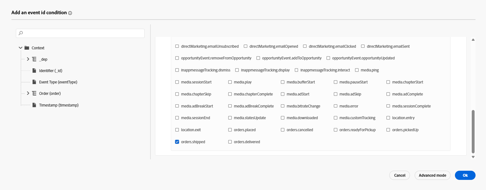

# 이벤트 구성

## 학습 목표

구매 후 작업(주문 배송)이 발생할 때 고객 여정을 트리거할 이벤트를 만들고 구성합니다.

## Journey Optimizer으로 이동

브라우저의 오른쪽 상단 모서리에서 **큐브**&#x200B;를 클릭한 다음 **Journey Optimizer**&#x200B;을(를) 선택합니다.

## 주문 배송 이벤트 구성

단일 이벤트를 사용하는 여정을 만들려면 먼저 이벤트를 구성해야 합니다.

1. 관리 메뉴 아래의 왼쪽 레일에서 **구성**&#x200B;을 클릭한 다음 이벤트 타일에서 **관리** 단추를 클릭합니다

   

2. 오른쪽 상단에서 **이벤트 만들기** 단추를 클릭합니다.

   

3. 다음과 같이 이벤트의 설정을 업데이트합니다.
   - **이름** = `orderShipped`
   - **유형** = `Unitary`
   - **이벤트 ID 유형** = `Rule based`
   - **스키마** = `dep: Orders v.1`

   단일 형식 및 dep로 구성된 

4. `Fields` 입력란에서 **연필 아이콘**&#x200B;을 클릭합니다.

   필드 입력 상자의 

5. 이벤트에 추가할 다음 필드를 선택하고 완료되면 **확인** 단추를 클릭하십시오.
   - `Event Type (eventType)`
   - `Order ID (orderID)`

   

   >[!NOTE]
   >
   >주문 ID 필드만 선택하고 주문 😁의 일부 필드는 선택하지 마십시오.

6. `Event Id condition input`에서 **연필 아이콘**&#x200B;을 클릭하세요.

   이벤트 ID 조건 입력의 

7. **`Event Type` 필드를 캔버스로 드래그**

   

8. 표시되는 선택 상자에서 제목이 **orders.shipped.**&#x200B;인 값을 찾아 확인합니다. 그런 다음 **확인** 단추를 클릭합니다.

   선택 상자에서 

9. 그런 다음 네임스페이스 및 프로필 식별자의 마지막 두 값을 아래에 표시된 값으로 업데이트합니다.
   - **네임스페이스** —> `Email`
   - **프로필 식별자** —> `personalEmail`

>[!NOTE]
>
>**네임스페이스 및 프로필 식별자가 어디에 사용됩니까?**
>
>이벤트를 사용하는 모든 여정의 경우 해당 이벤트에 대해 프로필을 조회하는 데 사용할 ID 네임스페이스 및 관련 프로필 식별자를 지정해야 합니다. 하나의 정체성을 다른 정체성보다 선택하는 것이 여정이 어떻게 작동하는지에 영향을 미칠 수 있다는 것을 이해하는 것이 중요합니다.
>
>*빠른 예:*
>
>이벤트 페이로드는 ECID(기본 ID) 및 고객 ID(선택 사항)와 같은 ID가 포함된 페이지 보기입니다.
>
>- ECID 선택됨 —> ID 서비스가 이 관계를 처음 본 것 같으므로 여정이 이 이벤트를 수신하면 ECID를 사용하여 프로필을 조회하려고 시도하지만 프로필을 찾지 못합니다.  왜요? ECID와 고객 ID 간에 관계가 아직 존재하지 않으며, 프로필의 트레이트가 알려진 식별자인 고객 ID에 대해 저장되어 있을 수 있습니다
>- 선택한 고객 ID —> 이 ID는 채울 필요가 없으며 대부분의 페이지 보기에서 비어 있을 수 있습니다.  따라서 이 ID를 선택한 경우 고객 ID가 설정된 인증된 페이지 보기가 있는 경우에만 여정이 실행됩니다.
>
>짧은 답변: 정답은 없으며 사용 사례 😃을(를) 기준으로 해야 하는 절충안입니다.

## 최종 주문 출하 이벤트 구성

최종 이벤트 구성이 아래와 일치하는지 확인합니다.  모든 항목이 정상인 경우 **저장** 단추를 클릭하십시오.

>[!TIP]
>
>첫 번째 AJO 이벤트를 구성했습니다. 하이파이브 하세요!

## 요약

여정의 진입점으로 사용할 수 있는 Adobe Journey Optimizer에서 구성된 주문 배송 이벤트
