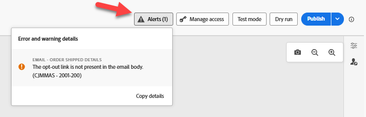

# 테스트 여정

## 학습 목표

여정 테스트 도구를 사용하여 이벤트 트리거 및 여정 로직이 올바르게 구성되었는지 확인합니다.

## 여정 테스트

1. 여정 목록이 표시되지 않으면 왼쪽 레일에서 **여정**&#x200B;을 클릭하고 **찾아보기 탭**&#x200B;을 클릭합니다
2. 열려면 **여정**&#x200B;을 클릭하세요.
3. **경고**&#x200B;를 클릭하고 오류가 없는지 확인합니다(경고는 괜찮음).



>[!NOTE]
>
>**CJMMAS란? - 2001-200**
>
>이메일 변형에 옵트아웃 링크가 누락되었음을 나타냅니다.

4. **시뮬레이션**&#x200B;을 클릭하고 왼쪽에서 **테스트 모드**&#x200B;를 선택합니다.

왼쪽의 [시뮬레이션]에서 


>[!NOTE]
>
>준비하는 데 몇 분 정도 걸릴 수 있습니다. 이 시간 동안에는 이벤트 트리거 버튼을 사용할 수 없습니다.


5. **이벤트 트리거**&#x200B;를 클릭하고 다음 속성을 채우십시오.
   - **이벤트 유형**: `orders.shipped`
   - **개인 전자 메일**: `henry.creel@emailsim.io`
   - **주문 ID**: `123`
6. **보내기**&#x200B;를 클릭합니다(보내기 클릭 후 응답하는 데 몇 초 정도 소요됨).


> [!WARNING]
>
>일부 학생들은 오류가 발생하여 몇 번 보내야 합니다. 이 작업을 **여러 번**&#x200B;해야 할 수 있습니다.
>
>**경우에 따라** 첫 번째 전송에서 다음 오류가 발생합니다.
>
>**인렛이 없습니다(참조 id: 3216a850-c40d-11f0-8fa5-73d1522cc9a2)**
>
>오류가 발생하면 **이벤트 트리거**&#x200B;를 클릭한 다음 **보내기**&#x200B;를 다시 클릭합니다.  이 작업을 **여러 번**&#x200B;해야 할 수 있습니다.


7. **결과** -> 왼쪽의 **로그 표시**&#x200B;를 클릭합니다.


> [!NOTE]
>
>오류가 발생한 일부 학생들은 빈 인스턴스 배열 `{"instances": []}`을(를) 표시하는 다른 로그를 받는 경우가 있습니다. 차단기가 아닙니다. 다음 단계로 넘어가십시오.

다음과 같은 메시지가 로그에 표시됩니다.

>[!NOTE]
>
>사용된 키 필드를 찾고 있습니다. **actionsHistory**, **transitionsHistory**, **eta**, **tracking_number**, **eventType**, **personalEmail** 및 **orderID**.

```json
{
  "actionsHistory": {
    "8919055f-1b00-4a43-8bd6-c8af894474b2": {
      "eta": "11/27/2025",
      "tracking_number": "091204404",
      "jo_status_code": "http_200"
    }
  },
  "transitionsHistory": {
    "orderShipped (1158856989)": {
      "eventType": "orders.shipped",
      "_id": "joTestModeEvent_5abbfdcd-561d-45a7-ba42-d0640539831a",
      "_dep": {
        "personalEmail": "henry.creel@emailsim.io"
      },
      "order": {
        "orderID": "123"
      },
      "timestamp": "2025-11-17T23:30:49.576289372Z"
    }
  }
}
```


8. 브라우저 **탭**&#x200B;을 **닫기**
9. 오른쪽 상단의 **테스트 모드 닫기**


10. 오른쪽 상단의 여정 **게시**&#x200B;를 클릭합니다.

오른쪽 상단의 여정에 대한 

11. 왼쪽 상단의 \&lt;- 화살표를 클릭하여 **여정**&#x200B;을 **닫기**


다음으로 실제 주문 배송 이벤트를 AEP으로 보냅니다.

## 요약

여정이 구성 유효성 검사를 통과했으며 이벤트를 받을 준비가 되었습니다.
