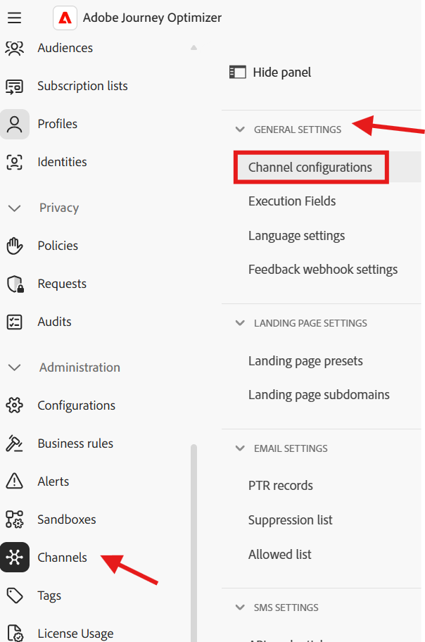

# SMS 채널 구성

## 목표

다음 단계 세트에서는 SMS 채널을 구성합니다. 이 단계는 캠페인을 구축할 때 나중에 개별 라인 소유자에게 메시지를 보낼 수 있도록 필요합니다.

## 채널로 이동

1. Adobe Journey Optimizer에서 **관리** -> **채널** 메뉴로 이동합니다.
1. **API 자격 증명**→ **SMS 설정**&#x200B;을 선택합니다.
1. **API 자격 증명 만들기**&#x200B;를 클릭합니다.

## SMS API 자격 증명 정의

먼저 AJO에서 아웃바운드 SMS 요청을 전송하는 데 사용하는 API 커넥터를 만듭니다.

1. SMS 공급자에서 **Twilio**&#x200B;을(를) 선택합니다.
1. 자신의 [Twilio 체험판 계정](https://www.twilio.com/try-twilio)을(를) 사용하여 다음 API 자격 증명 세부 정보를 입력하십시오.
   - **이름:** `DEP SMS`
   - **계정 SID:**&#x200B;이(가) Twilio 콘솔 대시보드에 있습니다.
   - **인증 토큰:**&#x200B;이(가) Twilio 콘솔 대시보드에 있습니다(**보기**&#x200B;를 클릭하여 표시).
1. API 자격 증명을 등록하려면 **제출**&#x200B;을 클릭하세요.

>[!NOTE]
>
>이 단계를 시작하기 전에 확인된 전화 번호로 무료 Twilio 체험판 계정이 필요합니다. [twilio.com/try-twilio](https://www.twilio.com/try-twilio)에 등록한 다음 Twilio 콘솔 대시보드에서 계정 SID와 인증 토큰을 찾습니다. 전체 연습은 Twilio의 [시작 안내서](https://www.twilio.com/docs/usage/tutorials/how-to-use-your-free-trial-account)를 참조하십시오.

## SMS 채널 구성 만들기

이제 이 API 자격 증명을 여정 및 캠페인이 사용할 수 있는 채널 구성에 매핑합니다.

1. **채널** → **일반 설정** → **채널 구성**(으)로 이동합니다.

   

2. **채널 구성 만들기**&#x200B;를 클릭합니다.

   

3. 다음 값으로 SMS 채널 구성 설정 을 입력합니다.
   - **이름:** `Relational-SMS-Multi-Entity`
   - **채널:** `Mobile Message`
   - **마케팅 액션:** `SMS Targeting`

>[!NOTE]
>
>사용자에게 권한이 없다는 오류 메시지가 표시되면 무시하고 계속합니다.

## SMS 설정

모바일 메시지로 채널 을 선택하면 SMS 설정이라는 새 섹션이 표시됩니다. 다음 세부 정보를 입력합니다.

- **모바일 메시지 유형:** `Marketing`
- **모바일 메시지 구성:** `DEP SMS`
- **보낸 사람 번호:** `01234567890`
- **하위 도메인:** `leave blank`
- **옵트아웃 번호:** `leave blank`

## 실행 세부 정보

1. 실행 세부 정보에서 **오케스트레이션된 캠페인** 탭을 클릭합니다

   

2. **사용** 확인란이 선택되었는지 확인

   

3. 다음 하위 섹션 **실행 차원** 아래에서 다음을 설정하십시오.
   - **메시지 배달 단위:** `Target + Secondary Dimension`
   - **프로필 대상 Dimension:** `dep-rel: Customer Account - customer_id`
   - **보조 Dimension:** `Customer Line`

   대상 및 보조 차원이 있는 

   

   >[!NOTE]
   >
   >이 설정은 메시지를 보낼 때 프로필 대상 Dimension에 일치하는 레코드당 하나의 메시지를 전달해야 한다는 오케스트레이션된 캠페인을 알려줍니다.

4. 실행 주소 제목 아래에서 **보조 Dimension**&#x200B;에 대한 라디오 단추를 선택한 다음 **SMS 실행 필드**&#x200B;에서 편집 단추를 클릭합니다

   

5. 팝업에서 스키마 **dep-rel: 고객 전화**&#x200B;을 클릭하고 **휴대폰**&#x200B;을 선택합니다.

   

   

6. 아래에서 최종 실행 세부 정보 섹션이 일치하는지 확인

## 제출 및 검토

1. **제출** 단추를 클릭하여 구성을 완료하고 성공 메시지가 표시됩니다

   

2. 계속 진행하기 전에 채널 구성 인벤토리 페이지에서 상태가 **활성**(으)로 표시되는지 확인하십시오.

   

   >[!CAUTION]
   >
   >상태가 **활성**&#x200B;이 될 때까지 기다립니다. 그렇지 않으면 이후의 랩 단계가 실패합니다.

3. 상태가 활성으로 바뀌면 완료됩니다!

>[!TIP]
>
>🚀 부야! 이제 SMS 채널이 라이브되며 조치를 취할 준비가 되었습니다!

## 요약

이제 SMS 채널을 구성하는 방법을 확인했습니다.  이 구성은 API 기반 SMS이므로 공급자에 따라 다른 인증 방법을 사용할 수 있습니다.

관심 있는 경우 [여기](https://experienceleague.adobe.com/ko/docs/journey-optimizer/using/channels/sms/configure-sms/sms-configuration)에서 더 읽을 수 있습니다.
