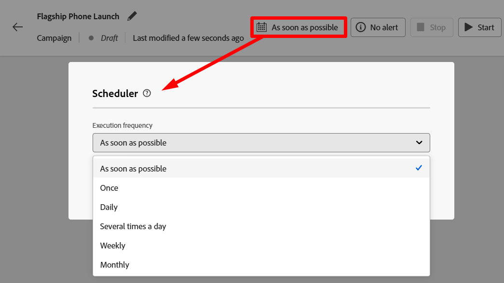

# 오케스트레이션된 캠페인 만들기

## 목표

다음 단계 세트에서 모든 캠페인의 시작점인 조정된 캠페인(활동 없음)의 셸을 만듭니다.

## 캠페인으로 이동

1. 먼저 브라우저의 오른쪽 상단에 있는 앱 서랍에서 앱을 선택하여 Adobe Journey Optimizer 애플리케이션에 있는지 확인합니다

&#x200B;2. 왼쪽 탐색 레일에서 **캠페인**&#x200B;을 선택합니다.
&#x200B;3. 그런 다음 오른쪽 상단의 **캠페인 만들기** 단추를 클릭합니다

&#x200B;4. 표시되는 모달에서 **오케스트레이션 - 마케팅**&#x200B;을 선택하고 **확인**&#x200B;을 클릭합니다.

## 캠페인 설정

1. 필요한 캠페인 메타데이터에 다음 정보를 입력하십시오.
   - **이름** —> `Flagship Phone Launch`
   - **설명** —> *비워 둠*
   - **병합 정책** —> `Default Timebased`
   - **태그** —> *비어 있음*

완료되면 화면은 아래와 같이 표시됩니다.

&#x200B;2. 계속하려면 **저장** 단추를 클릭하십시오.

## 예약 이해

캠페인을 만든 후 워크플로우 캔버스에 즉시 도달해야 합니다.  오른쪽 상단에는 이 워크플로우를 사용자 캠페인에서 실행해야 하는 빈도에 대한 예약 옵션이 있습니다.

기본값은 항상 **가능한 한 빨리**(으)로 설정됩니다. 이 연습에서는 기본값을 사용하지만 다른 많은 옵션을 사용할 수 있습니다.

## 요약

이제 오케스트레이션된 캠페인을 만드는 방법과 일정을 조정할 때 사용할 수 있는 일반 옵션을 확인했습니다.
