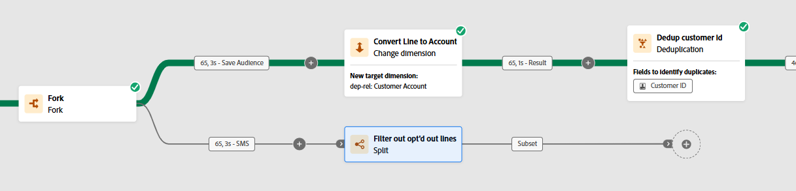
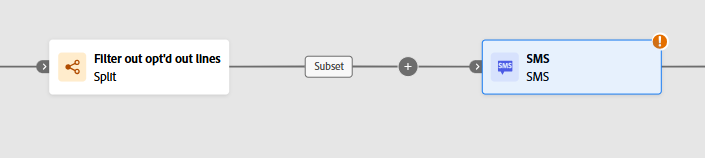
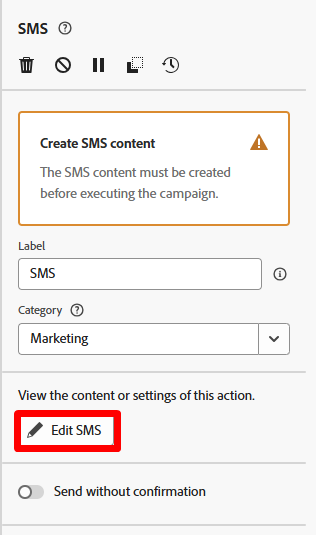

# 라인 필터링

## 목표

다음 단계 세트에서는 라인 수준에서 옵트아웃됨으로 인해 SMS 메시지로 타깃팅할 수 없는 모든 라인을 필터링할 예정입니다.  이는 라인 수준 대상이므로 프로필 동의에 의존할 수 없습니다.

## 분할 활동 설정

1. 포크 활동의 아래쪽 전환에 있는 **+** 아이콘을 클릭하고 팝업에서 **분할** 활동을 선택합니다.

   

2. 오른쪽 레일에서 레이블을 업데이트하여 다음 내용을 표시합니다. `Filter out opt'd out lines`

   

3. 오른쪽 레일에서 기본 세그먼트 **하위 집합** 섹션을 확장하고 **필터 만들기** 단추를 클릭합니다.

   

4. SMS 메시지에서 옵트아웃된 모든 고객 회선을 제거하도록 조건을 추가한 다음 **확인**&#x200B;을 클릭합니다.

   

   >[!NOTE]
   >
   >조건을 만드는 방법을 파악해야 하지만 최종 결과는 위의 스크린샷과 일치합니다.  잡았다!

5. 작업 내용을 저장하려면 오른쪽 상단에 있는 저장 버튼을 클릭합니다.  캔버스는 현재 다음과 같습니다.

## SMS 활동 추가

1. 워크플로우 캔버스에서 추가한 분할 조건 뒤에 있는 **+** 아이콘을 클릭하고 **SMS 활동**&#x200B;을 선택합니다

   

   

2. 오른쪽 레일에서 SMS 편집 버튼을 클릭하여 SMS 메시지 구성을 시작합니다

   

3. 위쪽 탐색에서 Actions 메뉴 항목을 클릭하고 SMS 구성 드롭다운에서 이전에 만든 채널을 선택합니다.

>[!CAUTION]
>
>🫨이(가) 없습니다.  왜 결과가 안 나오나요?  이미 SMS 채널을 설정하지 않으셨나요?  제품이 고장났나요?
>
>!!!!!!!!!

## 기겁한 순간

포크 전환에는 현재 고객 라인(즉, 현재 결과가 관계 저장소에서 관련되는 테이블)의 타겟팅 차원이 있습니다.  오케스트레이션된 캠페인의 고유한 특징은 전송 시 항상 실시간 고객 프로필에 다시 참여하여 메시지의 게재 및 추적 정보가 프로필에 귀속된다는 것입니다.  이 조인은 고객 계정 테이블에서 미리 빌드되었습니다.

SMS에 대한 채널 구성이 이미 미리 설정되어 있으며 현재 다음과 같습니다.

**이 글을 읽는 방법은 다음과 같습니다.**

- 보조 차원(예: 고객 라인)에서 찾은 관련 레코드 수에 대해 대상 차원(예: 고객 계정)당 하나의 메시지를 전달합니다
- 보조 차원(예: 고객 라인)에 있는 휴대폰 번호를 사용하여 각 SMS 게재를 실행합니다

한 프로필에 여러 메시지를 보낼 수 있는 이 고유한 기능은 여정과 다르게 만드는 오케스트레이션된 캠페인의 기본 기능 중 하나입니다.

그럼 이걸 어떻게 작동시킬까요?  변경 차원 😀 추가

## 변경 차원 추가

1. SMS 편집 화면에서 뒤로 단추를 클릭합니다.

   

2. 워크플로우 캔버스에서 필터 활동과 SMS 활동 사이의 **+** **아이콘**&#x200B;을 클릭하고 **차원 변경**&#x200B;을 선택합니다.

   

3. 오른쪽에서 변경 차원을 다음 정보로 업데이트합니다.
   - **레이블:** `Convert Line to Account`
   - **새 대상 차원:**`dep-rel: Customer Account`

   

4. 캔버스의 오른쪽 상단에 있는 **저장** 단추를 클릭하여 작업을 저장합니다. 완료되면 이제 워크플로가 다음과 같이 표시됩니다.

변경 차원을 추가한 후 

## SMS 메시지 구성

워크플로우를 수정했으므로 SMS를 다시 구성합니다.

1. 워크플로우 캔버스에서 SMS 활동을 클릭한 다음 왼쪽 레일에서 **SMS 편집** 단추를 클릭합니다

   

   >[!NOTE]
   >
   >이 화면을 로드하는 데 시간이 조금 걸립니다.  짜증나는 거 알아, 내 말 믿어 고쳐지고 있다고

2. 위쪽 탐색에서 **작업** 메뉴 항목을 클릭한 다음 SMS 구성 드롭다운에서 이전에 만든 채널을 선택합니다.

>[!TIP]
>
>기분 좋죠? 😮‍💨

## 요약

당신은 이것을 통해 성공했고 바라건대 두 가지 매우 중요한 것을 배웠습니다.

1. 최종 결과 타겟팅 차원은 사용하려는 채널 구성과 일치해야 합니다
1. 차원 변경 활동은 이러한 일이 발생하도록 보장하기 위해 가장 친한 친구가 될 수 있습니다
