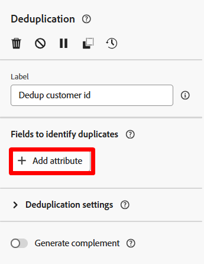

# 대상자 저장

## 목표

다음 단계 세트에서는 만든 대상자를 다시 대상자 포털에 저장하여 Adobe Experience Platform 및 해당 애플리케이션 전반의 다른 솔루션을 자신의 사용 사례에 활용할 수 있도록 할 것입니다.

## 차원 변경

1. 워크플로우 캔버스에서 **대상자 저장** 분기의 **+** **아이콘**&#x200B;을 클릭하고 활동 목록에서 **차원 변경** 활동을 선택합니다

&#x200B;2. 아래에 설명된 대로 변경 차원의 속성을 업데이트합니다.
   - **레이블:** `Convert Line to Account`
   - **새 대상 차원:** `dep-rel: Customer Account`

>[!NOTE]
>
>**이 작업을 수행하는 이유는 무엇입니까?**  Real-Time Customer Profile(대상자를 저장하는 위치)에 참여하려면 dep-rel: 고객 계정 스키마에서만 참여하는 구성한 프로필 타겟 매핑을 사용해야 합니다.

&#x200B;3. 완료되면 캔버스 모양이 다음과 같습니다.  작업 내용을 저장합니다!

변경 차원 활동을 추가한 후 

## 결과 중복 제거

1. 차원 변경 활동 뒤에 **+** **아이콘**&#x200B;을 클릭하고 활동 목록에서 **중복 제거** 활동을 선택합니다

&#x200B;2. 중복 제거 활동의 레이블을 `Dedup customer id`(으)로 업데이트

&#x200B;3. 이제 **+ 특성 추가** 단추를 클릭하고 **고객 ID**&#x200B;라는 스키마에서 필드를 선택합니다.

&#x200B;4. 중복 제거 설정에서 다음 세트가 있는지 확인합니다.
   - **유지할 중복 항목:** `1`
   - **중복 제거 방법:** `Random selection`

>[!NOTE]
>
>중복 제거에 대한 다른 옵션을 사용하면 사용자 지정 논리를 지정할 수 있습니다.  대부분의 경우 중복 제거를 수행해야 하는 경우 테이블의 기본 키를 사용하여 수행합니다.

&#x200B;5. 완료되면 캔버스는 다음과 같이 표시됩니다. 이동하기 전에 오른쪽 상단의 **저장** 단추를 클릭하십시오.

## 대상자 저장 활동 추가

1. 중복 제거 활동 뒤에 있는 **+** 아이콘을 클릭하고 **대상자 저장** 활동을 선택합니다.

&#x200B;2. 오른쪽 레일에서 활동의 속성을 다음으로 설정합니다.
   - **대상 레이블**: `Apple Upgrade Eligible Customer Accounts`
   - **프로필 매핑 필드**: `dep-rel: Customer Account - customer id`

>[!NOTE]
>
>&quot;프로필 매핑 필드&quot;는 관계형 스토어가 실시간 고객 프로필에 가입할 수 있도록 이전에 설정한 것입니다.  프로필이 고객 계정 수준으로 모델링되었으므로 대상을 동일한 수준으로 저장하려고 합니다.  따라서 변경 차원 및 중복 제거가 필요합니다.

## 대상 필드 매핑

기본적으로 타겟팅 차원의 기본 키(즉, 고객 ID)는 대상자에 필드로 추가됩니다. 오른쪽을 보고 필드를 확장하면 이 항목을 볼 수 있습니다.  주의할 두 가지 사항:

- **Source 대상 필드** —> 는 관계형 스키마에서 가져온 필드를 참조합니다
- **대상 필드** —> 대상 저장의 일부로 만들 필드의 이름

>[!NOTE]
>
>대상 필드 이름이 `Dep_rel_customer_account_Customer_id`인 방법을 참고하십시오.  이 항목을 항상 마케팅 담당자가 읽기 쉬운 항목으로 변경해야 합니다.

## 기본 대상 필드 수정

1. 기본 대상 필드의 이름을 **Customer\_ID**(으)로 바꾸십시오.

>[!TIP]
>
>이제 사람이 읽을 수 있는 필드 이름 🎉이(가) 있습니다.

&#x200B;2. 워크플로우를 실행하려면 **시작** 단추를 클릭하세요. 이제 워크플로우는 다음과 같으며 카운트는 다음과 같습니다.
   - 대상 작성: `65`
   - 줄을 계정으로 변환: `65`
   - 중복 제거 고객 ID: `46`

>[!NOTE]
>
>대상자 저장 활동은 워크플로우를 단순히 시작할 때가 아니라 게시할 때만 대상자를 만듭니다. 대상자가 만들어지면 추가한 모든 특성이 포함되며, 세분화 서비스 작업의 다음 예약된 매일 실행 동안 실시간 고객 프로필에 참여합니다.

>[!CAUTION]
>
>워크플로우를 게시하지 마십시오!

## 과제

대상자를 저장하기 전에 중복을 제거하지 않으면 어떻게 됩니까?  대상이 65개의 레코드를 모두 저장합니까, 아니면 46개의 레코드만 저장합니까?

## 답변

대상자는 65개의 레코드를 모두 저장하지만 대상자 읽기 활동은 가입 조건 😁을(를) 기반으로 가져올 때 중복 제거합니다.

## 요약

이제 대상자 저장의 작동 방식과 중복 제거가 중요한 이유에 대해 잘 알고 있어야 합니다.  관계형 저장소 데이터는 실시간 고객 프로필에 가입하는 방법을 알고 있어야 하므로 항상 프로필 대상 매핑을 정의해야 합니다.  프로필 대상 매핑이 조인 조건 🙂입니다.
