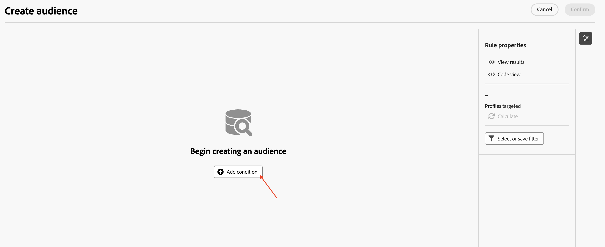

# 대상자 작성

## 목표

다음 단계 집합에서는 올바른 타겟팅 차원을 선택하고 적절한 조건을 설정하여 관계형 스키마에서 대상을 작성합니다. 또한 새로 고침 옵션을 사용하여 예상된 행 수를 확인합니다.

## 대상자 빌드

1. 캠페인이 렌더링되면 캔버스 내의 **+**&#x200B;을(를) 클릭하여 옵션 메뉴를 연 다음 **타깃팅 활동**&#x200B;에서 **대상자 빌드**&#x200B;를 선택합니다

2. **대상자 작성** 활동은 오른쪽의 세부 정보 창을 열고 검색 아이콘을 클릭하여 **타깃팅 차원**&#x200B;을(를) 선택합니다.

3. 목록에서 `dep-rel: Customer Account`을(를) 선택하고 **확인**&#x200B;을 클릭합니다.

4. **타깃팅 차원**&#x200B;이 구성되면 대상 만들기를 클릭하여 관계형 스키마에서 대상을 빌드하는 프로세스를 시작합니다

5. 대상자 세부 정보 만들기 창이 열리고 **조건 추가**&#x200B;를 클릭합니다.

6. 아래로 스크롤하여 `dep-rel: Plan Lookup` 옆에 있는 **>**&#x200B;을(를) 클릭하여 확장합니다.

7. `dep-rel: Plan Name`을(를) 선택하고 **확인**&#x200B;을 클릭합니다.

8. 사용자 지정 조건 패널에서 연산자를 &quot;같음&quot;으로 두고 값에 대해 드롭다운에서 [기본]을 선택합니다.

>[!NOTE]
>
>선택한 열에 사용할 수 있는 모든 개별 값이 드롭다운에 표시되므로 사용자 지정 조건을 쉽게 만들 수 있습니다.

9. 사용자 지정 조건이 구성되면 새로 고침 아이콘을 클릭하여 개수를 계산하고 확인합니다. 결과를 계산하는 데 도움이 되는 두 가지 위치가 있습니다

>[!NOTE]
>
>새로 고침 작업은 관계형 데이터에 대해 조건을 평가하고 예상 결과를 표시합니다. 이 작업은 일반적으로 몇 초 정도 소요되며, 기준을 미세 조정하고 기대치에 부합하도록 하는 데 매우 유용합니다.

10. 개수(**38**)는 지정한 조건과 일치하는 관계형 저장소의 행 수를 나타냅니다. **대상자 만들기** 창을 종료하려면 **확인**&#x200B;을 클릭하세요.

>[!NOTE]
>
>규칙 속성 섹션에는 자세한 내용을 보기 위한 옵션이 있습니다. 반환된 실제 결과를 보려면 **결과 보기**&#x200B;를 클릭하십시오. 실행 중인 쿼리를 보려면 **코드 보기** 옵션을 사용하십시오.

## 요약

이제 관계형 스키마에서 올바른 타겟팅 차원을 선택하여 캠페인에서 대상 작성 활동을 사용하는 것이 얼마나 쉬운지 확인했습니다. 그런 다음 대상 작성 기준을 구체화하는 조건을 추가하고 새로 고침 옵션을 사용하여 예상 행 수를 확인했습니다.

관심 있는 경우 [여기](https://experienceleague.adobe.com/en/docs/journey-optimizer/using/campaigns/orchestrated-campaigns/design-campaigns/build-audience)에서 더 읽을 수 있습니다.
