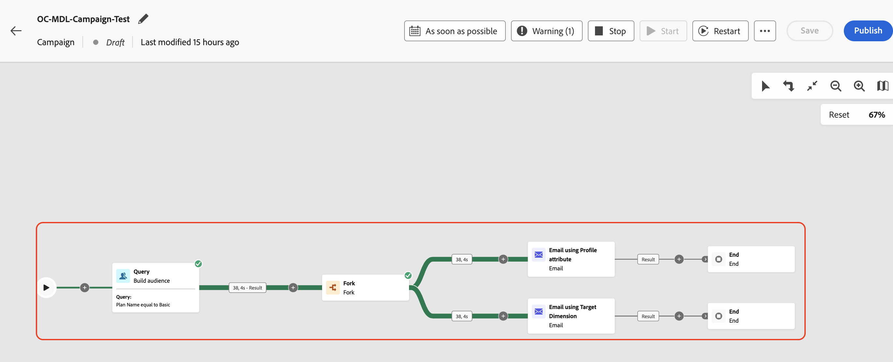
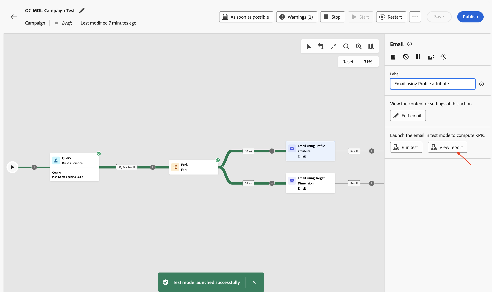

# 캠페인 테스트

## 목표

다음 단계 세트에서는 캠페인을 게시하기 전에 예상대로 캠페인 기능을 확인하기 위해 테스트 모드에서 캠페인을 실행합니다. 이 경우 테스트 모드는 실제로 이메일을 보내지는 않지만 전체 흐름을 확인하고 문제를 조기에 식별하는 데 도움이 됩니다.

## 워크플로우 시작

1. 두 개의 이메일 흐름이 구성되면 캠페인은 다음과 같이 표시됩니다. **테스트 모드**&#x200B;에서 캠페인을 실행하려면 **시작** 단추를 클릭하세요.

   ![테스트 모드에서 캠페인을 실행하려면 [시작]을 클릭하세요](assets/test-the-campaign-click-start-test-mode.png)

   >[!NOTE]
   >
   >이전 랩에서 언급했듯이 테스트 모드를 사용하여 캠페인 실행과 다양한 활동의 결과를 확인할 수 있습니다. 각 활동은 흐름의 끝에 도달할 때까지 순차적으로 실행됩니다.

2. 모든 캠페인 활동의 테스트 실행이 시작됩니다. 결과를 확인합니다.

## 이메일 보고서 #1

1. 전자 메일 게재를 테스트하려면 **프로필 특성을 사용한 전자 메일** 활동을 클릭하고 오른쪽 창에서 **테스트 실행**&#x200B;을 클릭합니다

   

2. 확인 메시지를 기다린 다음 **보고서 보기**&#x200B;를 클릭하여 전자 메일 테스트의 세부 정보를 확인합니다

   

3. 이메일 보고서 페이지에는 캠페인 통계 및 실행 상태가 표시됩니다. 이메일 테스트는 오류가 없는지 확인하는 활동이며 이메일을 보내지 않습니다. 일반적으로 완료하는 데 약 \~**5**&#x200B;분이 소요됩니다.

   

   >[!NOTE]
   >
   >최종 테스트 결과를 보려면 페이지를 몇 번 새로 고쳐야 할 수 있습니다.

4. 이메일 테스트가 완료되면 결과가 표시됩니다. 오류가 일부 있습니다. 이유를 알아보려면 **자세히 보기**&#x200B;를 클릭하세요.

   

5. 이유 상태: `Email address not found in profile`

>[!NOTE]
>
>이메일 활동에 대해 구성된 **게재 주소**, 프로필 특성을 사용하는 **이메일**&#x200B;이(가) 프로필 특성 `personalEmail.address`을(를) 사용하도록 구성되었으므로 **AEP 프로필**&#x200B;에 대한 종속성을 만들었습니다.
>
>관계형 스키마의 정규화된 **38** 고객 ID 중 시스템은 해당하는 **7**&#x200B;개의 AEP 프로필만 찾을 수 있습니다. 나머지 **31**&#x200B;에 대해 AEP 프로필이 존재하지 않아 `Email address not found in profile` 오류 메시지가 발생했습니다.
>
>오케스트레이션된 캠페인에서 AEP 프로필 특성을 사용할 때는 데이터 레이크와 관계 저장소의 데이터가 **일관되게**&#x200B;유지된다는 점을 기억해야 합니다.

## 이메일 보고서 #2

1. Target Dimension **활동을 사용하여**&#x200B;전자 메일에 대해 동일한 프로세스를 반복합니다

   

2. 확인 메시지를 기다린 다음 **보고서 보기**&#x200B;를 클릭하여 전자 메일 테스트의 세부 정보를 확인합니다

   

3. 이메일 테스트가 완료되면 결과가 표시됩니다. 이 경우 오류가 발생하지 않습니다

>[!NOTE]
>
>Target Dimension을 사용하는 전자 메일 활동 **전자 메일**&#x200B;에 대한 **배달 주소**&#x200B;이(가) 관계형 스키마에서 `dep_rel_customer_account.email`을(를) 사용하도록 구성되었으므로 AEP 프로필 또는 해당 특성에 대한 종속성이 없습니다.
>
>모든 **38** 적격 고객 ID가 관계형 저장소에 해당 전자 메일을 포함하고 있으며 오류 없이 타겟팅될 수 있습니다.

## 워크플로우 중지

캠페인에 대한 **테스트 모드**&#x200B;를 중지하려면 **중지** 단추를 클릭하십시오.

>[!TIP]
>
>두 이메일 채널 구성은 동일한 캠페인 내에서 테스트되었으며 AEP 프로필 속성을 사용하는 것과 이메일 채널 구성에서 Target Dimension을 사용하는 것 간에 차이가 관찰되었습니다.
>
>축하합니다. 메시지 게재 실습을 마치겠습니다.

## 요약

이제 흐름과 동작을 파악하기 위해 만든 캠페인을 테스트하는 방법을 살펴보았습니다. 여기에서는 테스트 흐름 실행 중에 이메일 채널 구성에 대해 서로 다른 설정을 사용하는 뉘앙스를 잘 이해했습니다.

필요한 경우 캠페인 테스트 모드 [여기](https://experienceleague.adobe.com/en/docs/journey-optimizer/using/campaigns/orchestrated-campaigns/launch/start-monitor-campaigns)에 대해 자세히 읽어볼 수 있습니다.
