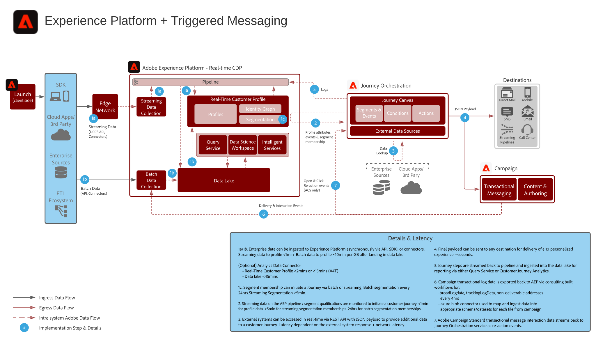

# 트리거 메시지와 Adobe Experience Platform 블루프린트

Adobe Experience Platform을 스트리밍 데이터, 고객 프로필 및 세분화의 중앙 허브로 사용하여 트리거된 메시지 및 경험을 실행합니다.

## 사용 사례

* 트리거 메시지
* 등록 확인
* 장바구니 및 애플리케이션 양식 버리기
* 장소 트리거 메시지

## 아키텍처

## 통합 패턴

* Adobe Experience Platform -> Journey Orchestration

## 필요 조건

* Adobe Experience Platform
* Journey Orchestration

## 가드레일

### Journey Orchestration

* [제한 사항에 대한 자세한 내용](https://experienceleague.adobe.com/docs/journeys/using/starting-with-journeys/limitations.html?lang=ko#starting-with-journeys)은 링크를 참조하세요.
* 대상 시스템이 과부하로 수신에 실패하지 않도록 API 설정을 통해 용량 제한을 사용할 수 있습니다. 용량 제한이란 최대 용량을 초과하는 메시지를 완전히 없애 보내지 않는 것을 말합니다. 트래픽 조절은 아직 지원하지 않습니다.
   * 최대 연결 수: 대상에서 처리할 수 있는 최대 http/s 수
   * 최대 호출 수: periodInMs 매개 변수 내에 실행할 수 있는 최대 호출 수
   * periodInMs: 밀리세컨드(ms)로 표기한 시간
* 세그먼트 멤버십에서 시작한 여정은 두 가지 모드로 작동할 수 있습니다.
   * 세그먼트 일괄 처리(24시간마다 새로 고침)
   * 세그먼트 스트리밍(5분 미만의 인증)
* 세그먼트 일괄 처리: 인증 사용자의 일별 볼륨을 이해해야 하며, 대상 시스템이 각 여정 및 모든 여정의 발생 처리량을 처리할 수 있어야 합니다.
* 세그먼트 스트리밍: 프로필 인증 첫 발생을 각 여정 및 모든 여정에 대한 일별 스트리밍 인증 볼륨과 함께 처리할 수 있어야 합니다.
* 최종 대상은 REST API 및 JSON 페이로드를 지원해야 합니다.
* 현재 Offer Decisioning을 지원하지 않습니다.
* [Experience Platform 프로필 및 데이터 수집 가드레일](https://experienceleague.adobe.com/docs/experience-platform/profile/guardrails.html?lang=ko)을 참조하세요.

### Adobe Campaign Standard

* 14tps(시간 당 50,000)의 처리량만 지원할 수 있습니다.
* 세그먼트 멤버십에서 시작한 여정은 지원하지 않습니다.
* 트랜잭션 메시지 열림에 대한 반응 이벤트/클릭 수는 Journey Orchestration 내에서 지원됩니다.
* 트랜잭션 메시지 로그는 현재 Experience Platform에 기본으로 동기화되지 않아 수동으로 구성해야 합니다. 로그는 네 시간에 한 번 이하로 내보내기를 추천합니다.

## 구현 단계

### Adobe Experience Platform

#### 스키마/데이터 세트

1. [고객 제공 데이터를 기반으로 Experience Platform에서 개인 프로필, 경험 이벤트 및 다중 항목 스키마를 구성합니다.](https://experienceleague.adobe.com/docs/platform-learn/tutorials/schemas/create-a-schema.html)
1. broadLog, trackingLog, 게재 불가 주소 및 프로필 환경 설정에 대하여 Adobe Campaign 스키마를 만듭니다(선택 사항).
1. [데이터](https://experienceleague.adobe.com/docs/platform-learn/tutorials/data-ingestion/create-datasets-and-ingest-data.html) 를 인제스트할 수 있도록 Experience Platform에서 데이터를 만듭니다.
1. [거버넌스를 ](https://experienceleague.adobe.com/docs/platform-learn/tutorials/data-governance/classify-data-using-governance-labels.html) 위해 Experience Platform에 데이터 사용 레이블을 추가합니다.
1. [대상 관리 정책을 만듭니다.](https://experienceleague.adobe.com/docs/platform-learn/tutorials/data-governance/create-data-usage-policies.html)

#### 프로필/ID

1. [고객용 네임스페이스를 만듭니다](https://experienceleague.adobe.com/docs/platform-learn/tutorials/identities/label-ingest-and-verify-identity-data.html).
1. [스키마에 ID를 추가합니다](https://experienceleague.adobe.com/docs/platform-learn/tutorials/identities/label-ingest-and-verify-identity-data.html).
1. [프로필에 대한 스키마 및 데이터 세트를 활성화합니다](https://experienceleague.adobe.com/docs/platform-learn/tutorials/profiles/bring-data-into-the-real-time-customer-profile.html).
1. [실시간 고객 프로필](https://experienceleague.adobe.com/docs/platform-learn/tutorials/profiles/create-merge-policies.html) 의  [!UICONTROL 보기] (선택 사항)를 다르게 보려면 병합 정책을 설정합니다.
1. Adobe Campaign에서 사용하기 위한 세그먼트를 만듭니다.

#### 소스/대상

1. [스트리밍 API 및 소스 ](https://experienceleague.adobe.com/?recommended=ExperiencePlatform-D-1-2020.1.dataingestion) 커넥터.1을 사용하여 Experience Platform에 데이터를 인제스트합니다. Adobe Campaign에서 사용할  [!DNL Azure] Blob 저장소 대상을 구성합니다.

#### 모바일 앱 배포

1. Adobe Campaign Classic의 경우 Adobe Campaign SDK, Adobe Campaign Standard의 경우 Experience Platform SDK를 구현합니다. Experience Platform Launch가 있는 경우 Experience Platform SDK의 Adobe Campaign Classic 또는 Adobe Campaign Standard 확장을 사용하는 것을 추천합니다.

### Journey Orchestration

1. 먼저 Journey Orchestration 내에서 고객 여정 시작에 사용할 스트리밍 데이터를 구성해야 오케스트레이션 ID를 할당할 수 있습니다. 이 오케스트레이션 ID는 데이터 수집에 사용할 수 있도록 개발자에게 제공됩니다.
1. 외부 데이터 소스를 구성합니다.
1. 사용자 정의 행동을 구성합니다.

### Adobe Campaign Standard

1. 적절한 개인화 설정으로 메시지 템플릿을 구성합니다.
1. 트랜잭션 메시지 로그를 내보내는 워크플로우를 구성합니다. 네 시간에 한 번 이하로 실행하기를 추천합니다.

## 관련 설명서

* [Adobe Experience Platform 설명서](https://experienceleague.adobe.com/docs/experience-platform.html?lang=ko)
* [Journey Orchestration 설명서](https://experienceleague.adobe.com/docs/journey-orchestration.html?lang=ko)
* [Adobe Campaign Classic 설명서](https://experienceleague.adobe.com/docs/campaign-classic.html?lang=ko)
* [Adobe Campaign Standard 설명서](https://experienceleague.adobe.com/docs/campaign-standard.html?lang=ko)
* [Experience Platform Launch 설명서](https://experienceleague.adobe.com/docs/launch.html?lang=ko)
* [Experience Platform Mobile SDK 설명서](https://experienceleague.adobe.com/docs/mobile.html?lang=ko)
