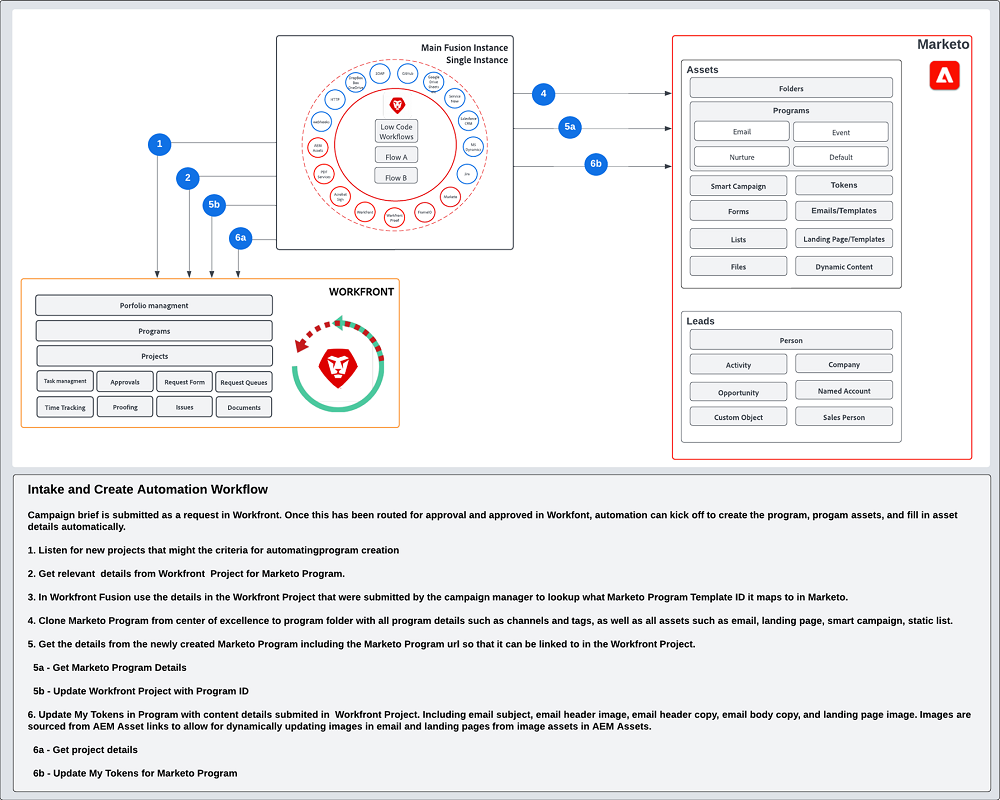

# 가져오기 및 만들기 {#intake-and-create}

마케팅 운영 팀에 새로운 캠페인을 시작하기 위해 필요한 마케팅 요청의 수는 고기능 팀이 반복 작업의 회전으로 전환되어 번지고 혁신을 침체시킬 수 있습니다.

캠페인 요청 제출 프로세스를 설정하고 일반적으로 요청된 마케팅 캠페인 만들기를 자동화함으로써 다음을 수행할 수 있습니다. 캠페인 속도를 높이고, 오류를 줄이고, 마케팅 작업의 적합한 구성원에게 요청을 라우팅하고, 리소스 활용도를 균형 있게 조정하고, 마케팅 작업의 대부분을 보다 전략적인 작업에 집중할 수 있습니다.

Workfront 및 Marketo Engage을 사용하면 시스템 간 연결을 통해 [Workfront 요청 양식](https://experienceleague.adobe.com/docs/workfront/using/administration-and-setup/customize/custom-forms/create-or-edit-a-custom-form.html){target=&quot;_blank&quot;} 를 사용하여 Marketo Engage 프로그램을 만든 다음 다음과 같은 키 변수를 채웁니다. 제목 줄, 이메일 복사, 이미지, 날짜, 시간, 이벤트 정보 등

이 통합을 위해 Workfront과 다른 시스템 간의 워크플로우를 자동화할 수 있는 작업 자동화 레이어인 Workfront Fusion을 사용합니다.

아래 워크플로우는 캠페인 관리자가 Workfront 요청 양식을 사용하여 웨비나에 대한 요청을 보여줍니다. 그러면 요청에서 제출한 세부 사항이 웨비나를 위한 Marketo Engage에서 만들 프로그램과 이메일을 트리거합니다. 또한 요청 양식에서 세부 사항을 가져와 전자 메일의 콘텐츠를 채웁니다.

>[!TIP]
>
>마케팅 캠페인 작업을 구성하는 데 사용되는 Workfront의 다양한 개체 유형과 Marketo Engage 프로그램에 매핑되는 방법에 대해 자세히 알아보려면 [Marketo 및 Workfront 개요](/help/blueprints/optimize-campaign-supply-chain-with-marketo-and-workfront/overview.md){target=&quot;_blank&quot;}.

## 자동화를 위한 Campaign 개발 프로세스 준비 {#prepare-your-campaign-development-process-for-automation}

모든 뛰어난 워크플로우 자동화 뒤에는 팀 및 이해 관계자가 자동화를 최대한 활용할 수 있는 정의된 프로세스가 있습니다.

**어떤 유형의 마케팅 요청을 받게 됩니까?**

이메일, 교육, 자사 웨비나, 이벤트 등 어떤 유형의 마케팅 전략을 실행할 수 있는지 생각해 보십시오. 타사 웨비나 디스플레이 광고도 실행합니까? 이러한 각 요청은 요청 양식에 특정 입력 필드가 필요하며, 복제될 Marketo Engage의 다른 프로그램 템플릿에 매핑되므로 고려해야 합니다.

또한 여러 지역에서 캠페인을 실행 중인지 알고 싶을 수 있습니다. 이 경우 Workfront에서 하나의 프로젝트를 고려하여 여러 프로그램을 만들 수 있으며 각 프로그램은 다른 언어 지원을 나타냅니다.

요청을 자동으로 처리할 수 있도록 하기 위해 수신해야 하는 마케팅 요청 유형을 미리 알고 있어야 합니다.

**캠페인 요청에 캡처해야 하는 정보는 무엇입니까?**

실행하는 각 전략에 대해 요청 양식에 캡처해야 하는 주요 정보를 생각해 보십시오. 다음은 Workfront 양식에서 캡처하여 캠페인 개발을 자동화하는 데 도움이 되는 정보의 몇 가지 예입니다.

<table> 
  <tr> 
   <td><b>마케팅 전략</b></td>
   <td><b>캡처할 정보</b></td>
  </tr>
  <tr> 
   <td>Email Blast</td>
   <td>・ 이메일 제목 
・ 예약된 날짜 
・ 이메일 복사 
・ 영업 활용 방안 
・ 이미지 - Marketo에서 사용할 AEM Assets URL을 직접 참조할 수 있습니다 
・ 대상 자격 기준</td>
  </tr>
  <tr>
   <td>웨비나/이벤트</td>
   <td>・ 이벤트 이름 
・ 이벤트 날짜 
・ 이벤트 시간 
・ Event City 
・ 이벤트 설명 
・ 웨비나 기록 페이지 - PageURL OnDemand 
・ 스피커 이름 
・ 스피커 제목 
・ 스피커 이미지 
・ 필요한 이메일(초대, 확인, 미리 알림, 후속) 
・ 이메일 헤더 이미지 
・ 대상 자격 기준</td>
  </tr>
  <tr>
   <td>양육권</td>
   <td>・ 이메일 수 
・ 이메일 복사 
・ 이메일 헤더 
・ 영업 활용 방안 
・ 대상 자격 기준</td>
  </tr>
  </tbody>
</table>

>[!NOTE]
>
>오늘날 자동화를 통해 프로그래밍 방식으로 대상을 구축하는 것은 토큰이 스마트 목록에서 지원되지 않으므로 Marketo Engage에서 제한됩니다. 즉, 사용자가 Marketo Engage에서 대상을 만들거나, 지속적으로 통신하는 미리 설정된 대상이 있는 경우, 자동화 프로세스 중에 복제된 프로그램 템플릿의 일부로 구성된 스마트 목록을 포함할 수 있습니다.

### 고객 우수성 중심 구축 {#establish-your-center-of-excellence}

프로그램 생성을 자동화하려는 경우 Marketo Engage의 우수성이 필요합니다. 우수센터 중에는 캠페인 개발 프로세스를 신속하고 표준화하기 위해 템플릿화된 프로그램과 자산이 포함되어 있습니다. 예를 들어 다양한 캠페인 요구 사항에 대한 프로그램 템플릿이 있을 수 있습니다. 이메일, 교육, 대면 이벤트 및 웨비나. 또한 다양한 지역 또는 다양한 유형의 이메일 공지에 사용하는 여러 이메일 프로그램 템플릿이 있을 수 있습니다.

Marketo Engage의 프로그램 템플릿으로 우수성을 구축하는 것은 캠페인 실행에 대한 프로그래밍 방식 접근 방식을 구현하는 첫 번째 단계 중 하나이며 캠페인 요청을 자동화하는 토대 역할을 합니다.

재사용 가능한 프로그램 템플릿 세트가 있는 경우 이 블루프린트에 요약된 자동화를 사용하여 노력을 더 확장하여 캠페인 개발을 보다 신속하게 진행할 수 있습니다.

자신만의 우수성 중심부를 만드는 방법에 대해 자세히 알아보려면 [Marketo 커뮤니티](https://nation.marketo.com/t5/product-blogs/marketo-master-class-center-of-excellence-with-chelsea-kiko/ba-p/243221)우수 사례를 보려면 {target=&quot;_blank&quot;}.

### 토큰을 사용하여 컨텐츠 채우기 {#use-tokens-to-populate-content}

Marketo Engage을 사용하여 토큰을 사용하여 콘텐츠를 캠페인 자산에 채울 수 있습니다. 예를 들어 Workfront Fusion은 전문가 센터에서 이메일 템플릿을 복제한 후 Workfront의 캠페인 요청에서 세부 사항을 가져와 Marketo Engage 프로그램의 내 토큰으로 전달할 수 있습니다. 그런 다음 토큰 값을 이메일에 직접 상속하여 이메일을 작성할 수 있습니다.

### AEM Assets에서 이미지 채우기 {#populate-images-from-aem-assets}

AEM Assets의 자산 링크와 Marketo Engage 토큰을 결합하여 활용하여 이메일 및 랜딩 페이지 개발을 자동화할 수 있습니다. 캠페인 요청자는 요청 프로세스의 일부로 AEM Assets에서 게시된 이미지 링크를 제출할 수 있습니다. 그런 다음 Workfront Fusion에서 이러한 링크를 Marketo Engage 토큰을 사용하여 전자 메일 HTML에 포함할 수 있습니다.

Fusion이 Workfront에 제출된 정보로 토큰 값을 업데이트할 수 있도록 내 토큰을 활용하려면, Marketo Engage에서 프로그램 및 프로그램 템플릿을 빌드해야 합니다.

>[!NOTE]
>
>AEM Assets은 이 워크플로우를 지원하는 데 필요하지 않지만 campaign 개발 공급망 전체에서 캠페인 자산을 관리하는 보다 능률적인 프로세스를 허용할 수 있습니다.

### 모든 프로그램 요청 유형에 대한 조회 라이브러리 조합 {#assemble-a-lookup-library-for-all-program-request-types}

Workfront 요청에서 새 Marketo Engage 프로그램 만들기를 자동화할 때 Workfront 요청에서 정보를 가져오고 Marketo Engage에서 복제해야 하는 올바른 프로그램 템플릿을 조회할 수 있는 Workfront Fusion 자동화에 단계를 포함하는 것이 중요합니다.

이를 위해 Marketo Engage 센터의 모든 다양한 프로그램 템플릿 목록이 포함된 데이터 세트를 Workfront Fusion에 가져올 수 있습니다.

프로그램 템플릿 조회 라이브러리에 포함할 몇 가지 기본 정보는 다음과 같습니다.

<table> 
  <tr> 
   <td><b>열</b></td>
   <td><b>설명</b></td>
  </tr>
  <tr> 
   <td>캠페인 유형</td>
   <td>이메일, 웨비나, 육성, 이벤트, 타사 웨비나, 목록 가져오기 등이 이러한 유형일 수 있습니다. 캠페인 유형은 요청 내용에 대한 읽기 가능한 설명으로 작동합니다.</td>
  </tr>
  <tr> 
   <td>Workfront 요청 유형</td>
   <td>Workfront 양식에서 선택된 요청 유형이며, 이메일, 웨비나, 육성 또는 이벤트와 같은 캠페인 유형과 같을 수 있습니다. Workfront 양식에서 선택한 입력을 Marketo의 프로그램 템플릿에 매핑하는 데 사용됩니다.</td>
  </tr>
  <tr> 
   <td>Workfront 양식 ID</td>
   <td>쓰기 요청을 확인하는 데 사용되는 Workfront 요청 양식의 고유 ID가 Marketo Engage 프로그램 템플릿에 매핑되고 있습니다.</td>
  </tr>
  <tr> 
   <td>Marketo 프로그램 ID</td>
   <td>수행 중인 요청에 매핑되는 Marketo Engage의 프로그램 템플릿의 ID입니다. Workfront Fusion에서 이러한 정보를 쉽게 이용할 수 있으므로 Fusion은 Marketo Engage에 요청하여 복제할 프로그램을 정확하게 파악할 수 있습니다.</td>
  </tr>
  </tbody>
</table>

## 자동화 흐름 가져오기 및 생성 {#intake-and-create-automation-flow}

다음은 사전 빌드된 Fusion에서 워크플로우 논리를 어셈블하는 방법의 예입니다 [Workfront](https://experienceleague.adobe.com/docs/workfront/using/adobe-workfront-fusion/fusion-apps-and-modules/workfront-modules.html){target=&quot;_blank&quot;} 및 [Marketo Engage](https://experienceleague.adobe.com/docs/workfront/using/adobe-workfront-fusion/fusion-apps-and-modules/marketo-modules.html)자동화를 더 빨리 제공할 수 있는 {target=&quot;_blank&quot;} 모듈입니다.

## 리소스 {#resources}

* [Adobe Marketo Engage 모듈](https://experienceleague.adobe.com/docs/workfront/using/adobe-workfront-fusion/fusion-apps-and-modules/marketo-modules.html){target=&quot;_blank&quot;}

* [Adobe Workfront 모듈](https://experienceleague.adobe.com/docs/workfront/using/adobe-workfront-fusion/fusion-apps-and-modules/workfront-modules.html){target=&quot;_blank&quot;}

* [Marketo 및 Workfront 개요](/help/blueprints/optimize-campaign-supply-chain-with-marketo-and-workfront/overview.md){target=&quot;_blank&quot;}
