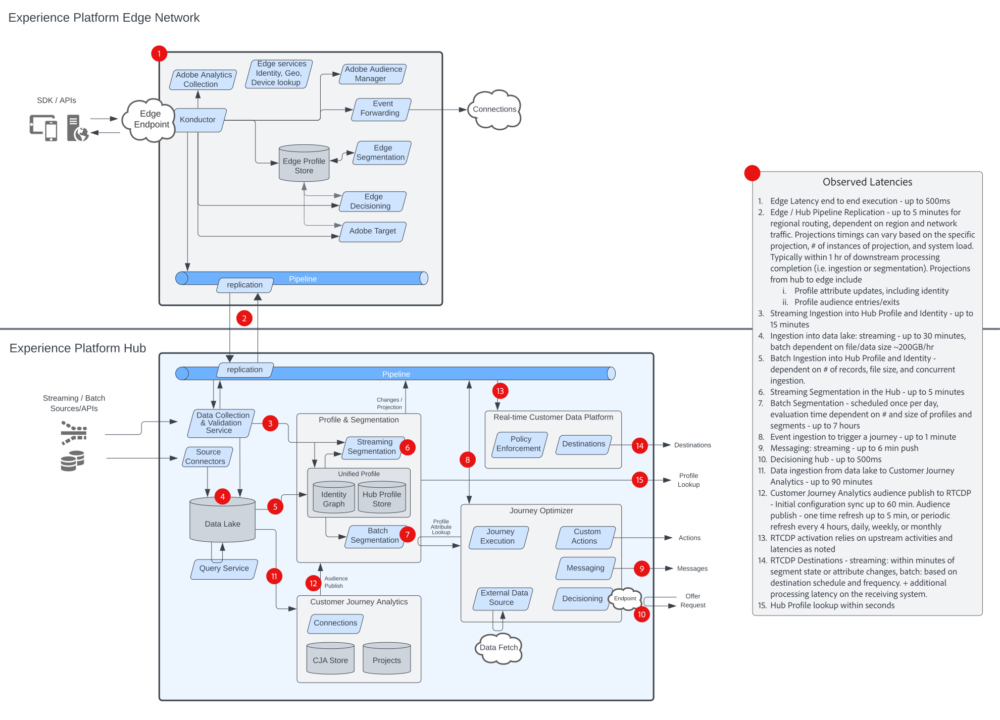

# 디지털 경험 블루프린트

Digital Experience 블루프린트는 시스템 및 데이터 흐름 아키텍처 다이어그램을 제공하여 Adobe Experience Platform 및 애플리케이션이 어떻게 통합되고 구현되는지 더 잘 이해할 수 있도록 합니다. 블루프린트는 Adobe Experience Platform 및 애플리케이션의 사용 사례 디자인 및 아키텍처를 알리는 데 도움이 되도록 시스템 간 및 구성 요소 데이터 및 콘텐츠 흐름, 작업 시퀀스 및 종속성을 시각적으로 표시합니다.

## 인기 블루프린트

<table>
<tr>
  <td>
    
    

      <a href="experience-platform/guardrails.md">
    <strong>Experience Platform 허브 및 Edge 아키텍처 및 보호 기능 다이어그램</strong>
    </a>
    

  </td>
   <td>
    
    

      <a href="experience-platform/deployment/websdk.md">
    <strong>웹 SDK 및 Edge Network 시퀀스 다이어그램</strong>
    </a>
    

  </td>
  <td>
    
    

      <a href="customer-journeys/journey-optimizer/journey-optimizer-overview.md">
    <strong>Adobe Journey Optimizer 개요 다이어그램</strong>
    </a>
    

  </td>
</tr>
</table>

