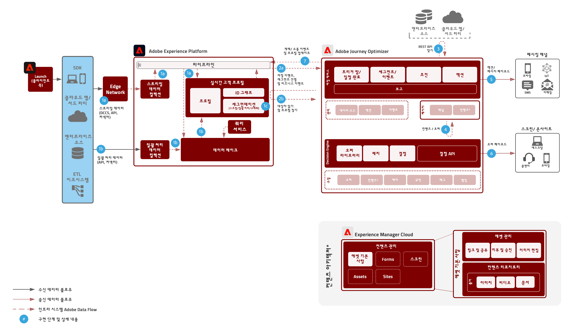

# 디지털 경험 블루프린트

디지털 경험 블루프린트는 전략을 다루고 기존 비즈니스 문제를 신속하게 해결하는 데 사용할 수 있는 반복 가능한 구현입니다. 각 블루프린트에서는 고가치 비즈니스 문제를 설명하는 여러 문서, 아키텍처, 구현 단계, 기술적 고려 사항 및 관련 설명서 링크를 제공합니다.

## 새로운 기능

* **[엔터프라이즈 대상에 대한 고객 및 프로필 활성화 블루프린트](/help/blueprints/audience-activation/enterprise-destinations.md)**

   *모든 시스템에서 고객 프로필을 최신 상태로 유지하면 영업 및 지원 업무에 도움이 됩니다&#x200B;.*
* **[고객 활동 허브 블루프린트](/help/blueprints/audience-activation/customer-activity.md)**

   *직원이 관여하는 지원 및 영업의 맥락을 제공합니다.*
* **[데이터 분석 및 인텔리전스 블루프린트](/help/blueprints/data-insights/analysis.md)**

   *데이터 레이크에 있는 데이터에 탐색 쿼리 및 분석을 수행합니다.*

## 추천 블루프린트

<table style="table-layout:fixed">
<tr>
  <td>
    
    
<a href="https://experienceleague.adobe.com/docs/blueprints-learn/architecture/customer-journeys/journey-optimizer.html"><strong>트리거 메시지와 Experience Platform</strong></a>

    
<em>[!UICONTROL Platform]을 중앙 허브로 사용하여 메시지와 경험을 트리거합니다.</em>

  </td>
  <td>
    
    
<a href="https://experienceleague.adobe.com/docs/blueprints-learn/architecture/audience-activation/online-offline.html"><strong>온라인/오프라인 대상자 활성화</strong></a>

    
<em>대상자에 의해 활성화되는 크로스채널 광고를 게재합니다.</em>

  </td>
  <td>
    
    
<a href="https://experienceleague.adobe.com/docs/blueprints-learn/architecture/customer-journey-analytics/digital-behavioral-data-consolidation.html"><strong>디지털 행동 데이터 통합</strong></a>

    
<em>다양한 채널에서의 고객 행동에 대해 통합된 단일 관점에서 분석할 수 있습니다.</em>

  </td>
</tr>
</table>

## 블로그 게시물

* [[!DNL Introducing Adobe Experience Platform’s New Digital Experience Blueprints]](https://medium.com/adobetech/introducing-adobe-experience-platforms-new-digital-experience-blueprints-93a6b5f5da7c)
* [[!DNL Blueprint for Audience Activation in Adobe Experience Platform]](https://medium.com/adobetech/a-blueprint-for-audience-activation-in-adobe-experience-platform-b2b30fae90fd)
* [[!DNL Blueprint for Web Personalization using Adobe Experience Platform Real-Time Customer Profile]](https://medium.com/adobetech/blueprint-for-web-personalization-using-adobe-experience-platform-real-time-customer-profile-fef2ce7a4b2f)
* [[!DNL Blueprint for Multi-Channel Orchestration in Adobe Experience Platform]](https://medium.com/adobetech/blueprint-for-multi-channel-orchestration-in-adobe-experience-platform-c68317e94184)
