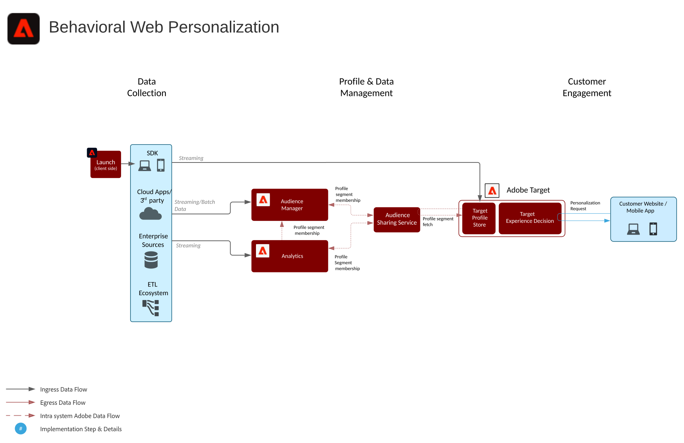
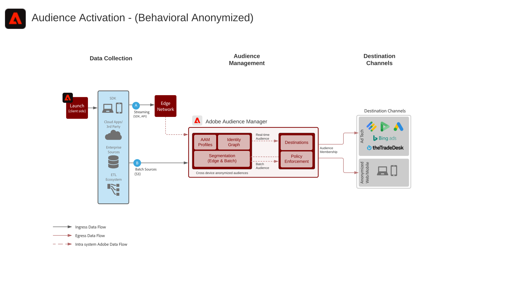
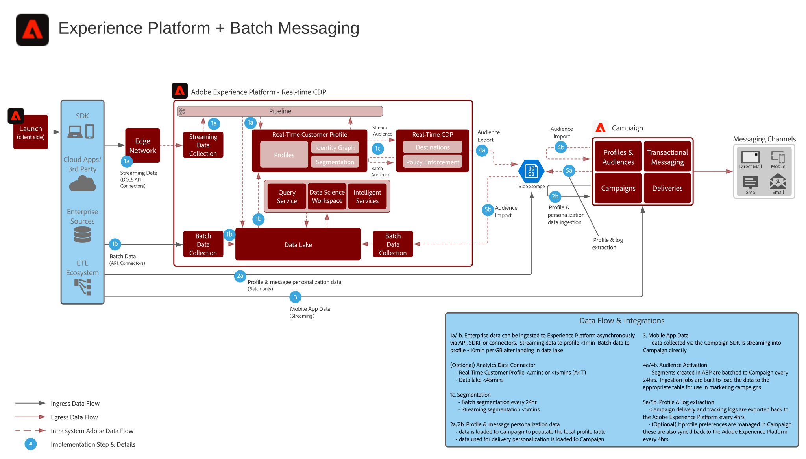

# 디지털 경험 청사진

Digital Experience Blueprint는 전략을 해결하고 설정된 비즈니스 문제를 해결하기 위한 반복적인 구현입니다. Blueprint를 사용하면 단기간에 효과를 높일 수 있고 신속하게 성과를 달성할 수 있습니다.

각 블루프린트는 Adobe 고객에게 높은 가치의 비즈니스 문제, 아키텍처, 구현 단계, 기술 고려 사항 및 관련 설명서로 연결되는 링크를 설명하는 일련의 결함을 제공합니다.

## 새로운 기능

* **[엔터프라이즈 대상 블루프린트에 대한 고객 및 프로필 활성화](/help/blueprints/audience-activation/enterprise-destinations.md)**

   *모든 시스템에서 고객 프로파일을 최신 상태로 유지하여 세일즈 및 지원 팀을 강화합니다&#x200B;.*
* **[고객 활동 허브 블루프린트](/help/blueprints/audience-activation/customer-activity.md)**

   *에이전트 지원 지원 및 영업에 대한 컨텍스트를 제공합니다.*
* **[데이터 분석 및 인텔리전스 블루프린트](/help/blueprints/data-insights/analysis.md)**

   *데이터 레이크에서 데이터를 탐색적 쿼리와 분석합니다.*

## 주요 청사진

<table style="table-layout:fixed">
<tr>
  <td>
    
    
<a href="https://experienceleague.adobe.com/docs/blueprints-learn/architecture/web-personalization/overview.html"><strong>웹/모바일 개인화 블루프린트</strong></a>

    
<em>개인화된 웹 및 모바일 컨텐츠 전달</em>

  </td>
  <td>
    
    
<a href="https://experienceleague.adobe.com/docs/blueprints-learn/architecture/audience-activation/overview.html"><strong>Audience Activation 블루프린트</strong></a>

    
<em>고객이 활성화한 크로스채널 광고 전달</em>

  </td>
  <td>
    
    
<a href="https://experienceleague.adobe.com/docs/blueprints-learn/architecture/multi-channel-message-orchestration/overview.html"><strong>멀티채널 오케스트레이션 블루프린트</strong></a>

    
<em>다양한 화면에서 개인화된 적시에 고객 경험을 제공할 수 있습니다.</em>

  </td>
</tr>
</table>

## 블로그 게시물

* [[!DNL Introducing Adobe Experience Platform’s New Digital Experience Blueprints]](https://medium.com/adobetech/introducing-adobe-experience-platforms-new-digital-experience-blueprints-93a6b5f5da7c)
* [[!DNL Blueprint for Audience Activation in Adobe Experience Platform]](https://medium.com/adobetech/a-blueprint-for-audience-activation-in-adobe-experience-platform-b2b30fae90fd)
* [[!DNL Blueprint for Web Personalization using Adobe Experience Platform Real-Time Customer Profile]](https://medium.com/adobetech/blueprint-for-web-personalization-using-adobe-experience-platform-real-time-customer-profile-fef2ce7a4b2f)
* [[!DNL Blueprint for Multi-Channel Orchestration in Adobe Experience Platform]](https://medium.com/adobetech/blueprint-for-multi-channel-orchestration-in-adobe-experience-platform-c68317e94184)
