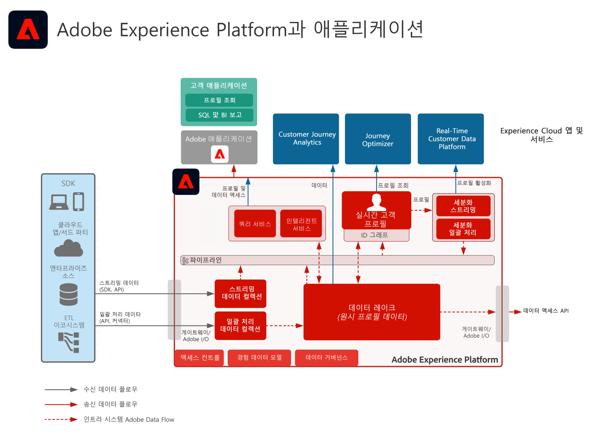
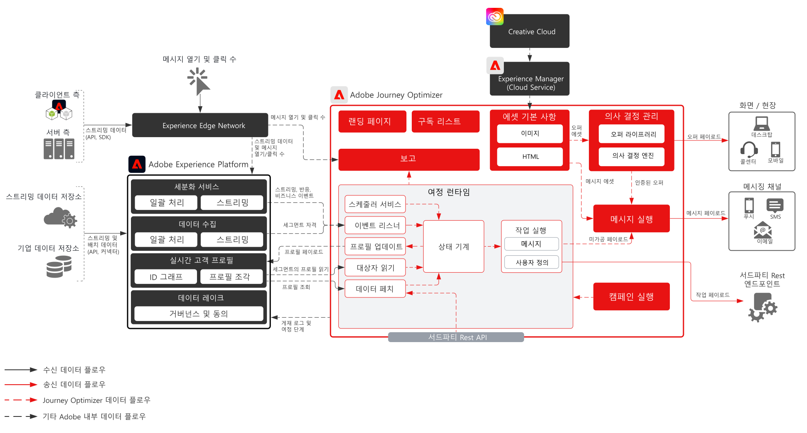
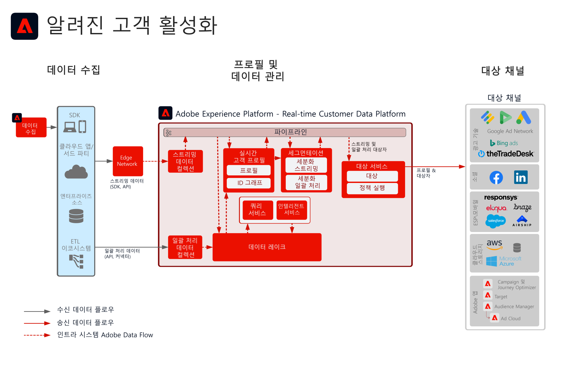

# 디지털 경험 블루프린트를 통한 업계 성공

고객이 어떻게 디지털 경험 블루프린트를 통해 탁월한 경험을 설계하고 성공하는지 알아봅니다. 검증되고 재사용할 수 있는 구현을 통해 전략을 구사하고 비즈니스 문제를 신속하게 해결할 수 있습니다.

## 주요 성공 사례

<table style="table-layout:fixed">
<tr>
  <td>
    
    </td>
  <td>
    

</td>
  <td>
    
  </td>
  <td>
    
  </td>
</tr>
<tr>
  <td>
    
<a href="https://experienceleague.adobe.com/docs/blueprints-learn/architecture/vertical-blueprints/apparel.html?lang=ko"><strong>의류 업계</strong></a>

    
<em>실시간 마케팅, 크로스 채널 활성화, Cross-Channel Analytics.</em>

  </td>
  <td>
    
<a href="https://experienceleague.adobe.com/docs/blueprints-learn/architecture/vertical-blueprints/retail.html?lang=ko"><strong>소매 업계</strong></a>

    
<em>디지털 미디어, 이메일, 푸시, 웹 채널에 걸친 실시간 고객 경험.</em>

  </td>
  <td>
    
<a href="https://experienceleague.adobe.com/docs/blueprints-learn/architecture/vertical-blueprints/telecommunications.html?lang=ko"><strong>통신 업계</strong></a>

    
<em>실시간으로 맞춤형 딜을 생성하는 한편 장기적 충성도를 확보하기 위해 효율적 고객 온보딩 진행.</em>

  </td>
  <td>
    
<a href="https://experienceleague.adobe.com/docs/blueprints-learn/architecture/vertical-blueprints/travel-hospitality.html?lang=ko"><strong>여행 및 서비스 업계</strong></a>

    
<em>다양한 채널에 대해 통합된 고객 행동 관점을 적용한 실시간 의사 결정.</em>

  </td>
</tr>
</table>

## 주요 성공 사례

* <a href="https://business.adobe.com/customer-success-stories/index.html?Products+%26+Services=Experience">Adobe Experience Cloud</a>
* <a href="https://business.adobe.com/customer-success-stories/index.html?Products+%26+Services=Experience+Platform">Adobe Experience Platform</a>
* <a href="https://business.adobe.com/customer-success-stories/index.html?Products+%26+Services=Intelligent+Services">Adobe 인텔리전트 서비스</a>
