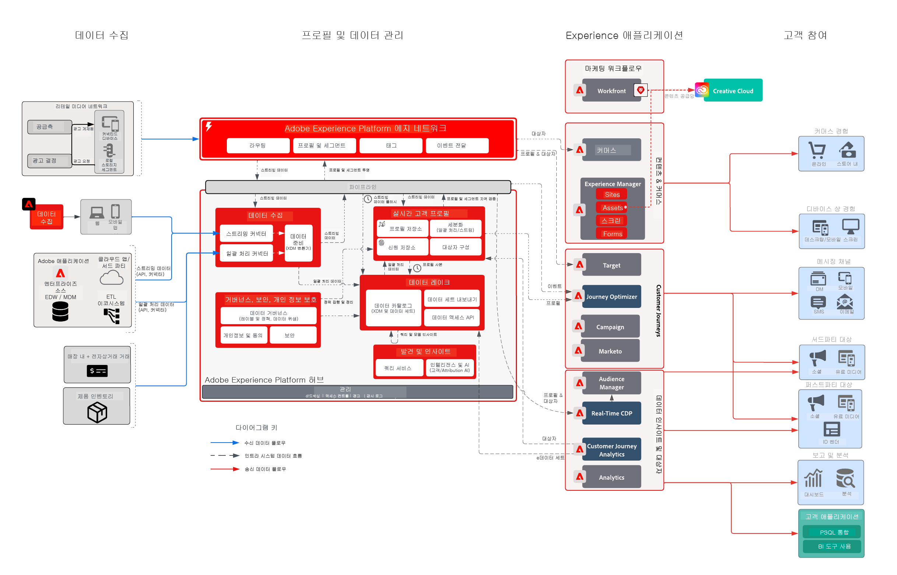

# 소매 업계 비즈니스 과제

이 통합 경험 비즈니스에서는 고객 여정 전체를 개인화하여 충성도를 높이고 기존 고객에게 업셀링하고 캠페인 전반의 마케팅 비용을 개선하고자 합니다. 이 목표를 달성하기 위한 전략은 오프라인 고객 데이터 및 거래 데이터를 포함하도록 디지털 기능을 확장하여 성장을 꾀하는 것입니다.

## Adobe의 접근 방식

* 모든 관련 온라인/오프라인 데이터를 포함하며 실시간으로 활성화할 수 있는 통합 고객 프로필 생성
* 최초 또는 재방문 시 구매 행동을 유도하기 위해 웹, 미디어, 푸시 채널 전반에 걸쳐 고객 상호 작용을 오케스트레이션합니다.

## 제공한 비즈니스 가치

| 목표 | 전략 | 발견한 가치 |
|---|---|---|
| **실시간 고객 여정 오케스트레이션&#x200B;**  **신규 고객의 재구매 촉진&#x200B;**  **마케팅 효율성 향상 및 미디어 비용 절감**</ul> | <ul><li>강력한 데이터 및 신원 전략을 통해 포괄적인 실시간 프로필 생성.</li><li>90일 동안의 내역 로드를 포함하여 실시간으로 고객 및 트랜잭션 데이터 스트리밍</li><li>Advertising Networks 및 Adobe Target에 대한 스트리밍 세그먼테이션을 통해 미디어 지출 및 개인화 노력을 강화할 수 있습니다.</li><li>성능을 측정하는 전략이 포함된 Adobe Campaign을 통한 실시간 고객 여정</li></ul> | <ul><li><strong>Real-time Customer Data Platform:</strong> 미디어, 이메일, 푸시, 웹에 걸쳐 실시간 고객 경험 제공</li><li><strong>데이터 소스:</strong> 해당 소매 업체의 프로필 스토어, 주문 시스템, 제품 카탈로그, 소매 매장을 포괄하는 데이터 스트리밍.</li><li><strong>실시간 미디어 활성화:</strong>속성 및 광고 억제를 위해 Advertising Networks에 세그먼트 스트리밍</li><li><strong>실시간 웹 개인화:</strong>소매점의 웹 환경에서 활성화하기 위해 Adobe Target에 활성화된 스트리밍 세그먼트.</li><li><strong>Journey Orchestration 규모:</strong>사용 가능한 고객 데이터로 보강되고 이메일 및 푸시 채널에 실시간으로 활성화된 트리거된 메시지</li></ul> |

## 사용 사례

| 카테고리 | 목표 | 사용 사례 | 설명 |
|:----|:----|:----|:----|
| 고객 여정 | 고객 확보 | 시작 시리즈 | 비즈니스, 제품 및 서비스에 대한 소개로 새로운 가입자를 환영합니다. |
|  |  | 첫 번째 구매 프로그램 |  |
|  | 판매 개선 | 포기한 장바구니/찾아보기 | 잠재 구매자 회수 및 판매 촉진 |
|  |  | 제품 리뷰/크로스셀 | 제품 검토를 사용하여 더 많은 항목을 교차 판매합니다. |
|  |  | 제품 프로모션 |  |
|  |  | 순서 변경 시간 | 순환 제품/서비스에 대한 반복 알림 |
|  | 브랜드 충성도 | 되돌아오다 | 비활성 상태인 고객을 복구합니다. |
|  |  | 생일 미리 알림 | 고객의 생일 축하의 일부가 되어 고객과의 더 개인적인 관계를 조성하세요! |
| 머천다이징 | 인벤토리 관리 | 재고로 돌아가기 | 고객이 원하는 제품이 재입고된 것을 보여줌으로써 재고를 개선합니다. |
|  |  | 다음 우수 범주 | 사용자를 위한 최상의 카테고리/판매 식별 |
|  |  | 베스트셀러 |  |
|  |  | 가격 하락 미리 알림 | 사용자에게 마음에 드는 항목의 가격이 감소했음을 보여 줍니다. |
|  |  | 유사 제품 |  |
| 개인화 | 전환 늘리기 | 쿠폰/오퍼 | 고객에게 최상의 오퍼/쿠폰 표시 |
|  |  | 개인화된 제품 검색 | 검색 경험 개선 |
|  |  | 제품 Recommendations | 제품 탐색 경험 개선 |
|  |  | 옴니채널 경험 | 모든 채널에서 고객에게 도달 |
| 측정 | 고객 여정 이해 | 크로스 채널 캠페인 | 크로스채널 캠페인 측정 |
|  |  | 세그먼트 성능 | 세그먼트 성능 및 기여도 이해 |
|  |  | 폴아웃 보고서 | 각 단계에서 전환 시각화 |
|  |  | 집단 분석 | 세그먼트 그룹 간 참여 측정 |
|  |  | 클릭-브릭 보고서 | 고객 전환이 매장 내 경험으로 이어지는 방식 확인 |
|  |  | 귀속 | 구매 전환에 가장 높은 영향을 미치는 접점/경험 보기 |
|  |  | 예측 인사이트 | 고객 성향에 대해 자세히 알아보기 |

## 아키텍처

## 관련 블루프린트

| 사용 사례/통합  | 링크 |
|:----|:----|
| CJA + AEP | [Customer Journey Analytics 블루프린트 개요](https://experienceleague.adobe.com/docs/blueprints-learn/architecture/customer-journey-analytics/overview.html?lang=ko) |
|  | [Customer Journey Analytics - 사용 사례](https://experienceleague.adobe.com/docs/analytics-platform/using/cja-usecases/cja-usecases.html?lang=ko) |
| AJO + AEP | [Adobe Journey Optimizer - 사용 사례](https://experienceleague.adobe.com/docs/blueprints-learn/architecture/customer-journeys/journey-optimizer/journey-optimizer.html?lang=en) |
|  | [의사 결정 관리](https://experienceleague.adobe.com/docs/blueprints-learn/architecture/customer-journeys/journey-optimizer/decision-management/decision-management-overview.html?lang=ko) |
| RTCDP + AEP | [온라인/오프라인 대상자 활성화](https://experienceleague.adobe.com/docs/blueprints-learn/architecture/audience-activation/known-customer-audience-activation/known.html?lang=ko) |
|  | [Experience Platform + 애플리케이션 활성화](https://experienceleague.adobe.com/docs/blueprints-learn/architecture/audience-activation/platform-and-applications.html?lang=ko) |
| MARKETO + AEP | [B2B 활성화 및 마케팅 ](https://experienceleague.adobe.com/docs/blueprints-learn/architecture/b2b-activation/overview.html?lang=en) |  |
| TARGET + AEP | [Adobe Target 사용 사례 - 행동 웹/모바일 개인화](https://experienceleague.adobe.com/docs/blueprints-learn/architecture/web-personalization/behavioral.html?lang=ko) | [알려진 고객 데이터를 사용한 웹/모바일 개인화](https://experienceleague.adobe.com/docs/blueprints-learn/architecture/web-personalization/known-personalization.html?lang=en) |  |
