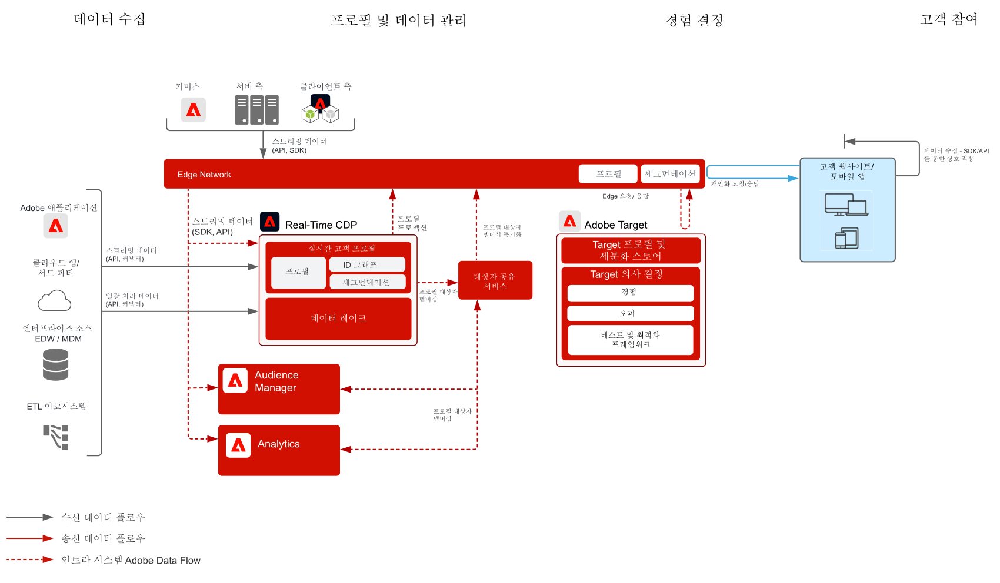

# 행동 기반 웹/모바일 개인화 블루프린트

온라인 행동과 대상자 데이터를 기반으로 개인화를 구현합니다.

## 사용 사례

* 랜딩 페이지 최적화
* 행동 타겟팅
* 이전 제품/콘텐츠 조회, 제품/콘텐츠 관련성, 환경 요인, 서드파티 대상자 데이터 및 인적 특성 기반 개인화

## 애플리케이션

* Adobe Target
* Adobe Analytics(선택 사항)
* Adobe Audience Manager(선택 사항)

## 아키텍처

## 가드레일

기본적으로 세그먼트 공유 서비스를 통해 각 Adobe Analytics 보고서 세트 당 75명의 대상자를 공유할 수 있습니다. 대상자 공유에 Audience Manager를 사용하는 경우에는 공유할 수 있는 대상자 수에 제한이 없습니다.  

## 구현 패턴

웹/모바일 개인화 블루프린트는 다음과 같은 방법을 통해 구현할 수 있습니다(아래에서 설명).

1. [!UICONTROL Platform 웹 SDK] 또는 [!UICONTROL Platform 모바일 SDK]와 [!UICONTROL Edge Network] 사용
1. 기존 애플리케이션별 SDK 사용(예: AppMeasurement.js)

### 1. Platform 웹/모바일 SDK와 Edge를 사용하는 방법

[Experience Platform 웹 및 모바일 SDK 블루프린트 를 참조하십시오](../data-ingestion/websdk.md)

### 2. 특정 애플리케이션용 SDK를 사용하는 방법

## 구현 필요 조건

| 애플리케이션/서비스 | 필요한 라이브러리 | 참고 사항 |
|---|---|---|
| Adobe Target | [!UICONTROL Platform 웹 SDK]* at.js 0.9.1+ 또는 mbox.js 61+ | mbox.js는 더 이상 개발되지 않으므로 at.js 사용을 추천합니다. |
| Adobe Audience Manager(선택 사항) | [!UICONTROL Platform 웹 SDK]* 또는 dil.js 5.0+ |  |
| Adobe Analytics(선택 사항) | [!UICONTROL Platform 웹 SDK]* 또는 AppMeasurement.js 1.6.4+ |  |
| Experience Cloud ID 서비스 | [!UICONTROL Platform 웹 SDK]* 또는 VisitorAPI.js 2.0+ |  |
| Experience Platform 모바일 SDK(선택 사항) | iOS 및 Android™용 4.11 이상 |  |
| Experience Platform 웹 SDK | 1.0, 현재 Experience Platform SDK 버전에는 [아직 Experience Cloud 애플리케이션에서 지원하지 않는 다양한 사용 사례](https://github.com/adobe/alloy/projects/5)가 있습니다. |  |

## 구현 단계

1. 웹 또는 모바일 애플리케이션에 [Adobe Target 구현](https://experienceleague.adobe.com/docs/target/using/implement-target/implementing-target.html?lang=ko)

   Audience Manager 또는 Adobe Analytics 사용 시:

1. [Adobe Audience Manager 구현](https://experienceleague.adobe.com/docs/audience-manager/user-guide/implementation-integration-guides/implement-audience-manager.html?lang=ko)
1. [Adobe Analytics 구현](https://experienceleague.adobe.com/docs/analytics/implementation/home.html?lang=ko)
1. [Experience Cloud ID 서비스 구현](https://experienceleague.adobe.com/docs/id-service/using/implementation/implementation-guides.html?lang=ko)

   >[!NOTE]
   >
   >애플리케이션 간에 대상자를 공유하려면 각 애플리케이션이 Experience Cloud ID를 사용해야 하며 동일한 Experience Cloud 조직의 일부여야 합니다.

1. [사람 및 대상자 공유 서비스(공유 대상자) 제공 요청](https://www.adobe.com/go/audiences)
1. [Adobe Analytics](https://experienceleague.adobe.com/docs/analytics/components/segmentation/segmentation-workflow/seg-build.html?lang=ko) 또는 [Adobe Audience Manager](https://experienceleague.adobe.com/docs/audience-manager/user-guide/features/segments/segment-builder.html?lang=ko)에서 세그먼트를 작성하고 [해당 대상자를 Experience Cloud에 공유하도록 구성](https://experienceleague.adobe.com/docs/analytics/components/segmentation/segmentation-workflow/seg-publish.html?lang=ko)(Audience Manager 또는 Adobe Analytics 사용 시)합니다.
1. 대상자가 Adobe Target에서 사용 가능해지면 이를 [Adobe Target을 통한 경험 타겟팅](https://experienceleague.adobe.com/docs/target/using/audiences/target.html?lang=ko)에 사용할 수 있습니다.

## 관련 설명서

* [Experience Cloud 대상](https://experienceleague.adobe.com/docs/core-services/interface/audiences/audience-library.html?lang=ko)
* [Audience Manager와 Adobe Target 통합](https://experienceleague.adobe.com/docs/audience-manager/user-guide/implementation-integration-guides/integration-other-solutions/aam-target-integration.html?lang=ko)
* [Adobe Analytics 세그먼트를 Adobe Audience Manager를 통해 공유](https://experienceleague.adobe.com/docs/analytics/components/segmentation/segmentation-workflow/seg-publish.html)

## 관련 블로그 게시물

* [[!DNL Blueprint for Web Personalization using Adobe Experience Platform Real-Time Customer Profile]](https://medium.com/adobetech/blueprint-for-web-personalization-using-adobe-experience-platform-real-time-customer-profile-fef2ce7a4b2f)
* [[!DNL Integrating Adobe Experience Platform Decisioning Engine with AEM Websites]](https://jaeness.medium.com/integrating-adobe-experience-platform-decisioning-engine-with-aem-websites-9c222acd12e2)
* [[!DNL How Adobe Experience Platform Predictive Audiences improves Personalized Experiences]](https://medium.com/adobetech/how-adobe-experience-platform-predictive-audiences-improves-personalized-experiences-1f75a60cb7a3)
* [[!DNL Adobe Experience Platform Web SDK for Audience Management]](https://medium.com/adobetech/adobe-experience-platform-web-sdk-for-audience-management-751fa6d063bc)
* [[!DNL Implementing Adobe Experience Platform Real-Time Customer Profile through our “Customer Zero” Program]](https://medium.com/adobetech/implementing-adobe-experience-platform-real-time-customer-profile-through-our-customer-zero-32e7cd952896)
* [[!DNL How Adobe Experience Platform Can Help Customers Personalize Their Mobile Messaging in Real-Time with Journey Orchestration Service and a Mobile Messaging Vendor]](https://medium.com/adobetech/how-adobe-experience-platform-helped-a-client-personalize-their-mobile-messaging-in-real-time-with-7d634aefa098)
* [[!DNL Segmentation in Seconds: How Adobe Experience Platform Made Real-time Customer Profiles a Reality]](https://medium.com/adobetech/segmentation-in-seconds-how-adobe-experience-platform-made-real-time-customer-profiles-a-reality-a7a8552b0847)
