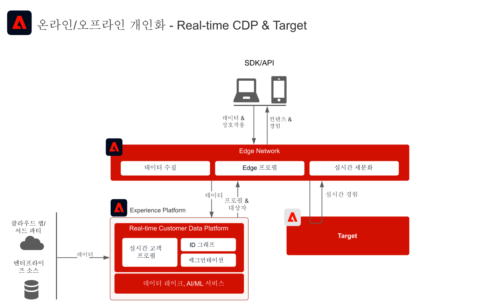
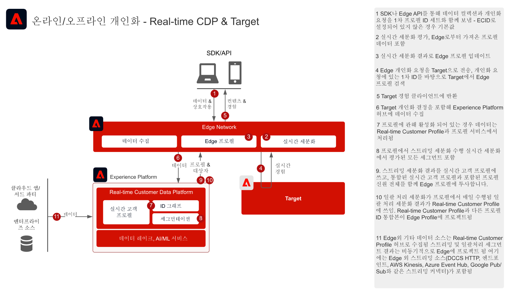
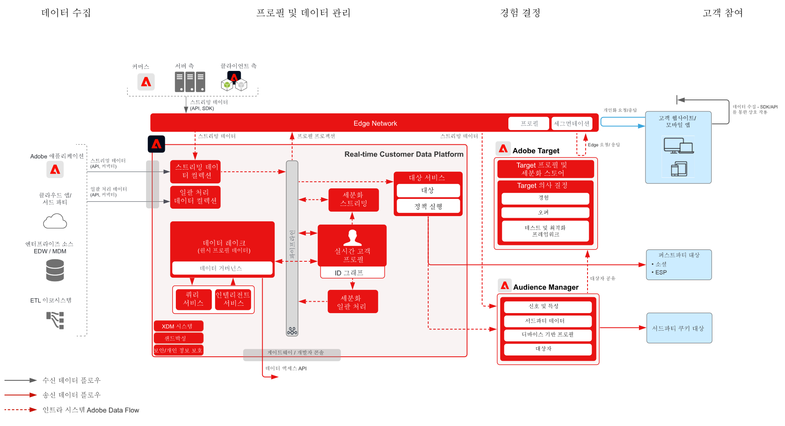

# 알려진 고객 데이터를 사용한 웹/모바일 개인화   블루프린트

## 사용 사례

* 알려진 고객 데이터를 사용한 온라인 개인화
* 랜딩 페이지 최적화
* 이전 제품/콘텐츠 조회, 제품/콘텐츠 관련성, 환경 요인 및 인적 특성과 더불어 거래, 충성도 및 CRM 데이터 등 오프라인 인사이트와 모델에서 도출한 인사이트를 기반으로 한 개인화.
* Real-time Customer Data Platform에서 정의한 대상자를 Adobe Target을 사용하여 웹사이트 및 모바일 앱에서 공유 및 타겟팅합니다.

## 애플리케이션

* [!UICONTROL Real-time Customer Data Platform]
* Adobe Target
* Adobe Audience Manager(선택 사항): 서드파티 대상자 데이터 추가
* Adobe Analytics 또는 Customer Journey Analytics(선택 사항): 정교한 세분화를 통해 이전 고객 및 행동 데이터를 기반으로 세그먼트를 작성하는 기능 추가

## 통합 패턴

| 통합 패턴 | 기능 | 필요 조건 |
|---|---|---|
| Real-time Customer Data Platform에서 Target으로 공유된 데이터를 Edge에서 실시간으로 세그먼트 평가 | <ul><li>대상자를 실시간으로 평가하여 Edge의 현재 또는 다음 페이지 개인화에 사용합니다.</li><li>또 스트리밍 또는 일괄 방식으로 평가된 모든 세그먼트는 Edge Network에 투영되어 에지 세그먼트 평가 및 개인화에 포함됩니다.</li></ul> | <ul><li>Web/Mobile SDK 또는 Edge Network Server API를 구현해야 합니다.</li><li>데이터 스트림은 Target 및 Experience Platform 확장이 활성화된 Experience Edge에서 구성해야 합니다.</li><li>Target 대상은 Real-time Customer Data Platform 대상에서 구성해야 합니다.</li><li>Target과 통합하려면 Experience Platform 인스턴스와 동일한 IMS 조직이어야 합니다.</li></ul> |
| Edge 접근 방식을 통해 Real-time Customer Data Platform에서 Target으로 스트리밍 및 일괄 처리 대상자 공유 | <ul><li>Edge Network를 통해 Real-time Customer Data Platform에서 Target으로 스트리밍 및 일괄 처리 대상자를 공유합니다. 대상자를 실시간으로 평가하려면 Web SDK 및 Edge Network 구현이 필요합니다.</li></ul> | <ul><li>스트리밍 및 일괄 처리 RTCDP 대상자를 Target으로 공유할 때는 Target의 Web/Mobile SDK 또는 Edge API 구현이 필요하지 않지만, 위에서 설명한 실시간 에지 세그먼트 평가를 사용하려면 필요합니다.</li><li>AT.js를 사용하는 경우 ECID 신원 네임스페이스에 대한 프로필 통합만 지원합니다.</li><li>Edge에서 사용자 정의 신원 네임스페이스를 조회하는 Web SDK/Edge API 배포가 필요하며 각 신원은 신원 맵 내 신원으로 설정해야 합니다.</li><li>Target 대상은 Real-time Customer Data Platform 대상 내에서 구성해야 하며, RTCDP의 기본 프로덕션 샌드박스만 지원합니다.</li><li>Target과 통합하려면 Experience Platform 인스턴스와 동일한 IMS 조직이어야 합니다.</li></ul> |
| 대상자 공유 서비스를 통해 Real-time Customer Data Platform에서 Target과 Audience Manager로 스트리밍 및 일괄 처리 대상자 공유 | <ul><li>이 통합 패턴은 Audience Manager의 서드파티 데이터 및 대상자를 사용한 추가 보강이 필요한 경우 활용할 수 있습니다.</li></ul> | <ul><li>스트리밍 및 일괄 처리 대상자를 Target에 공유할 때는 Web/Mobile SDK가 필요하지 않지만, 실시간 Edge 세그먼트 평가를 활성화할 때는 필요합니다.</li><li>AT.js를 사용하는 경우 ECID 신원 네임스페이스에 대한 프로필 통합만 지원합니다.</li><li>Edge에서 사용자 정의 신원 네임스페이스를 조회하는 Web SDK/Edge API 배포가 필요하며 각 신원은 신원 맵 내 신원으로 설정해야 합니다.</li><li>대상자 공유 서비스를 통한 대상자 프로젝션은 반드시 프로비저닝해야 합니다.</li><li>Target과 통합하려면 Experience Platform 인스턴스와 동일한 IMS 조직이어야 합니다.</li><li>기본 프로덕션 샌드박스에서 가져온 대상자에서만 대상자 공유 핵심 서비스를 지원합니다.</li></ul> |

## Adobe Target으로 실시간, 스트리밍, 일괄 처리 대상자 공유하기

아키텍처

시퀀스 세부 사항

아키텍처 개요

## 구현 패턴

알려진 고객 개인화는 몇 가지 구현 방법을 통해 지원됩니다.

### 구현 패턴 1 - Edge Network와 Web/Mobile SDK 또는 Edge Network API(권장 방법)

* Web/Mobile SDK에서 Edge Network를 사용합니다. 실시간 Edge 세분화를 사용하려면 Web/Mobile SDK 또는 Edge API 구현 방법이 필요합니다.
* [Experience Platform Web 및 Mobile SDK 블루프린트를 참조하세요.](../experience-platform/deployment/websdk.md)         SDK 기반 구현에 대해 설명하고 있습니다.
* Mobile SDK에서 사용하려면 [Adobe Journey Optimizer - Decisioning 확장](https://aep-sdks.gitbook.io/docs/using-mobile-extensions/adobe-journey-optimizer-decisioning)을 Mobile SDK에 설치해야 합니다.
* Edge Profile을 사용하는 Adobe Target의 API 기반 구현에 대해서는 [Edge Network Server API를 참조하세요](https://experienceleague.adobe.com/docs/experience-platform/edge-network-server-api/overview.html?lang=ko).

### 구현 패턴 2 - 애플리케이션별 SDK

기존 애플리케이션별 SDK를 사용합니다(예: AT.js, AppMeasurement.js). 이 구현 방법은 실시간 Edge 세그먼트 평가를 지원하지 않습니다. 그러나 이 구현 방법은 Experience Platform 허브에서 스트리밍 및 일괄 처리 대상자를 공유하는 작업을 지원합니다.

[애플리케이션별 SDK 블루프린트 참조](../experience-platform/deployment/appsdk.md)

### 구현 단계

1. 웹 또는 모바일 애플리케이션에 [Adobe Target 구현](https://experienceleague.adobe.com/docs/target/using/implement-target/implementing-target.html?lang=ko)
1. [Experience Platform 및 [!UICONTROL Real-time Customer Profile 구현]](https://experienceleague.adobe.com/docs/platform-learn/getting-started-for-data-architects-and-data-engineers/overview.html?lang=ko) Edge에서 사용 가능한 활성 [병합 정책](https://experienceleague.adobe.com/docs/experience-platform/profile/merge-policies/ui-guide.html?lang=ko#create-a-merge-policy)을 구현하여 생성한 대상자가 활성화되도록 합니다.
1. 올바른 확장(Target 또는 Adobe Journey Optimizer - Decisioning)을 설치한 [Experience Platform Web SDK](https://experienceleague.adobe.com/docs/experience-platform/edge/home.html?lang=ko) 또는 [Experience Platform Mobile SDK](https://aep-sdks.gitbook.io/docs/)를 구현합니다. 실시간 Edge 세분화에는 Experience Platform Web/Mobile SDK 또는 EDGE API가 필요하지만, Real-time Customer Data Platform에서 Target으로 스트리밍 및 일괄 처리 대상을 공유하는 데에는 필요하지 않습니다.
1. [Edge Datastream으로 Edge Network 구성](https://experienceleague.adobe.com/docs/experience-platform/edge/fundamentals/datastreams.html?lang=ko)
1. [Real-time Customer Data Platform 내에서 Adobe Target을 대상으로 사용](https://experienceleague.adobe.com/docs/experience-platform/destinations/catalog/personalization/adobe-target-connection.html?lang=ko)
1. (선택 사항)[Adobe Audience Manager 구현](https://experienceleague.adobe.com/docs/audience-manager/user-guide/implementation-integration-guides/implement-audience-manager.html?lang=ko).
1. (선택 사항)[Experience Platform과 Adobe Target 간 대상자 공유를 위한 프로비저닝을 요청(공유 대상자)](https://www.adobe.com/go/audiences)하여 Experience Platform에서 Target으로 대상자를 공유합니다.

## 가드레일

[웹 및 모바일 개인화 블루프린트 개요 페이지의 가드레일을 참조하세요.](overview.md)

* Edge 프로필은 사용자가 Edge에서 활성 상태일 때, 즉 해당 프로필에 Web/Mobile SDK 또는 Edge Server API를 통해 Edge로 제출되는 스트리밍 이벤트가 있을 때만 만들어집니다. 이는 보통 웹 사이트 또는 모바일 앱에서 활성 상태인 사용자에 해당합니다.
* Edge 프로필에는 기본 14일의 유지 기한이 있습니다. 사용자에게서 활성 Edge 이벤트가 수집되지 않는 경우 그 프로필은 비활성 상태 14일 후 Edge에서 만료됩니다. 프로필은 허브에서 유효한 상태로 유지되며, 사용자가 Edge에서 다시 활성 상태가 되면 Edge와 동기화됩니다.
* Edge에서 새 프로필이 만들어지면 허브 동기화 호출을 비동기적으로 수행하여 대상을 통해 Edge 투영용으로 구성된 모든 대상자 및 속성을 가져옵니다. 이는 비동기 프로세스이므로 허브 프로필이 Edge에 동기화되려면 1초에서 몇 분 정도 걸릴 수 있습니다. 따라서 새 프로필의 경우 첫 페이지 경험 시 허브의 프로필 컨텍스트를 가진다고 보장할 수 없습니다. 이는 허브에 새로 수집한 데이터에도 적용됩니다. 이 데이터는 비동기적으로 Edge에 투영되므로 데이터가 적절한 Edge에 도달하는 시점은 Edge 활동과는 별개입니다. Edge에서 활성 상태인 프로필만 허브에서 투영된 속성과 대상자를 유지합니다.

## 구현 시 고려 사항

ID 필요 조건

* 모든 기본 신원은 위에서 설명한 Edge Network 및 Web SDK를 통한 구현 패턴 1을 적용할 때 활용할 수 있습니다. 로그인을 처음 개인화할 때에는 개인화 요청에서 설정한 기본 ID가 Real-time Customer Data Platform 프로필의 기본 ID와 일치해야 합니다. 허브에서 익명 디바이스와 알려진 고객의 신원 연결을 진행한 뒤 Edge로 투영합니다.
* 소비자가 웹 사이트를 방문하거나 로그인하기 전에 허브에 업로드된 데이터는 개인화에 바로 사용할 수 없습니다. 먼저 활성 Edge 프로필이 있어야 허브 데이터를 해당 프로필에 동기화할 수 있습니다. Edge 프로필을 만들면 허브 프로필과 비동기적으로 동기화되어 다음 페이지 개인화가 발생합니다.
* Adobe Experience Platform에서 Adobe Target으로 대상자를 공유하려면 위의 통합 패턴 2와 3에서 설명한 대로 대상자 공유 서비스를 사용할 때 ECID를 신원으로 사용해야 합니다.
* Audience Manager을 통해 대체 ID를 사용하여 Experience Platform 대상을 Adobe Target에 공유할 수도 있습니다. Experience Platform에서 Audience Manager를 활성화 가능한 지원되는 네임스페이스는 다음과 같습니다: IDFA, GAID, AdCloud, Google, ECID, EMAIL_LC_SHA256. Audience Manager와 Target은 ECID 신원을 통해 대상자 멤버십을 해결하므로 Adobe Target에 최종 대상자를 공유하려면 해당 소비자에 대한 신원 그래프에 ECID가 있어야 합니다.

## 관련 설명서

### SDK 설명서

* [Experience Platform Web SDK 설명서](https://experienceleague.adobe.com/docs/experience-platform/edge/home.html?lang=ko)
* [Experience Platform 태그 설명서](https://experienceleague.adobe.com/docs/experience-platform/tags/home.html?lang=ko)
* [Experience Cloud ID 서비스 설명서](https://experienceleague.adobe.com/docs/id-service/using/home.html?lang=ko)

### 연결 설명서

* [Real-time Customer Data Platform용 Adobe Target 연결](https://experienceleague.adobe.com/docs/experience-platform/destinations/catalog/personalization/adobe-target-connection.html?lang=ko)
* [Edge Datastream 구성](https://experienceleague.adobe.com/docs/experience-platform/edge/fundamentals/datastreams.html?lang=ko)
* [Experience Platform 세그먼트를 Audience Manager 및 기타 Experience Cloud 솔루션에 공유하기](https://experienceleague.adobe.com/docs/audience-manager/user-guide/implementation-integration-guides/integration-experience-platform/aam-aep-audience-sharing.html?lang=ko)

### 세분화 설명서

* [Experience Platform 세분화 개요](https://experienceleague.adobe.com/docs/experience-platform/segmentation/home.html?lang=ko)
* [실시간 세분화](https://experienceleague.adobe.com/docs/experience-platform/segmentation/ui/edge-segmentation.html?lang=ko)
* [세분화 스트리밍](https://experienceleague.adobe.com/docs/experience-platform/segmentation/api/streaming-segmentation.html?lang=ko)
* [Adobe Analytics 세그먼트를 Adobe Audience Manager를 통해 공유](https://experienceleague.adobe.com/docs/analytics/components/segmentation/segmentation-workflow/seg-publish.html?lang=ko)
* [병합 정책 구성](https://experienceleague.adobe.com/docs/experience-platform/profile/merge-policies/ui-guide.html?lang=ko#create-a-merge-policy)

### 튜토리얼

* [Real-Time CDP와 Adobe Target을 사용한 다음 방문 개인화](https://experienceleague.adobe.com/docs/platform-learn/tutorials/experience-cloud/next-hit-personalization.html?lang=ko)

### 관련 블로그 게시물

* [Adobe Target 및 Real-time Customer Data Platform을 사용한 동일한 페이지 고급 개인화 공지](https://blog.adobe.com/en/publish/2021/10/05/adobe-announces-same-page-enhanced-personalization-with-adobe-target-real-time-customer-data-platform)
* [[!DNL Blueprint for Web Personalization using Adobe Experience Platform Real-Time Customer Profile]](https://medium.com/adobetech/blueprint-for-web-personalization-using-adobe-experience-platform-real-time-customer-profile-fef2ce7a4b2f)
* [[!DNL Adobe Experience Platform's Identity Service — How to Solve the Customer Identity Conundrum]](https://medium.com/adobetech/adobe-experience-platforms-identity-service-how-to-solve-the-customer-identity-conundrum-f95e22d16ea9)
* [[!DNL Adobe Experience Platform Web SDK for Audience Management]](https://medium.com/adobetech/adobe-experience-platform-web-sdk-for-audience-management-751fa6d063bc)
* [[!DNL Implementing Adobe Experience Platform Real-Time Customer Profile through our "Customer Zero" Program]](https://medium.com/adobetech/implementing-adobe-experience-platform-real-time-customer-profile-through-our-customer-zero-32e7cd952896)
* [[!DNL Segmentation in Seconds: How Adobe Experience Platform Made Real-time Customer Profiles a Reality]](https://medium.com/adobetech/segmentation-in-seconds-how-adobe-experience-platform-made-real-time-customer-profiles-a-reality-a7a8552b0847)
