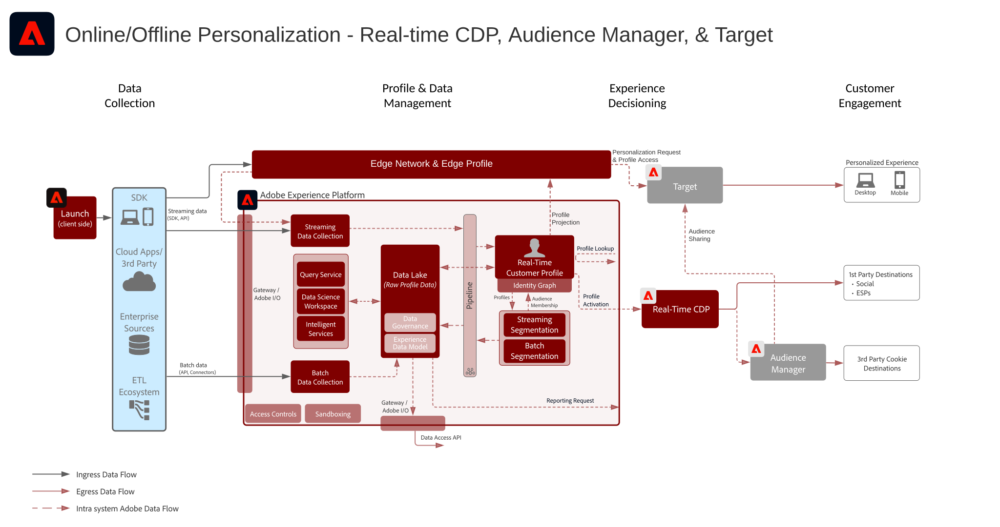

# 온라인/오프라인 웹/모바일 개인화 블루프린트

웹 개인화를 이메일 및 기타 알려지거나 알려지지 않은 채널 개인화와 동기화합니다.

## 사용 사례

* 랜딩 페이지 최적화
* 행동 및 오프라인 프로필 타겟팅
* 이전 제품/콘텐츠 조회, 제품/콘텐츠 관련성, 환경 요인, 서드파티 대상자 데이터 및 인적 특성과 더불어 거래, 충성도 및 CRM 데이터 등 오프라인 인사이트와 모델에서 도출한 인사이트를 기반으로 한 개인화

## 애플리케이션

* [!UICONTROL Real-time Customer Data Platform]
* Adobe Target
* Adobe Audience Manager(선택 사항): 서드파티 대상자 데이터, co-op 기반 디바이스 그래프, Platform 세그먼트를 Adobe Analytics로 표면화하는 기능 및 Adobe Analytics 세그먼트를 Platform에서 표면화하는 기능 제공
* Adobe Analytics(선택 사항): 과거 행동 데이터 및 Adobe Analytics 데이터의 세밀한 세분화를 기반으로 세그먼트를 작성하는 기능 제공

## 아키텍처

## 가드레일

[웹 및 모바일 개인화 블루프린트 개요 페이지의 가드레일을 참조하세요.](overview.md)

## 구현 패턴

웹/모바일 개인화 블루프린트는 다음과 같은 방법을 통해 구현할 수 있습니다(아래에서 설명).

1. [!UICONTROL Platform 웹 SDK] 또는 [!UICONTROL Platform 모바일 SDK]와 [!UICONTROL Edge Network] 사용
1. 기존 애플리케이션별 SDK 사용(예: AppMeasurement.js)

### 1. Platform 웹/모바일 SDK와 Edge를 사용하는 방법

### 2. 특정 애플리케이션용 SDK를 사용하는 방법

## 구현 필요 조건

| 애플리케이션/서비스 | 필요한 라이브러리 | 참고 사항 |
|---|---|---|
| Adobe Target | [!UICONTROL Platform 웹 SDK]* at.js 0.9.1+ 또는 mbox.js 61+ | mbox.js는 더 이상 개발되지 않으므로 at.js 사용을 추천합니다. |
| Adobe Audience Manager(선택 사항) | [!UICONTROL Platform 웹 SDK]* 또는 dil.js 5.0+ |  |
| Adobe Analytics(선택 사항) | [!UICONTROL Platform 웹 SDK]* 또는 AppMeasurement.js 1.6.4+ | Adobe Analytics 추적에는 RDC(지역 단위 데이터 수집)를 사용해야 합니다. |
| Experience Cloud ID 서비스 | [!UICONTROL Platform 웹 SDK]* 또는 VisitorAPI.js 2.0+ | (추천)ID 서비스 배포에 Experience Platform Launch를 사용하여 반드시 애플리케이션 호출 발생 이전에 ID가 설정되도록 합니다. |
| Experience Platform 모바일 SDK(선택 사항) | iOS 및 Android™용 4.11 이상 |  |
| Experience Platform 웹 SDK | 1.0, 현재 Experience Platform SDK 버전에는 [아직 Experience Cloud 애플리케이션에서 지원하지 않는 다양한 사용 사례](https://github.com/adobe/alloy/projects/5)가 있습니다. |  |

## 구현 단계

1. 웹 또는 모바일 애플리케이션에 [Adobe Target 구현](https://experienceleague.adobe.com/docs/target/using/implement-target/implementing-target.html?lang=ko)
1. [Adobe Audience Manager 구현](https://experienceleague.adobe.com/docs/audience-manager/user-guide/implementation-integration-guides/implement-audience-manager.html?lang=ko)(선택 사항)
1. [Adobe Analytics 구현](https://experienceleague.adobe.com/docs/analytics/implementation/home.html?lang=ko)(선택 사항)
1. [Experience Platform 및 [!UICONTROL Real-time Customer Profile] 구현](https://experienceleague.adobe.com/docs/platform-learn/getting-started-for-data-architects-and-data-engineers/overview.html?lang=ko)
1. [Experience Cloud ID 서비스](https://experienceleague.adobe.com/docs/id-service/using/implementation/implementation-guides.html?lang=ko) 또는 [Experience Platform 웹 SDK](https://experienceleague.adobe.com/docs/experience-platform/edge/home.html?lang=ko) 구현
   >[!NOTE]
   >
   >애플리케이션 간에 대상자를 공유하려면 각 애플리케이션이 Experience Cloud ID를 사용해야 하며 동일한 Experience Cloud 조직의 일부여야 합니다.
1. [Experience Platform과 Adobe Target 간 대상자 공유를 위한 제공 요청(공유 대상자)](https://www.adobe.com/go/audiences)

## 관련 설명서

* [Experience Platform 세그먼트를 Audience Manager 및 기타 Experience Cloud 솔루션에 공유하기](https://experienceleague.adobe.com/docs/audience-manager/user-guide/implementation-integration-guides/integration-experience-platform/aam-aep-audience-sharing.html?lang=ko)
* [Experience Platform 세분화 개요](https://experienceleague.adobe.com/docs/experience-platform/segmentation/home.html?lang=ko)
* [세분화 스트리밍](https://experienceleague.adobe.com/docs/experience-platform/segmentation/api/streaming-segmentation.html?lang=ko)
* [Experience Platform 세분화 작성기 개요](https://experienceleague.adobe.com/docs/experience-platform/segmentation/ui/overview.html?lang=ko)
* [Audience Manager 소스 커넥터](https://experienceleague.adobe.com/docs/experience-platform/sources/connectors/adobe-applications/audience-manager.html?lang=ko)
* [Adobe Analytics 세그먼트를 Adobe Audience Manager를 통해 공유](https://experienceleague.adobe.com/docs/analytics/components/segmentation/segmentation-workflow/seg-publish.html?lang=ko)
* [Experience Platform 웹 SDK 설명서](https://experienceleague.adobe.com/docs/experience-platform/edge/home.html)
* [Experience Cloud ID 서비스 설명서](https://experienceleague.adobe.com/docs/id-service/using/home.html?lang=ko)
* [Experience Platform Launch 설명서](https://experienceleague.adobe.com/docs/launch/using/home.html?lang=ko)

## 관련 블로그 게시물

* [[!DNL Blueprint for Web Personalization using Adobe Experience Platform Real-Time Customer Profile]](https://medium.com/adobetech/blueprint-for-web-personalization-using-adobe-experience-platform-real-time-customer-profile-fef2ce7a4b2f)
* [[!DNL Build an Optimal Online Experience: Enrich Unified Profile with Query Service]](https://medium.com/adobetech/build-an-optimal-online-experience-enrich-unified-profile-with-query-service-8027c196ab33)
* [[!DNL Integrating Adobe Experience Platform Decisioning Engine with AEM Websites]](https://jaeness.medium.com/integrating-adobe-experience-platform-decisioning-engine-with-aem-websites-9c222acd12e2)
* [[!DNL Adobe Experience Platform’s Identity Service — How to Solve the Customer Identity Conundrum]](https://medium.com/adobetech/adobe-experience-platforms-identity-service-how-to-solve-the-customer-identity-conundrum-f95e22d16ea9)
* [[!DNL How Adobe Experience Platform Predictive Audiences improves Personalized Experiences]](https://medium.com/adobetech/how-adobe-experience-platform-predictive-audiences-improves-personalized-experiences-1f75a60cb7a3)
* [[!DNL Adobe Experience Platform Web SDK for Audience Management]](https://medium.com/adobetech/adobe-experience-platform-web-sdk-for-audience-management-751fa6d063bc)
* [[!DNL Implementing Adobe Experience Platform Real-Time Customer Profile through our “Customer Zero” Program]](https://medium.com/adobetech/implementing-adobe-experience-platform-real-time-customer-profile-through-our-customer-zero-32e7cd952896)
* [[!DNL How Adobe Experience Platform Can Help Customers Personalize Their Mobile Messaging in Real-Time with Journey Orchestration Service and a Mobile Messaging Vendor]](https://medium.com/adobetech/how-adobe-experience-platform-helped-a-client-personalize-their-mobile-messaging-in-real-time-with-7d634aefa098)
* [[!DNL Segmentation in Seconds: How Adobe Experience Platform Made Real-time Customer Profiles a Reality]](https://medium.com/adobetech/segmentation-in-seconds-how-adobe-experience-platform-made-real-time-customer-profiles-a-reality-a7a8552b0847)
* [[!DNL Build an Optimal Online Experience: Enrich Unified Profile with Query Service]](https://medium.com/adobetech/build-an-optimal-online-experience-enrich-unified-profile-with-query-service-8027c196ab33)
