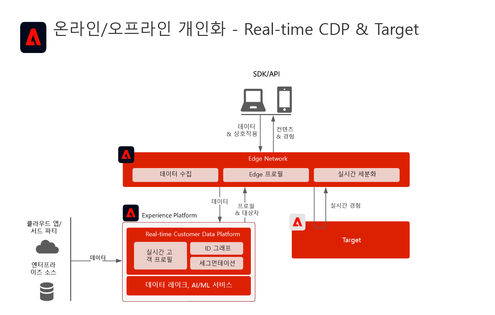
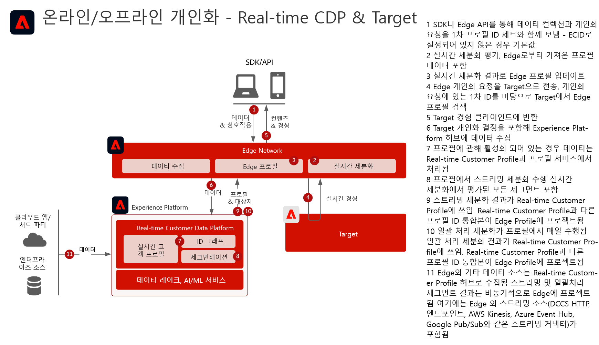
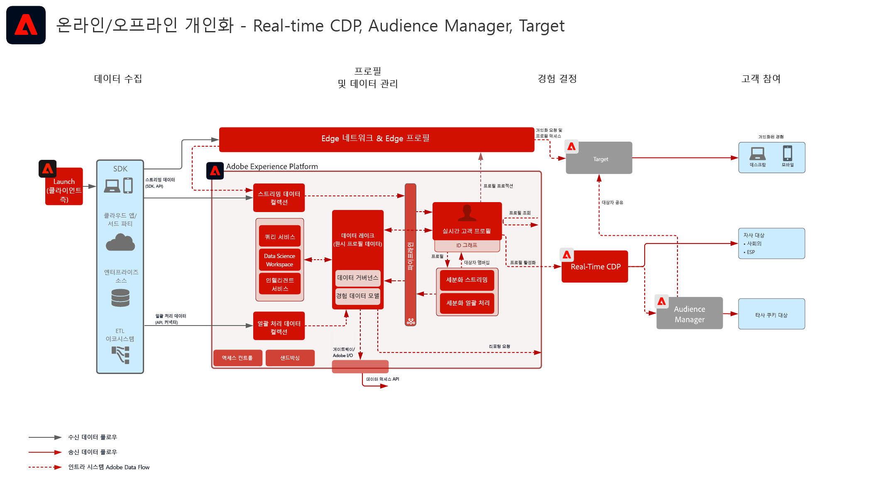
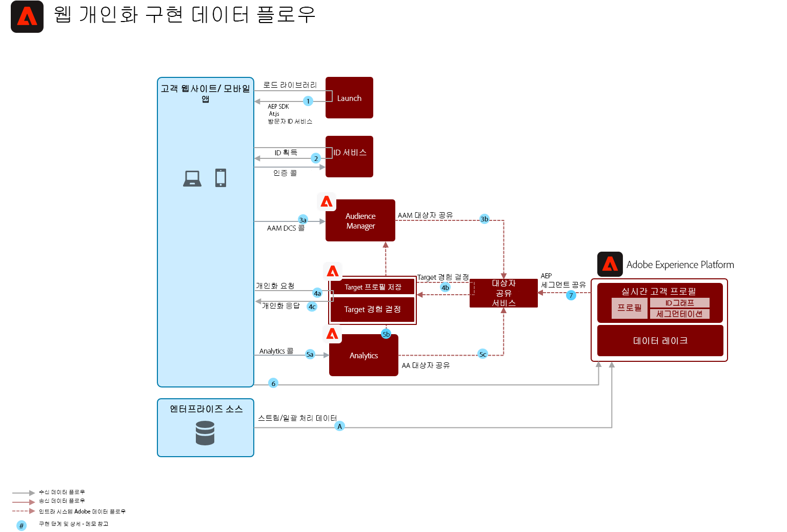

# 온라인 및 오프라인 데이터를 사용한 웹/모바일 개인화

웹 개인화를 이메일 및 기타 알려지거나 알려지지 않은 채널 개인화와 동기화합니다.

## 사용 사례

* 랜딩 페이지 최적화
* 행동 및 오프라인 프로필 타겟팅
* 이전 제품/콘텐츠 조회, 제품/콘텐츠 관련성, 환경 요인, 서드파티 대상자 데이터 및 인적 특성과 더불어 거래, 충성도 및 CRM 데이터 등 오프라인 인사이트와 모델에서 도출한 인사이트를 기반으로 한 개인화
* Real-time Customer Data Platform에서 정의한 대상자를 Adobe Target을 사용하여 웹사이트 및 모바일 앱에서 공유 및 타겟팅합니다.

## 애플리케이션

* [!UICONTROL Real-time Customer Data Platform]
* Adobe Target
* Adobe Audience Manager(선택 사항): 서드파티 대상자 데이터, co-op 기반 디바이스 그래프, Platform 세그먼트를 Adobe Analytics로 표면화하는 기능 및 Adobe Analytics 세그먼트를 Platform에서 표면화하는 기능 제공
* Adobe Analytics(선택 사항): 과거 행동 데이터 및 Adobe Analytics 데이터의 세밀한 세분화를 기반으로 세그먼트를 작성하는 기능 제공

## 통합 패턴

<table class="tg" style="undefined;table-layout: fixed; width: 790px">
<colgroup>
<col style="width: 20px">
<col style="width: 276px">
<col style="width: 229px">
<col style="width: 265px">
</colgroup>
<thead>
  <tr>
    <th class="tg-y6fn">#</th>
    <th class="tg-f7v4">통합 패턴</th>
    <th class="tg-y6fn">기능</th>
    <th class="tg-f7v4">필요 조건</th>
  </tr>
</thead>
<tbody>
  <tr>
    <td class="tg-0lax">1</td>
    <td class="tg-73oq">대상자 공유 서비스 접근을 통해 RTCDP 스트리밍 및 일괄 처리 대상자를 Target과 Audience Manager로 공유하기</td>
    <td class="tg-0lax"> - 대상자 공유 서비스 접근을 통해 RTCDP의 스트리밍 및 일괄 처리 대상자를 Target과 Audience Manager로 공유합니다. 대상자를 실시간으로 평가하려면 통합 패턴 3에서 설명하는 실시간 대상자 평가와 WebSDK가 필요합니다.</td>
    <td class="tg-73oq"> - 대상자 공유 서비스를 통한 대상자 프로젝션은 반드시 프로비저닝해야 합니다. - Target과 통합하려면 Experience Platform 인스턴스와 동일한 IMS 조직이어야 합니다. - Target이 작업을 제대로 수행할 수 있도록 공유하려면 신원을 ECID로 식별해야 합니다. AAM에는 승인 신원의 목록이 별도로 있어 매치할 수 있습니다. - 이 통합에는 WebSDK 배포가 필요하지 않습니다.</td>
  </tr>
  <tr>
    <td class="tg-0lax">2</td>
    <td class="tg-73oq">Edge 접근을 통해 RTCDP 스트리밍 및 일괄 처리 대상자를 Target으로 공유하기</td>
    <td class="tg-0lax"> - Edge Network를 통해 RTCDP의 스트리밍 및 일괄 처리 대상자를 Target으로 공유합니다. 대상자를 실시간으로 평가하려면 통합 패턴 3에서 설명하는 실시간 대상자 평가와 WebSDK가 필요합니다.</td>
    <td class="tg-73oq">- 현재 베타 버전 - Target 대상은 RTCDP 대상 내에 구성해야 합니다. - Target과 통합하려면 Experience Platform 인스턴스와 동일한 IMS 조직이어야 합니다. WebSDK는 필요하지 않습니다. WebSDK 및 AT.js를 지원합니다.  - AT.js를 사용하는 경우 ECID 기준 프로필 조회만 지원합니다.  - Edge에서 사용자 지정 ID 네임스페이스를 조회하는 경우 WebSDK 배포가 필요하며 각 신원을 신원 맵 내 신원으로 설정해야 합니다.</td>
  </tr>
  <tr>
    <td class="tg-0lax">3</td>
    <td class="tg-73oq">WebSDK를 사용하여 Edge 환경에서의 RTCDP 실시간 세그먼트 평가를 Edge Network를 통해 Target에 공유합니다.</td>
    <td class="tg-0lax"> - 대상자를 실시간으로 평가하여 Edge의 현재 또는 다음 페이지 개인화에 사용합니다.</td>
    <td class="tg-73oq">- 현재 베타 버전 - Target 대상은 RTCDP 대상 내에 구성해야 합니다. - Target과 통합하려면 Experience Platform 인스턴스와 동일한 IMS 조직이어야 합니다. - WebSDK를 구현해야 합니다. - API를 통해서도 지원합니다.</td>
  </tr>
</tbody>
</table>

## 아키텍처

개요 아키텍처

프로세스 흐름 아키텍처

자세한 아키텍처

## 가드레일

[웹 및 모바일 개인화 블루프린트 개요 페이지의 가드레일을 참조하세요.](overview.md)

## 구현 패턴

웹/모바일 개인화 블루프린트는 다음과 같은 방법을 통해 구현할 수 있습니다(아래에서 설명).

1. [!UICONTROL Platform 웹 SDK] 또는 [!UICONTROL Platform 모바일 SDK]와 [!UICONTROL Edge Network] 사용
1. 기존 애플리케이션별 SDK 사용(예: AppMeasurement.js)

### 1. Platform 웹/모바일 SDK와 Edge를 사용하는 방법

[Experience Platform 웹 및 모바일 SDK 블루프린트를 참조하십시오.](../data-ingestion/websdk.md)

### 2. 특정 애플리케이션용 SDK를 사용하는 방법

## 구현 필요 조건

ID 필요 조건

* Adobe Experience Platform에서 Adobe Target으로 대상자를 공유하려면 ECID를 ID로 사용해야 합니다.
* Audience Manager을 통해 대체 ID를 사용하여 Experience Platform 대상을 Adobe Target에 공유할 수도 있습니다. Experience Platform에서 Audience Manager를 활성화 가능한 지원되는 네임스페이스는 다음과 같습니다: IDFA, GAID, AdCloud, Google, ECID, EMAIL_LC_SHA256. Audience Manager와 Target은 ECID를 통해 대상자의 멤버십을 처리하므로, Adobe Target에 대상자를 최종 공유할 때까지 계속 ECID가 필요합니다.

| 애플리케이션/서비스 | 필요한 라이브러리 | 참고 사항 |
|---|---|---|
| Adobe Target | [!UICONTROL Platform 웹 SDK]* at.js 0.9.1+ 또는 mbox.js 61+ | mbox.js는 더 이상 개발되지 않으므로 at.js 사용을 추천합니다. |
| Adobe Audience Manager(선택 사항) | [!UICONTROL Platform 웹 SDK]* 또는 dil.js 5.0+ |  |
| Adobe Analytics(선택 사항) | [!UICONTROL Platform 웹 SDK]* 또는 AppMeasurement.js 1.6.4+ | Adobe Analytics 추적에는 RDC(지역 단위 데이터 수집)를 사용해야 합니다. |
| Experience Cloud ID 서비스 | [!UICONTROL Platform 웹 SDK]* 또는 VisitorAPI.js 2.0+ | (추천) ID 서비스 배포에 Experience Platform Launch를 사용하여 반드시 애플리케이션 호출 발생 이전에 ID가 설정되도록 합니다. |
| Experience Platform 모바일 SDK(선택 사항) | iOS 및 Android™용 4.11 이상 |  |
| Experience Platform Web SDK | 1.0, 현재 Experience Platform SDK 버전에는 [아직 Experience Cloud 애플리케이션에서 지원하지 않는 다양한 사용 사례](https://github.com/adobe/alloy/projects/5)가 있습니다. |  |

## 구현 단계

1. 웹 또는 모바일 애플리케이션에 [Adobe Target 구현](https://experienceleague.adobe.com/docs/target/using/implement-target/implementing-target.html?lang=ko)
1. [Adobe Audience Manager 구현](https://experienceleague.adobe.com/docs/audience-manager/user-guide/implementation-integration-guides/implement-audience-manager.html?lang=ko)(선택 사항)
1. [Adobe Analytics 구현](https://experienceleague.adobe.com/docs/analytics/implementation/home.html?lang=ko)(선택 사항)
1. [Experience Platform 및 [!UICONTROL Real-time Customer Profile] 구현](https://experienceleague.adobe.com/docs/platform-learn/getting-started-for-data-architects-and-data-engineers/overview.html?lang=ko)
1. [Experience Cloud ID 서비스](https://experienceleague.adobe.com/docs/id-service/using/implementation/implementation-guides.html?lang=ko) 또는 [Experience Platform Web SDK](https://experienceleague.adobe.com/docs/experience-platform/edge/home.html?lang=ko) 구현
1. [Real-time Customer Data Platform 내에서 Adobe Target을 대상으로 사용](https://experienceleague.adobe.com/docs/experience-platform/destinations/catalog/personalization/adobe-target-connection.html?lang=en) 또는 대상 공유 접근 방식 [Experience Platform과 Adobe Target(공유 대상) 간 대상 공유에 대한 프로비저닝 요청](https://www.adobe.com/go/audiences) Experience Platform에서 Target으로 대상을 공유하려면 다음을 수행하십시오.
   >[!NOTE]
   >
   >RTCDP와 Adobe Target 간에 대상자 공유 서비스를 사용하는 경우 Experience Cloud ID를 사용하여 대상자를 공유해야 하며, 대상자가 동일한 Experience Cloud 조직에 속해 있어야 합니다. ECID 이외의 신원을 지원하려면 WebSDK와 Experience Edge Network를 사용해야 합니다.

## 관련 설명서

* [Experience Platform 세그먼트를 Audience Manager 및 기타 Experience Cloud 솔루션에 공유하기](https://experienceleague.adobe.com/docs/audience-manager/user-guide/implementation-integration-guides/integration-experience-platform/aam-aep-audience-sharing.html?lang=ko)
* [Experience Platform 세분화 개요](https://experienceleague.adobe.com/docs/experience-platform/segmentation/home.html?lang=ko)
* [세분화 스트리밍](https://experienceleague.adobe.com/docs/experience-platform/segmentation/api/streaming-segmentation.html?lang=ko)
* [Real-time Customer Data Platform용 Adobe Target 연결](https://experienceleague.adobe.com/docs/experience-platform/destinations/catalog/personalization/adobe-target-connection.html?lang=en)
* [Experience Platform 세분화 작성기 개요](https://experienceleague.adobe.com/docs/experience-platform/segmentation/ui/overview.html?lang=ko)
* [Audience Manager 소스 커넥터](https://experienceleague.adobe.com/docs/experience-platform/sources/connectors/adobe-applications/audience-manager.html?lang=ko)
* [Adobe Analytics 세그먼트를 Adobe Audience Manager를 통해 공유](https://experienceleague.adobe.com/docs/analytics/components/segmentation/segmentation-workflow/seg-publish.html?lang=ko)
* [Experience Platform Web SDK 설명서](https://experienceleague.adobe.com/docs/experience-platform/edge/home.html)
* [Experience Cloud ID 서비스 설명서](https://experienceleague.adobe.com/docs/id-service/using/home.html?lang=ko)
* [Experience Platform 태그 설명서](https://experienceleague.adobe.com/docs/experience-platform/tags/home.html?lang=ko)

## 관련 블로그 게시물

* [[!DNL Blueprint for Web Personalization using Adobe Experience Platform Real-Time Customer Profile]](https://medium.com/adobetech/blueprint-for-web-personalization-using-adobe-experience-platform-real-time-customer-profile-fef2ce7a4b2f)
* [[!DNL Build an Optimal Online Experience: Enrich Unified Profile with Query Service]](https://medium.com/adobetech/build-an-optimal-online-experience-enrich-unified-profile-with-query-service-8027c196ab33)
* [[!DNL Integrating Adobe Experience Platform Decisioning Engine with AEM Websites]](https://jaeness.medium.com/integrating-adobe-experience-platform-decisioning-engine-with-aem-websites-9c222acd12e2)
* [[!DNL Adobe Experience Platform’s Identity Service — How to Solve the Customer Identity Conundrum]](https://medium.com/adobetech/adobe-experience-platforms-identity-service-how-to-solve-the-customer-identity-conundrum-f95e22d16ea9)
* [[!DNL How Adobe Experience Platform Predictive Audiences improves Personalized Experiences]](https://medium.com/adobetech/how-adobe-experience-platform-predictive-audiences-improves-personalized-experiences-1f75a60cb7a3)
* [[!DNL Adobe Experience Platform Web SDK for Audience Management]](https://medium.com/adobetech/adobe-experience-platform-web-sdk-for-audience-management-751fa6d063bc)
* [[!DNL Implementing Adobe Experience Platform Real-Time Customer Profile through our “Customer Zero” Program]](https://medium.com/adobetech/implementing-adobe-experience-platform-real-time-customer-profile-through-our-customer-zero-32e7cd952896)
* [[!DNL How Adobe Experience Platform Can Help Customers Personalize Their Mobile Messaging in Real-Time with Journey Orchestration Service and a Mobile Messaging Vendor]](https://medium.com/adobetech/how-adobe-experience-platform-helped-a-client-personalize-their-mobile-messaging-in-real-time-with-7d634aefa098)
* [[!DNL Segmentation in Seconds: How Adobe Experience Platform Made Real-time Customer Profiles a Reality]](https://medium.com/adobetech/segmentation-in-seconds-how-adobe-experience-platform-made-real-time-customer-profiles-a-reality-a7a8552b0847)
* [[!DNL Build an Optimal Online Experience: Enrich Unified Profile with Query Service]](https://medium.com/adobetech/build-an-optimal-online-experience-enrich-unified-profile-with-query-service-8027c196ab33)
