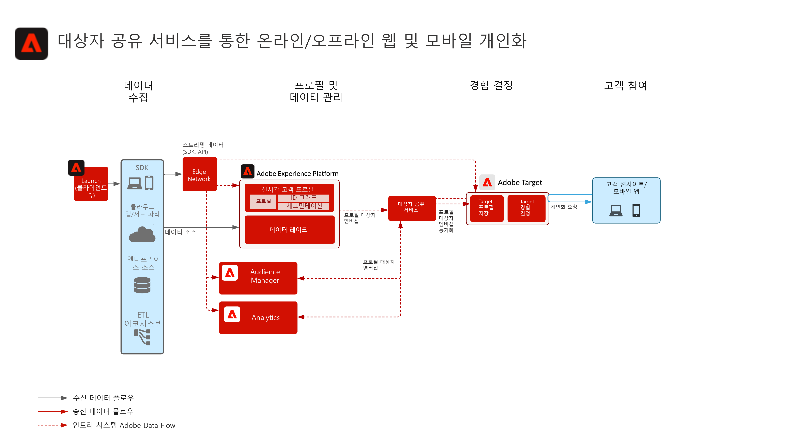
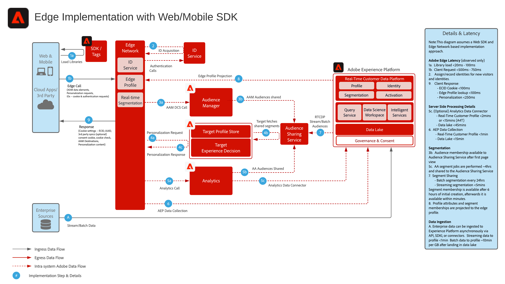

# 온라인 및 오프라인 데이터를 사용한 웹/모바일 개인화

## 사용 사례

* 온라인 및 오프라인 데이터 및 알려진 프로필을 사용한 온라인 개인화
* 랜딩 페이지 최적화
* 트랜잭션, 충성도 및 CRM 데이터와 같은 오프라인 데이터 및 모델링된 통찰력 외에 이전 제품/컨텐츠 보기, 제품/컨텐츠 선호도, 환경 속성 및 인구 통계를 기반으로 개인화
* Real-time Customer Data Platform에서 정의한 대상자를 Adobe Target을 사용하여 웹사이트 및 모바일 앱에서 공유 및 타겟팅합니다.

## 애플리케이션

* [!UICONTROL Real-time Customer Data Platform]
* Adobe Target
* Adobe Audience Manager(선택 사항): 서드파티 대상자 데이터, co-op 기반 디바이스 그래프, Real-time Customer Data Platform 대상자를 Adobe Analytics로 표면화하는 기능, Adobe Analytics 대상자를 Real-time Customer Data Platform으로 표면화하는 기능 추가
* Adobe Analytics(선택 사항): 과거 행동 데이터 및 Adobe Analytics 데이터의 세밀한 세분화를 기반으로 세그먼트를 작성하는 기능 제공

## 사용 사례 시나리오

<table class="tg" style="undefined;table-layout: fixed; width: 790px">
<colgroup>
<col style="width: 20px">
<col style="width: 276px">
<col style="width: 229px">
<col style="width: 265px">
</colgroup>
<thead>
  <tr>
    <th class="tg-y6fn">#</th>
    <th class="tg-f7v4">사용 사례 시나리오</th>
    <th class="tg-y6fn">기능</th>
    <th class="tg-f7v4">필요 조건</th>
  </tr>
</thead>
<tbody>
  <tr>
    <td class="tg-0lax">1</td>
<td class="tg-73oq">Real-time Customer Data Platform에서 Target으로 공유된 에지에 대한 실시간 세그먼트 평가</td>
    <td class="tg-0lax"> - 대상자를 실시간으로 평가하여 Edge의 현재 또는 다음 페이지 개인화에 사용합니다. - 또한 스트리밍 또는 일괄 방식으로 평가된 모든 세그먼트는 에지 네트워크에 투영되어 에지 세그먼트 평가 및 개인화에 포함됩니다.</td>
    <td class="tg-73oq">- 아래에 설명된 구현 패턴 1. - 웹/모바일 SDK를 구현해야 합니다. - 현재 실시간 세그멘테이션에 대한 Mobile SDK 및 API 기반 지원을 사용할 수 없습니다 - Target 및 Experience Platform 확장이 활성화된 Experience Edge에서 데이터 스트림을 구성해야 합니다. 데이터 스트림 ID가 Target 대상 구성에 제공됩니다. - Target 대상은 Real-time Customer Data Platform 대상에서 구성해야 합니다. - Target과 통합하려면 Experience Platform 인스턴스와 동일한 IMS 조직이어야 합니다.</td> 
  </tr>
  <tr>
    <td class="tg-0lax">2</td>
    <td class="tg-73oq">Edge 접근 방식을 통해 Real-time Customer Data Platform에서 Target으로 스트리밍 및 배치 대상 공유</td>
    <td class="tg-0lax">- Edge 네트워크를 통해 Real-time Customer Data Platform에서 Target으로 스트리밍 및 일괄 처리 대상자를 공유합니다. 대상자를 실시간으로 평가하려면 통합 패턴 1에서 설명하는 실시간 대상자 평가와 WebSDK가 필요합니다. - 이 통합은 일반적으로 통합 1단계에서 설명한 대로 스트리밍 및 배치 대상을 실시간 구동하는 Edge Collection 및 WebSDK로 마이그레이션하는 대신 기존 SDK를 사용하여 스트리밍 및 배치 대상을 공유하는 데 사용됩니다.</td>
    <td class="tg-73oq">- 아래에 설명된 구현 패턴 1 또는 2. - 통합 패턴 1에 설명된 대로 실시간 에지 세그먼트 평가를 활성화하려면 필요한 경우 스트리밍 및 배치 대상을 Target에 공유하는 데 웹/모바일 SDK가 필요하지 않습니다.  - AT.js를 사용하는 경우 ECID 네임스페이스에 대한 프로필 통합만 지원됩니다.  - Edge에서 사용자 정의 ID 네임스페이스를 조회하는 경우 WebSDK 배포가 필요하며 각 신원을 신원 맵 내 신원으로 설정해야 합니다. - 데이터 스트림은 Experience Edge에 구성해야 합니다. 데이터 스트림 ID가 Target 대상 구성에 제공됩니다. - Target 대상은 Real-time Customer Data Platform 대상에서 구성해야 합니다. - Target과 통합하려면 Experience Platform 인스턴스와 동일한 IMS 조직이어야 합니다.</td>
  </tr>
  <tr>
    <td class="tg-0lax">3</td>
    <td class="tg-73oq">대상 공유 서비스 접근 방식을 통해 Real-time Customer Data Platform에서 Target 및 Audience Manager에 대한 스트리밍 및 배치 대상 공유</td>
    <td class="tg-0lax">- 대상자 공유 서비스를 통해 Real-time Customer Data Platform의 스트리밍 및 일괄 처리 대상자를 Target과 Audience Manager로 공유합니다.  -이 통합 패턴은 Audience Manager의 타사 데이터 및 대상의 추가 보강이 필요한 경우 활용할 수 있습니다. 그렇지 않으면 통합 패턴 1과 2가 선호됩니다. 대상자를 실시간으로 평가하려면 통합 패턴 1에서 설명하는 실시간 대상자 평가와 WebSDK가 필요합니다.</td>
    <td class="tg-73oq">- 아래에 설명된 구현 패턴 1 또는 2. - 이 통합에는 웹/모바일 SDK 배포가 필요하지 않습니다.  - 대상자 공유 서비스를 통한 대상자 프로젝션은 반드시 프로비저닝해야 합니다. - Target과 통합하려면 Experience Platform 인스턴스와 동일한 IMS 조직이어야 합니다. - Target이 작업을 제대로 수행할 수 있도록 공유하려면 신원을 ECID로 식별해야 합니다.</td>
  </tr>
</tbody>
</table>

## 시나리오 1 및 2 - Adobe Target에 대한 실시간, 스트리밍 및 배치 대상 공유

아키텍처

시퀀스 세부 사항

사용 사례 시나리오 1 및 2를 위한 개요 아키텍처

### 사용 사례 시나리오 1에 대한 구현 단계는 사용 사례 시나리오 2도 지원합니다.

1. 웹 또는 모바일 애플리케이션에 [Adobe Target 구현](https://experienceleague.adobe.com/docs/target/using/implement-target/implementing-target.html?lang=ko)
1. [Experience Platform 및 구현 [!UICONTROL 실시간 고객 프로필]](https://experienceleague.adobe.com/docs/platform-learn/getting-started-for-data-architects-and-data-engineers/overview.html?lang=ko) 대상자를 구성하여 Edge에 활성화 [병합 정책](https://experienceleague.adobe.com/docs/experience-platform/profile/merge-policies/ui-guide.html?lang=en#create-a-merge-policy) 를 Edge에서 활성화하여 공유할 수 있습니다.
1. 구현 [웹 SDK Experience Platform](https://experienceleague.adobe.com/docs/experience-platform/edge/home.html?lang=ko). Experience Platform Web SDK는 실시간 Edge 세분화에 필요하지만, Real-time Customer Data Platform에서 Target으로 스트리밍 및 일괄 처리 대상을 공유하는 데에는 필요하지 않습니다. 현재 Mobile SDK 및 API를 통한 실시간 세분화는 지원하지 않습니다.
1. [에지 데이터 스트림으로 에지 네트워크 구성](https://experienceleague.adobe.com/docs/experience-platform/edge/fundamentals/datastreams.html)
1. [Real-time Customer Data Platform 내에서 Adobe Target을 대상으로 사용](https://experienceleague.adobe.com/docs/experience-platform/destinations/catalog/personalization/adobe-target-connection.html?lang=ko)

 

## 시나리오 3 - Adobe Target 및 Audience Manager에 대한 대상 공유 서비스를 통한 스트리밍 및 배치 대상 공유

아키텍처

### 시나리오 3에 대한 구현 단계 는 시나리오 2도 지원합니다

1. 웹 또는 모바일 애플리케이션에 [Adobe Target 구현](https://experienceleague.adobe.com/docs/target/using/implement-target/implementing-target.html)
1. [Adobe Audience Manager 구현](https://experienceleague.adobe.com/docs/audience-manager/user-guide/implementation-integration-guides/implement-audience-manager.html?lang=ko)(선택 사항)
1. [Adobe Analytics 구현](https://experienceleague.adobe.com/docs/analytics/implementation/home.html?lang=ko)(선택 사항)
1. [Experience Platform 및 [!UICONTROL Real-time Customer Profile] 구현](https://experienceleague.adobe.com/docs/platform-learn/getting-started-for-data-architects-and-data-engineers/overview.html)
1. 구현 [Experience Cloud ID 서비스](https://experienceleague.adobe.com/docs/id-service/using/implementation/implementation-guides.html?lang=ko)
1. [Experience Platform과 Adobe Target(공유 대상) 간 대상 공유에 대한 프로비저닝 요청](https://www.adobe.com/go/audiences) Experience Platform에서 Target으로 대상을 공유하려면 다음을 수행하십시오.
1. (선택 사항) [에지 데이터 스트림으로 에지 네트워크 구성](https://experienceleague.adobe.com/docs/experience-platform/edge/fundamentals/datastreams.html) (Audience Manager 대상 또는 데이터에 의해 대상을 Audience Manager에 공유하거나 보강할 필요가 없는 통합 패턴 2에만 필요합니다.)
1. (선택 사항) [Real-time Customer Data Platform 내에서 Adobe Target을 대상으로 사용](https://experienceleague.adobe.com/docs/experience-platform/destinations/catalog/personalization/adobe-target-connection.html?lang=en) 대상 공유 서비스 및 Audience Manager을 통해 Real-time Customer Data Platform에서 Edge에 바로 스트리밍 및 배치 대상을 공유할 수 있습니다.

 

## 구현 패턴

온라인 및 오프라인 개인화는 몇 가지 구현 방법을 통해 지원됩니다.

### 구현 패턴 1 - 사용 사례 시나리오 1과 2를 지원합니다. 웹/모바일 SDK를 사용한 Edge Network(권장 방법)

웹/모바일 SDK에서 Edge 네트워크 사용

시퀀스 다이어그램

 

### 구현 패턴 2 - 사용 사례 시나리오 2와 3을 지원합니다. 애플리케이션별 SDK

기존 애플리케이션별 SDK 사용(예: AT.js 및 AppMeasurement.js)

 

## 가드레일

[웹 및 모바일 개인화 블루프린트 개요 페이지의 가드레일을 참조하세요.](overview.md)

## 구현 시 고려 사항

ID 필요 조건

* 모든 기본 ID는 Edge 네트워크 및 WebSDK와 함께 위에 요약된 구현 패턴 1을 활용할 때 활용할 수 있습니다. 로그인을 처음 개인화할 때에는 개인화 요청에서 설정한 기본 ID가 Real-time Customer Data Platform 프로필의 기본 ID와 일치해야 합니다. 허브에서 익명 디바이스와 알려진 고객의 신원 연결을 진행한 뒤 Edge로 투영합니다.
* Adobe Experience Platform의 대상을 Adobe Target에 공유하려면 위의 사용 사례 시나리오 3에 요약된 대로 대상 공유 서비스를 사용할 때 ECID를 ID로 사용해야 합니다.
* Audience Manager을 통해 대체 ID를 사용하여 Experience Platform 대상을 Adobe Target에 공유할 수도 있습니다. Experience Platform에서 Audience Manager를 활성화 가능한 지원되는 네임스페이스는 다음과 같습니다: IDFA, GAID, AdCloud, Google, ECID, EMAIL_LC_SHA256. Audience Manager와 Target은 ECID를 통해 대상자의 멤버십을 처리하므로, Adobe Target에 대상자를 최종 공유할 때까지 계속 ECID가 필요합니다.

## 관련 설명서

### SDK 설명서

* [Experience Platform Web SDK 설명서](https://experienceleague.adobe.com/docs/experience-platform/edge/home.html)
* [Experience Platform 태그 설명서](https://experienceleague.adobe.com/docs/experience-platform/tags/home.html?lang=ko)
* [Experience Cloud ID 서비스 설명서](https://experienceleague.adobe.com/docs/id-service/using/home.html?lang=ko)

### 연결 설명서

* [Real-time Customer Data Platform용 Adobe Target 연결](https://experienceleague.adobe.com/docs/experience-platform/destinations/catalog/personalization/adobe-target-connection.html?lang=en)
* [Edge 데이터 스트림 구성](https://experienceleague.adobe.com/docs/experience-platform/edge/fundamentals/datastreams.html)
* [Experience Platform 세그먼트를 Audience Manager 및 기타 Experience Cloud 솔루션에 공유하기](https://experienceleague.adobe.com/docs/audience-manager/user-guide/implementation-integration-guides/integration-experience-platform/aam-aep-audience-sharing.html?lang=ko)

### 세그먼테이션 설명서

* [Experience Platform 세분화 개요](https://experienceleague.adobe.com/docs/experience-platform/segmentation/home.html?lang=ko)
* [실시간 세분화](https://experienceleague.adobe.com/docs/experience-platform/segmentation/ui/edge-segmentation.html)
* [세분화 스트리밍](https://experienceleague.adobe.com/docs/experience-platform/segmentation/api/streaming-segmentation.html?lang=ko)
* [Adobe Analytics 세그먼트를 Adobe Audience Manager를 통해 공유](https://experienceleague.adobe.com/docs/analytics/components/segmentation/segmentation-workflow/seg-publish.html?lang=ko)
* [병합 정책 구성](https://experienceleague.adobe.com/docs/experience-platform/profile/merge-policies/ui-guide.html?lang=en#create-a-merge-policy)

### 튜토리얼

* [Real-time CDP 및 Adobe Target을 사용한 다음 개인화 항목](https://experienceleague.adobe.com/docs/platform-learn/tutorials/experience-cloud/next-hit-personalization.html?lang=ko)

### 관련 블로그 게시물

* [Adobe이 Adobe Target 및 Real-time Customer Data Platform을 사용하여 동일한 페이지 고급 개인화 를 발표합니다.](https://blog.adobe.com/en/publish/2021/10/05/adobe-announces-same-page-enhanced-personalization-with-adobe-target-real-time-customer-data-platform)
* [[!DNL Blueprint for Web Personalization using Adobe Experience Platform Real-Time Customer Profile]](https://medium.com/adobetech/blueprint-for-web-personalization-using-adobe-experience-platform-real-time-customer-profile-fef2ce7a4b2f)
* [[!DNL Adobe Experience Platform’s Identity Service — How to Solve the Customer Identity Conundrum]](https://medium.com/adobetech/adobe-experience-platforms-identity-service-how-to-solve-the-customer-identity-conundrum-f95e22d16ea9)
* [[!DNL Adobe Experience Platform Web SDK for Audience Management]](https://medium.com/adobetech/adobe-experience-platform-web-sdk-for-audience-management-751fa6d063bc)
* [[!DNL Implementing Adobe Experience Platform Real-Time Customer Profile through our “Customer Zero” Program]](https://medium.com/adobetech/implementing-adobe-experience-platform-real-time-customer-profile-through-our-customer-zero-32e7cd952896)
* [[!DNL Segmentation in Seconds: How Adobe Experience Platform Made Real-time Customer Profiles a Reality]](https://medium.com/adobetech/segmentation-in-seconds-how-adobe-experience-platform-made-real-time-customer-profiles-a-reality-a7a8552b0847)
