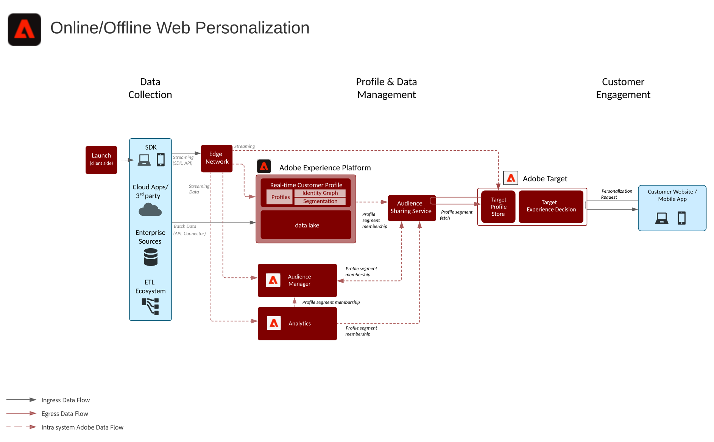
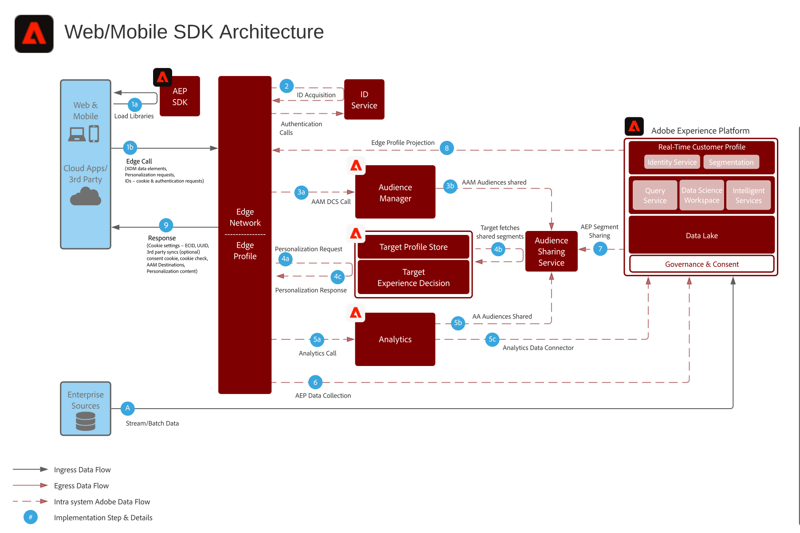
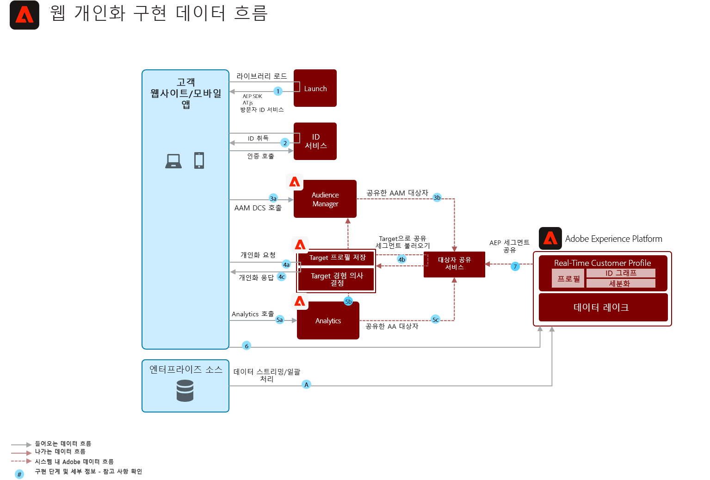

# 온라인/오프라인 웹/모바일 개인화 블루프린트

이메일 및 기타 알려진 익명의 채널 개인화와 웹 개인화를 동기화할 수 있습니다.

## 사용 사례

* 랜딩 페이지 최적화
* 행동 및 오프라인 프로필 타깃팅
* 거래, 충성도 및 CRM 데이터와 같은 오프라인 통찰력 외에도 이전 제품/컨텐츠 뷰, 제품/컨텐츠 친화성, 환경 특성, 제3자 고객 데이터 및 인구 통계학적 정보를 기반으로 개인화

## 애플리케이션

* [!UICONTROL 실시간 고객 데이터 플랫폼]
* Adobe Target
* Adobe Audience Manager(선택 사항):제3자 대상 데이터, 공동 작업 기반 장치 그래프, Adobe Analytics에서 플랫폼 세그먼트를 표시하는 기능, 플랫폼에서 Adobe Analytics 세그먼트를 표시하는 기능 추가
* Adobe Analytics(선택 사항):Adobe Analytics 데이터에서 내역 행동 데이터와 세분화된 세그먼트를 기반으로 세그먼트를 작성하는 기능을 추가합니다.

## 아키텍처

## 가드레일

* 스트리밍 또는 일괄 평가 방법을 통해 Experience Platform에서 Audience Manager으로 공유되는 세그먼트는 세그먼트 구현 후 몇 분 이내에 공유됩니다. Experience Platform 세그먼트 멤버십이 Audience Manager 프로필에서 구현되기 시작하는 데 약 4시간의 Audience Manager과 Experience Platform 간에 초기 세그먼트 구성 동기화가 있습니다. Audience Manager 프로파일에 포함되면 Adobe Target을 통해 동일한 페이지 개인화를 위해 Experience Platform 세그먼트 멤버십을 사용할 수 있습니다.
* Experience Platform과 Audience Manager 간 4시간 세그먼트 구성 동기화 내에서 발생하는 세그먼트 합성의 경우 이러한 세그먼트 합산이 후속 배치 세그먼트 작업 시 &quot;기존&quot; 세그먼트로 Audience Manager으로 실현됩니다.
* Experience Platform에서 일괄 세그먼트 공유 - 하루에 한 번 또는 API를 통해 수동으로 시작 이러한 세그먼트 멤버십이 실현되면 몇 분 내에 Audience Manager에 공유되고 Target에서 동일한/다음 페이지 개인화를 위해 사용할 수 있습니다.
* 약 5분 내에 스트리밍 세그먼테이션이 실현됩니다. 이러한 세그먼트 조정이 발생하면 몇 분 내에 Audience Manager에 공유되고 Target에서 동일한/다음 페이지 개인화에 사용할 수 있습니다.
* 기본적으로 세그먼트 공유 서비스는 각 Adobe Analytics 보고서 세트에 대해 최대 75명의 대상을 공유할 수 있도록 허용합니다. 고객에게 Audience Manager 라이선스가 있는 경우 Adobe Analytics 및 Adobe Target 또는 Audience Manager과 Adobe Target 간에 공유할 수 있는 대상 수에 제한이 없습니다.

## 구현 패턴

웹/모바일 개인화 청사진은 아래에 설명된 다음 접근 방식을 통해 구현할 수 있습니다.

1. 플랫폼 웹 SDK/모바일 SDK 및 Edge 네트워크 사용.
1. 기존의 애플리케이션별 SDK 사용(예: AppMeasurement.js)

### 1. 플랫폼 웹/모바일 SDK 및 Edge 방식

### 2. 애플리케이션별 SDK 방식

## 구현 전제 조건

| 애플리케이션/서비스 | 필수 라이브러리 | 참고 사항 |
|---|---|---|
| Adobe Target | 플랫폼 웹 SDK*, at.js 0.9.1+ 또는 mbox.js 61+ | mbox.js가 더 이상 개발되지 않으므로 at.js가 선호됩니다. |
| Adobe Audience Manager(선택 사항) | 플랫폼 웹 SDK* 또는 dil.js 5.0+ |  |
| Adobe Analytics(선택 사항) | 플랫폼 웹 SDK* 또는 AppMeasurement.js 1.6.4+ | Adobe Analytics 추적은 RDC(지역 데이터 수집)를 사용해야 합니다. |
| Experience Cloud ID 서비스 | 플랫폼 웹 SDK* 또는 VisitorAPI.js 2.0+ | (권장) Experience Platform Launch을 사용하여 ID 서비스를 배포하여 응용 프로그램 호출 전에 ID가 설정되었는지 확인합니다 |
| Experience Platform Mobile SDK(선택 사항) | iOS 및 Android™의 경우 4.11 이상 |  |
| Experience Platform 웹 SDK | 1.0, 현재 Experience Platform SDK 버전에는 Experience Cloud 응용 프로그램에 대해 아직 지원되지 않는 다양한 사용 사례가 있습니다](https://github.com/adobe/alloy/projects/5)[ |  |

## 구현 단계

1. [웹 또는 모바일 ](https://experienceleague.adobe.com/docs/target/using/implement-target/implementing-target.html) 애플리케이션용 Adobe 타깃팅 구현
1. [Adobe Audience Manager](https://experienceleague.adobe.com/docs/audience-manager/user-guide/implementation-integration-guides/implement-audience-manager.html)  구현(선택 사항)
1. [Adobe Analytics](https://experienceleague.adobe.com/docs/analytics/implementation/home.html)   구현(선택 사항)
1. [Experience Platform 및  [!UICONTROL 실시간 고객 프로파일 구현]](https://experienceleague.adobe.com/docs/platform-learn/getting-started-for-data-architects-and-data-engineers/overview.html)
1. [Experience Cloud ID 서비스](https://experienceleague.adobe.com/docs/id-service/using/implementation/implementation-guides.html) 또는 [Experience Platform 웹 SDK](https://experienceleague.adobe.com/docs/experience-platform/edge/home.html) 구현
   >[!NOTE]
   >
   >각 응용 프로그램은 Experience Cloud ID를 사용하고 동일한 Experience Cloud 조직에 속해 있어야 응용 프로그램 간에 대상 공유를 허용할 수 있습니다.
1. [Experience Platform과 Adobe Target 간 대상 공유를 위한 프로비저닝 요청(공유 대상)](https://www.adobe.com/go/audiences)

## 관련 설명서

* [Audience Manager 및 기타 Experience Cloud 솔루션과 Experience Platform 세그먼트 공유](https://experienceleague.adobe.com/docs/audience-manager/user-guide/implementation-integration-guides/integration-experience-platform/aam-aep-audience-sharing.html)
* [Experience Platform 세그멘테이션 개요](https://experienceleague.adobe.com/docs/experience-platform/segmentation/home.html)
* [스트리밍 세분화](https://experienceleague.adobe.com/docs/experience-platform/segmentation/api/streaming-segmentation.html)
* [Experience Platform 세그먼트 빌더 개요](https://experienceleague.adobe.com/docs/experience-platform/segmentation/ui/overview.html)
* [Audience Manager 소스 커넥터](https://experienceleague.adobe.com/docs/experience-platform/sources/connectors/adobe-applications/audience-manager.html)
* [Adobe Audience Manager을 통한 Adobe Analytics 세그먼트 공유](https://experienceleague.adobe.com/docs/analytics/components/segmentation/segmentation-workflow/seg-publish.html)
* [Experience Platform 웹 SDK 설명서](https://experienceleague.adobe.com/docs/experience-platform/edge/home.html)
* [Experience Cloud ID 서비스 설명서](https://experienceleague.adobe.com/docs/id-service/using/home.html)
* [Experience Platform Launch 설명서](https://experienceleague.adobe.com/docs/launch/using/home.html)

## 관련 블로그 게시물

* [[!DNL Blueprint for Web Personalization using Adobe Experience Platform Real-Time Customer Profile]](https://medium.com/adobetech/blueprint-for-web-personalization-using-adobe-experience-platform-real-time-customer-profile-fef2ce7a4b2f)
* [[!DNL Build an Optimal Online Experience: Enrich Unified Profile with Query Service]](https://medium.com/adobetech/build-an-optimal-online-experience-enrich-unified-profile-with-query-service-8027c196ab33)
* [[!DNL Integrating Adobe Experience Platform Decisioning Engine with AEM Websites]](https://jaeness.medium.com/integrating-adobe-experience-platform-decisioning-engine-with-aem-websites-9c222acd12e2)
* [[!DNL Adobe Experience Platform’s Identity Service — How to Solve the Customer Identity Conundrum]](https://medium.com/adobetech/adobe-experience-platforms-identity-service-how-to-solve-the-customer-identity-conundrum-f95e22d16ea9)
* [[!DNL How Adobe Experience Platform Predictive Audiences improves Personalized Experiences]](https://medium.com/adobetech/how-adobe-experience-platform-predictive-audiences-improves-personalized-experiences-1f75a60cb7a3)
* [[!DNL Adobe Experience Platform Web SDK for Audience Management]](https://medium.com/adobetech/adobe-experience-platform-web-sdk-for-audience-management-751fa6d063bc)
* [[!DNL Implementing Adobe Experience Platform Real-Time Customer Profile through our “Customer Zero” Program]](https://medium.com/adobetech/implementing-adobe-experience-platform-real-time-customer-profile-through-our-customer-zero-32e7cd952896)
* [[!DNL How Adobe Experience Platform Can Help Customers Personalize Their Mobile Messaging in Real-Time with Journey Orchestration Service and a Mobile Messaging Vendor]](https://medium.com/adobetech/how-adobe-experience-platform-helped-a-client-personalize-their-mobile-messaging-in-real-time-with-7d634aefa098)
* [[!DNL Segmentation in Seconds: How Adobe Experience Platform Made Real-time Customer Profiles a Reality]](https://medium.com/adobetech/segmentation-in-seconds-how-adobe-experience-platform-made-real-time-customer-profiles-a-reality-a7a8552b0847)
* [[!DNL Build an Optimal Online Experience: Enrich Unified Profile with Query Service]](https://medium.com/adobetech/build-an-optimal-online-experience-enrich-unified-profile-with-query-service-8027c196ab33)
