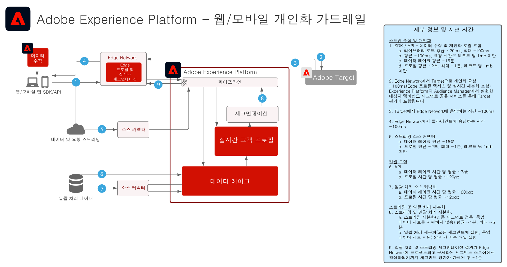

# 웹 및 모바일 개인화

웹 및 모바일 개인화에서는 대상자 세분화를 여러 애플리케이션에서 사용하여 고객 경험을 개인화 및 최적화하는 기능을 다룹니다. 고객의 행동, 인적 특성, 충성도 수준 및 이전 거래 기록을 활용하여 레이아웃, 콜 투 액션 및 콘텐츠를 개인화할 수 있습니다.

| 블루프린트 | 설명 | Experience Cloud 애플리케이션 |
|---|---|---|
| **[행동 기반의 웹/모바일 개인화](behavioral.md)** | <ul><li>온라인 행동과 대상자 데이터를 기반으로 개인화 구현</li></ul> | <ul><li>Adobe Target</li><li>Adobe Analytics *(선택 사항)*</li><li>Adobe Audience Manager *(선택 사항)*</li></ul> |
| **[온라인/오프라인 웹/모바일 개인화](online-offline.md)** | <ul><li>오프라인 특성 및 이벤트(거래, 예약, CRM 및 충성도 데이터)를 개인화에 활용합니다.</li><li>웹, 이메일 및 다른 알려진 채널에 걸쳐 개인화를 동기화합니다.</li></ul> | <ul><li>[!UICONTROL Real-time Customer Data Platform]</li><li>Adobe Target</li><li>Adobe Analytics *(선택 사항)*</li><li>Adobe Audience Manager *(선택 사항)*</li></ul> |

## 웹 및 모바일 개인화 가드레일

[대상자 및 프로필 활성화 관련 가드레일에 대해서는 대상자 및 프로필 활성화 블루프린트 섹션의 가드레일을 참조하세요.](../audience-activation/overview.md)

### 온라인/오프라인 개인화 가드레일 다이어그램

## 관련 블로그 게시물

* [[!DNL Blueprint for Web Personalization using Adobe Experience Platform Real-Time Customer Profile]](https://medium.com/adobetech/blueprint-for-web-personalization-using-adobe-experience-platform-real-time-customer-profile-fef2ce7a4b2f)
* [[!DNL Integrating Adobe Experience Platform Decisioning Engine with AEM Websites]](https://jaeness.medium.com/integrating-adobe-experience-platform-decisioning-engine-with-aem-websites-9c222acd12e2)
* [[!DNL Adobe Experience Platform’s Identity Service — How to Solve the Customer Identity Conundrum]](https://medium.com/adobetech/adobe-experience-platforms-identity-service-how-to-solve-the-customer-identity-conundrum-f95e22d16ea9)
* [[!DNL Content and Commerce AI: Personalizing Your Interactions with Customers Through Content Intelligence]](https://medium.com/adobetech/content-and-commerce-ai-personalizing-your-interactions-with-customers-through-content-intelligence-dc182601deab)
* [[!DNL How Adobe Experience Platform Predictive Audiences improves Personalized Experiences]](https://medium.com/adobetech/how-adobe-experience-platform-predictive-audiences-improves-personalized-experiences-1f75a60cb7a3)
* [[!DNL Adobe Experience Platform Web SDK for Audience Management]](https://medium.com/adobetech/adobe-experience-platform-web-sdk-for-audience-management-751fa6d063bc)
* [[!DNL Demonstrating the Power of Adobe’s New Journey Orchestration Service to Build Personalized Omnichannel Experiences in Real-Time]](https://medium.com/adobetech/demonstrating-the-power-of-adobes-new-journey-orchestration-service-to-build-personalized-aa60d88cd34)
* [[!DNL Real-Time Scoring to Improve Personalization with Adobe Experience Platform]](https://medium.com/adobetech/real-time-scoring-to-improve-personalization-with-adobe-experience-platform-78d3a47406f7)
* [[!DNL Implementing Adobe Experience Platform Real-Time Customer Profile through our “Customer Zero” Program]](https://medium.com/adobetech/implementing-adobe-experience-platform-real-time-customer-profile-through-our-customer-zero-32e7cd952896)
* [[!DNL How Adobe Experience Platform Can Help Customers Personalize Their Mobile Messaging in Real-Time with Journey Orchestration Service and a Mobile Messaging Vendor]](https://medium.com/adobetech/how-adobe-experience-platform-helped-a-client-personalize-their-mobile-messaging-in-real-time-with-7d634aefa098)
* [[!DNL Data-Driven Marketing Campaigns using Adobe Experience Platform’s Unified Profile in Adobe Campaign]](https://medium.com/adobetech/data-driven-marketing-campaigns-using-adobe-experience-platforms-unified-profile-in-adobe-campaign-9d9a97e183c4)
* [[!DNL Segmentation in Seconds: How Adobe Experience Platform Made Real-time Customer Profiles a Reality]](https://medium.com/adobetech/segmentation-in-seconds-how-adobe-experience-platform-made-real-time-customer-profiles-a-reality-a7a8552b0847)
* [[!DNL Analytical Workloads and Real-Time Customer Profile — Two Sides of the Same Brain with a Single-Minded Purpose]](https://medium.com/adobetech/analytical-workloads-and-real-time-customer-profile-two-sides-of-the-same-brain-with-a-cdfac85ce8c1)
* [[!DNL Build an Optimal Online Experience: Enrich Unified Profile with Query Service]](https://medium.com/adobetech/build-an-optimal-online-experience-enrich-unified-profile-with-query-service-8027c196ab33)
